## 计算机网络-自顶向下

### 第一章 计算机网络和互联网

#### 1.1 互联网

&emsp;&emsp;与互联网连接的设备称为**主机**^【因为容纳/运行应用程序】^或**端系统**^【因为位于互联网的边缘】^。

&emsp;&emsp;主机分为**客户端**和**服务器**。

&emsp;&emsp;端系统彼此交换**报文**。端系统通过**通信链路**和**分组交换机**连接到一起。

&emsp;&emsp;通信链路的**传输速度**的单位是bit/s。一台端系统向另一台端系统发送报文时，发送端将报文分段并为每段加上首部字节，由此形成的信息包称为**分组**。

&emsp;&emsp;交换机主要包括**路由器**和**链路层交换机**。链路层交换机通常用于接入网中，而路由器通常用于网络核心中。从发送端系统到接收端系统，一个分组所经历的一系列通信链路和分组交换机称为通过该网络的**路径**。

&emsp;&emsp;端系统通过**互联网服务提供商**接入互联网。

&emsp;&emsp;端系统、分组交换机和其他互联网部件都要运行一系列**协议**，这些协议控制互联网中信息的接收和发送。**IP**协议定义了在路由器和端系统之间发送和接收的分组格式。互联网的主要协议统称为**TCP/IP**。

&emsp;&emsp;**协议**定义了两个或多个通信实体之间交换的报文的格式和顺序，以及发送/接收一条报文或其他事件所采取的动作。

&emsp;&emsp;**互联网标准**由**互联网工程任务组**研发，其标准文档称为**请求评论**。

&emsp;&emsp;应用程序涉及多个相互交换数据的端系统称为**分布式应用程序**。

&emsp;&emsp;与互联网相连的端系统提供了一个**套接字接口**，该接口规定了运行在端系统上的程序请求互联网基础设施向运行在另一个端系统上的特定目的地程序交付数据的方式。

&emsp;&emsp;ICANN负责分配IP地址，分配AS号，管理DNS根服务器，分配域名以及解决域名纷争。

#### 1.2 网络边缘

&emsp;&emsp;**接入网**指将端系统物理连接到其边缘路由器的网络。**边缘路由器**是端系统到任何其他远程端系统的路径上的第一台路由器。

&emsp;&emsp;家庭接入：DSL、电缆、FTTH、拨号和卫星

&emsp;&emsp;企业/家庭接入：以太网和WiFi

&emsp;&emsp;广域无线接入：3G/4G/5G和LTE

&emsp;&emsp;**物理媒体**包括**导引型媒体**^【电波沿着固态媒体传播】^和**非导引型媒体**^【电波在空气或外层空间传播】^。

#### 1.3 网络核心

&emsp;&emsp;通过网络链路和交换机移动数据有两种基本方法：**分组交换**和**电路交换**。

&emsp;&emsp;在电路交换的网络中，端系统间通信会话期间，==预留==了端系统间沿路径通信所需要的资源^【缓存和链路传输速度】^，而在分组交换的网络中==不会预留==这些资源。

##### 1.3.1 分组交换

&emsp;&emsp;多数分组交换机在链路的输入的使用**存储转发传输**机制。存储转发传输是指在交换机能够开始向输出链路传输该分组的第一个比特之前，必须接收到整个分组。


&emsp;&emsp;通过有`N`条速度均为`R`的链路组成的路径，其中有`N-1`台路由器，则端到端时延：$d_{端到端}=N\frac{L}{R}$。

&emsp;&emsp;对于每条相连的链路，分组交换机有一个用来存储路由器准备发往该链路的分组的**输出缓存/队列**。


&emsp;&emsp;分组需要承受输出缓存的**排队时延**。

&emsp;&emsp;由于缓存空间是有限的，一个到达的分组可能发现该缓存已被其他待传输的分组完全占满，此时刚到达的分组或已经排队的分组其中之一将被丢弃，称为**分组丢失/丢包**。

&emsp;&emsp;每个端系统都有IP地址，分组的首部中包含了目的地的IP地址。

&emsp;&emsp;每台路由器具有一个将目的IP地址(一部分)映射成输出链路的**转发表**。

##### 1.3.2 电路交换

&emsp;&emsp;链路中的电路是通过**频分复用**或**时分复用**来实现的。

&emsp;&emsp;对于频分复用，链路的频谱由跨越链路创建的所有连接共享。在连接期间链路为每条连接专用一个频段，该频段的宽度称为**带宽**。

&emsp;&emsp;对于时分复用，时间被划分为固定期间的帧，称为**时间帧**，并且每个时间帧又被划分为固定数量的**时隙**。当网络跨越一条链路创建一条连接时，网络会为这个连接分配一个时隙，通常时隙的长度能够传输单个帧。

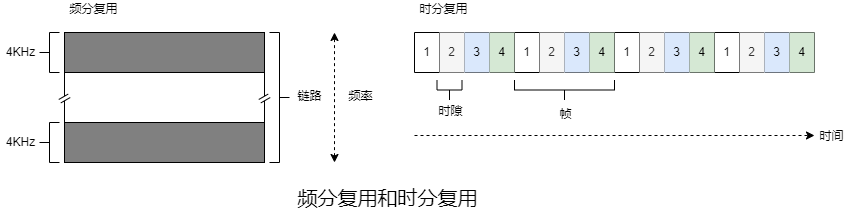

##### 1.3.3 网络的网络

&emsp;&emsp;因为接入ISP向全球传输ISP付费，故接入ISP被认为是**客户**，而全球传输ISP被认为是**提供商**。

&emsp;&emsp;在任何给定的区域，可能有一个**区域ISP**，每个区域ISP则与**第一层ISP连接**。

&emsp;&emsp;任何ISP(除了第一层ISP)可以选择**多宿**。

&emsp;&emsp;位于相同等级结构层次的邻近一对ISP能够**对等**。

&emsp;&emsp;**互联网交换点**是一个汇合点，多个ISP能够在这里一起对等。


#### 1.4 分组交换网

&emsp;&emsp;当分组从一个节点/主机/路由器沿着这条路劲到后继节点/主机/路由器，该节点在沿途的每个节点经受了几种不同类型的时延，其中最重要的是**节点处理时延**、**排队时延**、**传输时延**和**传播时延**，这些时延的总和是**节点总时延**。若用$d_{proc}$、$d_{queue}$、$d_{trans}$、$d_{prop}$、$d_{nodal}$分别表示处理时延、排队时延、传输时延、传播时延和节点总时延，则$d_{nodal}=d_{proc}+d_{queue}+d_{trans}+d_{prop}$。


&emsp;&emsp;检查分组首部和决定将该分组导向何处所需要的时间是**处理时延**的一部分。

&emsp;&emsp;在队列中，当分组在链路上等待传输时，需要经受**排队时延**。

&emsp;&emsp;**传输时延**是路由器推出分组所需的时间，可表示为$\frac{L}{R}$，$L$表示分组的长度，$R(b/s)$表示链路的传输速度，即从队列中推出1bit的速度。&emsp;&emsp;

&emsp;&emsp;$\frac{L\alpha}{R}$是**流量强度**，其中$\alpha(pkt/s)$表示分组到达队列的平均速度。流量强度主要用于衡量排队时延，==设计系统时流量强度不能大于1==。

&emsp;&emsp;1bit从一个路由器到另一个路由器所需的时间是**传播时延**。

&emsp;&emsp;源主机和目的主机之间有$N-1$台路由器，网络通畅^【排队时延可以忽略】^，节点时延累加起来，得到端到端时延：
$$
\begin{align}
d_{end-end}&=N(d_{proc}+d_{trans}+d_{prop})\\&=N(d_{proc}+\frac{L}{R}+d_{prop})
\end{align}
$$

&emsp;&emsp;**吞吐量**是进程交互比特的速度。

#### 1.5 协议层次及其服务模型

&emsp;&emsp;某层的**服务模型**是该层向上一层提供的服务。

&emsp;&emsp;各层的所有协议被称为**协议栈**。

&emsp;&emsp;

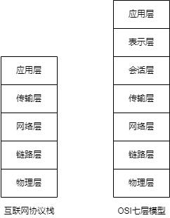

##### 1.5.1 互联网协议栈

|        | 功能                                           | 主要协议                                  | 分组名称 |
| ------ | ---------------------------------------------- | ----------------------------------------- | -------- |
| 应用层 | 存留网络应用程序及其应用层协议                 | HTTP、SMTP、FTP、DNS、DHCP、SNMP和NFS等   | 报文     |
| 传输层 | 应用程序之间传输应用层报文                     | TCP、UDP、DCCP、DCTCP、TRFC、SCTP和QUIC等 | 报文段   |
| 网络层 | 也称为IP层，将数据报从一台主机移动到另一台主机 | IP                                        | 数据报   |
| 链路层 | 沿着路径将数据报传递给下一个节点               | 以太网、WiFi和DOCSIS                      | 帧       |
| 物理层 | 将帧中的一个个比特从一个节点移动到下一个节点   |                                           | 比特     |

|      应用      | 应用层协议 |          传输层协议和端口           |
| :------------: | :--------: | :---------------------------------: |
|    电子邮件    |    SMTP    |         TCP:25/465/587/2525         |
|  远程终端访问  |   Telnet   |               TCP:23                |
|      Web       |    HTTP    |               TCP:80                |
|    文件传输    |    FTP     |              TCP:20/21              |
| 远程文件服务器 |    NFS     |              UDP:2049               |
|   流式多媒体   |  通常专用  |               TCP/UDP               |
|   互联网电话   |  通常专用  |               TCP/UDP               |
|    网络管理    |    SNMP    |             UDP:161/162             |
|    域名系统    |    DNS     |               UDP:53                |
|    SSH隧道     |    SSH     |               TCP:22                |
|      DHCP      |   BOOTP    |      UDP:67(server)/68(client)      |
|      BGP       |    BGP     |               TCP:179               |
|    OpenFlow    |  OpenFlow  |              TCP:6653               |
|    网络管理    |    SNMP    | UDP:161/162/163或(D)TLS:10161/10162 |

##### 1.5.2 OSI模型

&emsp;&emsp;**网络体系结构**是通信系统的整体设计，其广泛采用OSI模型。

&emsp;&emsp;相比互联网协议栈，OSI模型多出表示层和会话层。

&emsp;&emsp;表示层的作用是使通信的应用程序能够解释交换数据的含义。这些服务包括数据压缩、数据加密和数据描述。

&emsp;&emsp;会话层提供了数据交换的定界和同步功能，包括了建立检查点和恢复方案的方法。

##### 1.5.3 封装


&emsp;&emsp;在每一层，分组包括首部字段和**有效载荷字段**^【通常是上一层的分组】^。

#### 1.6 网络安全

&emsp;&emsp;**病毒**是一种需要某种形式的用户交互来感染用户设备的恶意软件。

&emsp;&emsp;**蠕虫**是一种无须任何明显用户交互就能进入设备的恶意软件。

&emsp;&emsp;**Dos攻击**包括==弱点攻击==^【发送特殊的报文来控制或宕机】^、==带宽洪泛==^【发送大量分组】^和==连接洪泛==^【创建大量TCP连接】^。

&emsp;&emsp;用来观察执行协议实体之间交换的报文的基本工具被称为**分组嗅探器**。

&emsp;&emsp;**IP哄骗**指将具有虚假源地址的分组注入互联网。

### 第二章 应用层

#### 2.1 应用层协议原理

&emsp;&emsp;**套接字**是应用程序进程和传输层协议之间的接口。一个进程可以有多个套接字。

&emsp;&emsp;应用程序开发者可以通过套接字控制应用层的一切，但是对传输层的控制仅限于选择协议和设定几个传输层参数。应用程序体系结构通常使用客户端/服务器体系结构和对等体系结构。

&emsp;&emsp;当进程向另一台主机的进程发送分组时需要定义目的主机的地址和目的主机中接收进程的标识符。&emsp;&emsp;

&emsp;&emsp;传输层为应用层提供的服务可分为四类：==可靠数据传输==、==吞吐量==、==定时==和==安全性==。

&emsp;&emsp;**带宽敏感的应用**具有吞吐量要求，而**弹性应用**能够根据可用的带宽。

&emsp;&emsp;**应用层协议**定义了运行在不同端系统上的应用程序进程如何相互传递报文：	

&emsp;&emsp;﹡交互的报文类型

&emsp;&emsp;﹡各种报文类型的语法

&emsp;&emsp;﹡字段的语义

&emsp;&emsp;﹡确定一个进程何时以及如何发送报文，对报文进行响应的规则

#### 2.2 HTTP

&emsp;&emsp;Web的应用层协议是**HTTP**。

&emsp;&emsp;HTTP服务器不保存关于客户端的任何信息，故HTTP是一个**无状态协议**。为了识别客户端，HTTP使用了cookie。

&emsp;&emsp;**持续连接**指一个TCP可以传输多个HTTP请求和响应。

&emsp;&emsp;**非持续连接**指一个TCP只能传输一个HTTP请求/响应对。

&emsp;&emsp;**Web缓存器**，也称为**代理服务器**，能够代表Web服务器来满足HTTP请求的网络实体。

&emsp;&emsp;HTTP的**条件GET**机制可以解决Web缓存器缓存的数据陈旧的问题。

&emsp;&emsp;HTTP主要是一个**拉协议**，TCP连接是由接收端发起。

##### 2.2.1 HTTP请求报文

```http
GET /somedir/page.html HTTP/2
Host: www.test.com
User-Agent: Mozilla/5.0
Accept: */*
Accept-Language: zh-CN,zh;q=0.8,zh-TW;q=0.7,zh-HK;q=0.5,en-US;q=0.3,en;q=0.2
Accept-Encoding: gzip, deflate, br
Connection: keep-alive
```

&emsp;&emsp;HTTP请求报文的第一行是**请求行**。请求行包括方法字段、URL字段和HTTP版本字段。

&emsp;&emsp;HTTP请求报文第一行之后的行是**首部行**。

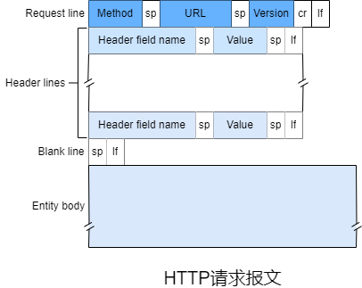

##### 2.2.2 HTTP响应报文

```http
HTTP/2 200 OK
content-type: text/javascript; charset=utf-8
content-encoding: br
last-modified: Wed, 03 Nov 2021 01:12:45 GMT
server: Windows-Azure-Blob/1.0 Microsoft-HTTPAPI/2.0
```

&emsp;&emsp;HTTP响应报文的第一行是**状态行**。请求行包括协议版本字段、状态码字段和相应状态字段。

&emsp;&emsp;HTTP响应报文第一行之后的行是**首部行**。


##### 2.2.3 条件GET

&emsp;&emsp;如果请求报文是GET方法且请求报文的首部行包括`If-modified-since`，该请求报文就是条件GET请求报文。


&emsp;&emsp;第三步中`If-modified-since`的值等于第二步中`last-modified`的值，这表示Web服务器仅当指定日期之后该对象修改后才发送该对象，假设该对象在指定日期后没被修改，于是第四步中Web服务器向Web缓存器发送的响应报文中状态码为304且没有对象，表示Web缓存器可以转发缓存的该对象的副本。

#### 2.3 电子邮件

&emsp;&emsp;互联网电子邮件系统由**用户代理**、**邮件服务器**和**简单邮件传输协议**组成。


&emsp;&emsp;1）发件方调用用户代理撰写内容并发送邮件。

&emsp;&emsp;2）发件方的用户代理把报文发给发件方的邮件服务器，在这里报文被放在报文队列里。

&emsp;&emsp;3）发件方邮件服务器上的SMTP客户端创建一个到收件方邮件服务器上的SMTP服务器的TCP连接。

&emsp;&emsp;4）经过初始SMTP握手后，SMTP客户端通过TCP连接发送报文。

&emsp;&emsp;5）收件方邮件服务器的SMTP服务器接收到报文并将报文投入到收件方的邮箱。

&emsp;&emsp;6）收件方调用用户代理查看邮件。

##### 2.3.1 SMTP

&emsp;&emsp;SMTP是互联网电子邮件中主要的应用层协议。它限制了邮件的报文(不只是首部)只能采用7-bit ASCII表示，若报文包含非7-bit ASCII字符或二进制数据，需要进行7-bit ASCII编码。

&emsp;&emsp;SMTP是**推协议**，TCP连接是发送端发起的。

```ini
S: 220 client
C: EHLO server
S: 250 from | 250 PIPELINING | 250 SIZE 12345
C: AUTH XOAUTH2 oauth
S: 235 2.7.0 Accepted
C: MAIL FROM: <client@email.com> 
S: 250 OK
C: RCPT TO: <server@email.com>
S: 250 OK
C: DATA
S: 354 End data with <CR><LF>.<CR><LF>
C: DATA fragment,content
S: 250 OK: queued as.
C: QUIT
S: 221 Bye
```

&emsp;&emsp;SMTP协议中客户端发送了5条命令：HELO/EHLO^【ESMTP版本】^(HELLO缩写)、MAIL FROM、RCPT TO、DATA以及QUIT。

&emsp;&emsp;ESMTP相比SMTP，在发送邮件时==需要验证用户账户==。

##### 2.3.2 电子邮件

```ini
From: from@email.com
To: to@email.com
Subject: subject
```

&emsp;&emsp;邮件报文的首部行包括环境信息，必须包含一个`From`和一个`To`，可能包含`Subject`以及其他可选首部行。

&emsp;&emsp;在用户代理建立一个到邮件服务器110端口上的TCP连接后，POP3按照3个阶段进行工作：授权、事务处理以及更新。

&emsp;&emsp;﹡授权阶段需要用户代理以明文形式发送用户名和密码来认证，主要指令有`user <username>`和`pass <password>`。

&emsp;&emsp;﹡事务处理阶段中用户代理可以取回报文，也可以添加/取消报文删除标记，主要指令有`list`、`retr`和`dele`。

&emsp;&emsp;﹡更新阶段在用户代理发出`quit`指令并结束会话后，邮件服务器会删除那些被标记的报文。

&emsp;&emsp;POP3会话期间，邮件服务器会保留一些状态信息，但是在会话中不会携带这些信息。

&emsp;&emsp;IMAP使用了TCP连接的143端口。相比POP3，IMAP把报文和文件夹联系起来并且提供了创建/修改/删除文件夹和获取报文某些部分的指令。

#### 2.4 DNS

&emsp;&emsp;主机可以用**主机名**和**IP地址**来进行识别。

&emsp;&emsp;一台名为a.com的主机，可能还有别名b.com和c.com，此时a.com是**规范主机名**。

&emsp;&emsp;**域名系统**是一个由分层的**DNS服务器**实现的分布式数据库，一个让主机查询分布式数据库的应用层协议。主要用于将主机名解析为IP地址，也提供**主机别名**、**邮件服务器别名**和**负载分配**服务。

##### 2.4.1 DNS工作原理

&emsp;&emsp;DNS服务器主要分为**根DNS服务器**、**顶级域DNS服务器**、**权威DNS服务器**和**本地DNS服务器**。

&emsp;&emsp;﹡根DNS服务器提供顶级域DNS服务器的IP地址。

&emsp;&emsp;﹡每个顶级域^【如com、org、net、edu和gov等】^和国家的顶级域^【如uk、fr、ca和cn等】^都有顶级域DNS服务器(集群)。顶级域DNS服务器提供权威DNS服务器的IP地址。 

&emsp;&emsp;﹡互联网上具有公共可访问主机的每个组织机构必须提供公共可访问的DNS记录，这些记录将这些主机的名称映射为IP地址。

&emsp;&emsp;﹡每个ISP都有一个本地DNS服务器/默认名称服务器


&emsp;&emsp;一般情况下，从请求主机到本地DNS服务器的查询是**递归查询**，其余的查询是**迭代查询**。

&emsp;&emsp;为了降低时延并减少报文数量，**DNS缓存**广泛使用，因此在大部分DNS查询中根DNS服务器都被绕过。

##### 2.4.2 DNS报文

&emsp;&emsp;**资源记录**提供了主机名到IP地址的映射，格式为`(Name, Value, Type, TTL)`。

&emsp;&emsp;﹡`Type = A`时，`Name`是主机名，`Value`是主机名对应的IP地址。

&emsp;&emsp;﹡`Type = NS `时，`Name`是域名，`Value`是能够获取该域名中主机IP地址的权威DNS服务器的主机名。

&emsp;&emsp;﹡`Type = CNAME `时，`Value`是别名为`Name`的主机的规范主机名。

&emsp;&emsp;﹡`Type = MX`时，`Value`是别名为`Name`的邮件服务器的规范主机名。

&emsp;&emsp;对于某个主机名，若DNS服务器是它的权威DNS服务器，则该DNS服务器会有一条包含该主机名的A型记录。若DNS服务器不是它的权威服务器，则该DNS服务器会有一条该主机名所属域名的NS型记录，还会有一条包含该NS型记录中`Value`的A型记录，还可能会有一条包含该主机名的A型记录。

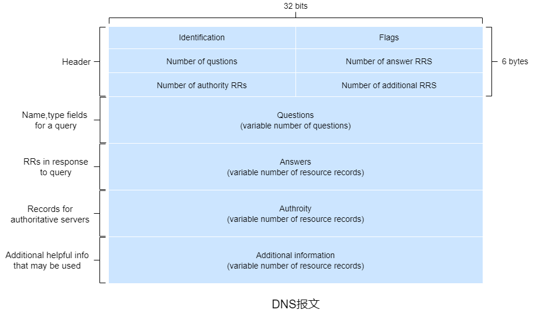

&emsp;&emsp;DNS报文分为查询和应答报文，报文格式相同。

&emsp;&emsp;﹡在首部区域，第一个字段占16位，用于标识该查询，该字段会被复制到应答报文中来匹配请求。第二个字段有若干1 位的标志位。0/1标识查询/应答报文。若请求的是权威DNS服务器则应答报文会设置[权威]标志位。若客户端在DNS服务器没有资源记录时希望它执行递归查询则会设置[希望递归]标志位。若DNS服务器支持递归查询则会在应答报文设置[递归可用]标志位。剩下四个字段表示后四个区域数据的数量。

&emsp;&emsp;﹡问题区域包名称字段和类型字段，名称字段是待查询的主机名称，类型字段对应资源记录中的类型字段。

&emsp;&emsp;﹡应答区域可以包含多条资源记录。&emsp;&emsp;

&emsp;&emsp;﹡权威区域包含其他权威DNS服务器的资源记录。

&emsp;&emsp;﹡附加信息区域包含其他有用的资源记录。

#### 2.5 P2P文件分发

##### 2.5.1 P2P体系结构

&emsp;&emsp;**分发时间**是所有$n$个对等方得到$f(bit)$文件的副本所需时间。


&emsp;&emsp;$D_{cs}$表示C/S体系结构的分发时间，其中服务器需要上传$n$个文件的副本，则
$$
\begin{align}
D_{cs}&\geqslant max\{D_c,D_s\}\\&\geqslant max\{\frac{f}{d_{min}},\frac{nf}{u_s}\}
\end{align}
$$
&emsp;&emsp;$D_{P2P}$表示P2P体系结构的分发时间，分发开始时只有服务器有文件，分发一次后可由对等方来分发，则
$$
\begin{align}
D_{P2P}&\geqslant max\{D_c,D_s,\frac{nf}{u_{total}}\}\\&\geqslant max\{\frac{f}{d_{min}},\frac{f}{u_s},\frac{nf}{u_s+\sum_{i=1}^{n}u_i}\}
\end{align}
$$

##### 2.5.2 BitTorrent

&emsp;&emsp;参与文件分发的所有对等方的集合称为**洪流**。在一个洪流中的对等方彼此下载等大小的文件块，通常是256KB。每个洪流具有一个基础设施节点，称为**追踪器**。当有对等方加入洪流时需要向追踪器注册并周期性地通知是否在洪流中。


&emsp;&emsp;与对等方建立TCP连接的其他对等方称为该对等方的**邻居/邻近对等方**。

&emsp;&emsp;**最稀缺优先**即优先请求本身没有且邻居中副本最少的块。这样可以大致地均衡每个块在洪流中的副本量。

&emsp;&emsp;对等方优先响应那些当前能够以==最高速度==提供副本的邻居。对等方会每十秒进行速度测量并确定速度前四的邻居，这四个邻居会被**疏通**。此外，每三十秒会随机再选择一个邻居进行交换，如果彼此都能满足，则继续交换。除了这五个邻居，其他邻居将被阻塞，即无法从该对等方获取块。这种机制被称为**一报还一报**。

#### 2.6 CDN

##### 2.6.1 视频流

&emsp;&emsp;一张未压缩/数字编码的图像有像素阵列组成，每个像素由一些比特编码来表示亮度或颜色。

&emsp;&emsp;视频是一系列图像以每秒二十四/三十张图像来展现。视频能被压缩，故可以比特率来权衡视频质量。

&emsp;&emsp;在**HTTP动态自适应流**中，视频编码为比特率不同的多个版本，每个版本都有一个不同的URL，每个版本的URL和比特率都存在HTTP服务器中的**告示文件**中。DASH运行客户端自由地切换版本。

##### 2.6.2 CDN

&emsp;&emsp;**内容分发网络**分布在多个地理位置的服务器上，并且将用户请求重定向到一个时延更低的CDN。

&emsp;&emsp;CDN分为**专用CDN**和**第三方CDN**，专用CDN由内容提供商自身拥有，第三方CDN分发多个内容提供商的内容。

&emsp;&emsp;CDN通常采用**深入**和**客邀**这两种安置原则。

&emsp;&emsp;﹡深入由Akamai首创，该原则通过在遍及全球的接入ISP中部署服务器集群来深入到ISP的接入网中。其目标是靠近端系统，通过减少端系统和CDN集群之间的链路和路由器来减少时延和提供吞吐量，但也带来了较高的维护管理成本。

&emsp;&emsp;﹡客邀被Limelight和很多其他CDN公司采用，该原则通过在少量的关键位置(通常是互联网交换点)建立大量集群来客邀ISP。相比深入，客邀的维护管理成本更低，但时延较高而且吞吐量较低。


&emsp;&emsp;大多数CDN利用DNS来截获和重定向请求。

&emsp;&emsp;1）客户端访问某Web网页。

&emsp;&emsp;2）客户端访问该Web下的某个资源时，发送了对应的DNS请求。

&emsp;&emsp;3）本地DNS服务器将DNS请求中继到该Web的权威DNS服务器，权威DNS服务器返回了CDN域下的主机名。

&emsp;&emsp;4）本地DNS服务器通过CDN域下的主机名向CDN权威DNS服务器发送DNS请求，CDN权威DNS服务器返回了CDN服务器的IP地址。

&emsp;&emsp;5）本地DNS服务器将IP地址返回给客户端。

&emsp;&emsp;6）客户端通过IP地址与CDN服务器建立TCP连接并发送HTTP请求。

&emsp;&emsp;CDN部署的核心都是**集群选择策略**，即动态地将请求重定向到CDN中的某个服务器集群/数据中心。

&emsp;&emsp;较简单的选择策略是将请求重定向到(距离DNS服务器)**地理上最近**的集群。另一种选择策略是对DNS服务器和集群之间进行周期性的时延以及丢包**实时测量**来选择。

### 第三章 传输层

&emsp;&emsp;网络层提供了主机之间的逻辑通信，传输层提供不同主机的进程之间的逻辑通信。

&emsp;&emsp;运输层的**多路复用**与**多路分解**指将主机间交付扩展到进程间交换。

&emsp;&emsp;﹡多路复用指在不同套接字中收集数据块并为每个数据块封装上首部信息从而生成报文段再将报文段传递到网络层。

&emsp;&emsp;﹡多路分解指将传输层报文段中的数据交付到正确的套接字。

&emsp;&emsp;多路复用需要**源端口号字段**^【套接字的唯一标识符】^和**目的端口号字段**^【报文段中标识目标套接字的字段】^。

&emsp;&emsp;端口号的长度是16位。0~1023之间的端口称为**周知端口号**。

&emsp;&emsp;**序号**用于为从发送端流向接收端的分组按序编号。

&emsp;&emsp;**校验和**用于分组的差错检测。

&emsp;&emsp;在信道中分组重新排序是可能的，可以表现为序号不存在于发送端和接收端的窗口中的分组/ACK的副本可能会出现。信道可以看成用来缓存分组，并在==任意时刻==释放这些分组。

&emsp;&emsp;通过设置分组的TTL来实现序号在发送端确定不会出现之前不会再被使用。

#### 3.1 UDP

&emsp;&emsp;UDP在发送报文段前传输层实体间没有握手，故UDP被称为==无连接==的。


&emsp;&emsp;UDP首部有四个字段，每个字段由2字节构成。

&emsp;&emsp;﹡长度字段即报文段中的字节数(首部+应用数据)。


&emsp;&emsp;伪首部包括源IP地址、目的IP地址、填充0的保留字段、传输层协议号以及报文长度。

&emsp;&emsp;发送端在计算校验和时需要先加上伪首部并将校验和字段置零，将伪首部、首部和应用数据转换成16位二进制(不足部分填充零)并求和，求和时需要回卷(如果进位到第17位则将结果加一)，将和取反得到校验和，发送端将设置校验和并去掉伪首部。接收端计算校验和方式类似于发送端(不需要将校验和置零)，最后结果全为一则说明数据无误，否则警告。

&emsp;&emsp;由于无法确保链路的可靠和内存中的差错检测，UDP在端到端基础上的传输层进行差错检测，这种设计被称为**端到端原则**，即同样功能的实现成本在较低级别相比较高级别可能较高。

#### 3.2 可靠数据传输

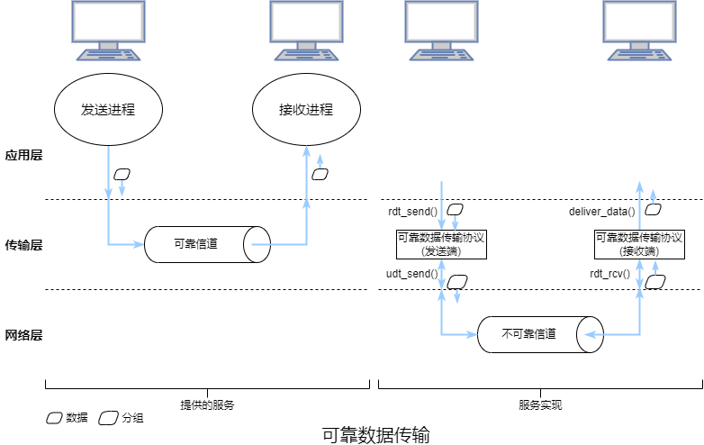

##### 3.2.1 rdt1.0


&emsp;&emsp;rdt1.0协议指经完全可靠信道的可靠数据传输，故接收端就不需要提供任何反馈信息给发送端。

&emsp;&emsp;FSM的初始状态用虚线表示。发送端和接收端的FSM都只有一个状态，故变迁必定是从一个状态返回到本身。

&emsp;&emsp;上层应用调用发送端的过程中，发送端只通过`rdt_send(data)`接收数据，经由`make_pkt(data)`产生一个包含该数据的分组，并将分组发送到信道中。

&emsp;&emsp;较低层协议调用接收端的过程中，接收端通过`rdt_rcv(packet)`从底层信道接收一个分组，经由`extract(packet,data)`取出数据，并通过`deliver_data(data)`将数据传输给上层。

##### 3.2.2 rdt2.0

&emsp;&emsp;通过**肯定确认**或**否定确认**来让发送端知道那些内容被正确接收或接收有误需要重传的可靠传输协议称为**自动重传请求**协议。自动重传请求协议还需要==差错检测==、==接收端反馈==^【用1位来表示，0是NAK，1是ACK】^和==重传==来处理比特差错的情况。


&emsp;&emsp;rdt2.0相比rdt1.0，加入了差错检测和肯定/否定确认。

&emsp;&emsp;当发送端等待ACK/NCK时不能从上层获取数据或发送分组，故rdt2.0被称为**停等**协议。

&emsp;&emsp;发送端有两个状态。在左边的状态中，发送端正在等待上层调用。当出现`rdt_send(data)`时，发送端将通过`make_pkt(data,checksum)`产生一个包含数据和校验和的分组，经由`udt_send(sndpkt)`发送该分组。在右边的状态中，发送端正在等待接收端回传的ACK/NAK。若收到ACK分组，即`rdt_rcv(rcvpkt) && isACK(rcvpkt)`，发送端会回到等待上层调用的状态。若收到NAK分组，即`rdt_rcv(rcvpkt) && isNAK(rcvpkt)`，发送端会重传分组并等待接收回传的ACK/NAK。

&emsp;&emsp;接收端只有一个状态。当分组到达时，接收端回传ACK/NAK，即`rdt_rcv(rcvpkt) && notcorrupt(rcvpkt)`或`rdt_rcv(rcvpkt) && corrupt(rcvpkt)`。

&emsp;&emsp;但是rdt2.0忽视了ACK/NAK分组受损的情况，解决这一问题的简单方法就是添加一个新字段来表示发送数据分组的序号。


&emsp;&emsp;rdt2.1是rdt2.0的修订版，rdt2.1的发送端和接收端FSM的状态数都是以前的两倍，因为需要反映出目前分组的序号。rdt2.1使用了接收端到发送端的ACK/NAK。当收到乱序的分组时，接收端回传ACK。当收到受损的分组时，接收端回传NAK。


&emsp;&emsp;rdt2.2相比rdt2.1，rdt2.2无NAK，而是对上一次正确接收的分组回传ACK。发送端收**冗余ACK**后，就知道了接收端没有正确接收到冗余ACK对应的分组后的分组。因此，ACK报文需要一个序号字段。

##### 3.2.3 rdt3.0


&emsp;&emsp;rdt3.0是用于具有比特差错的丢包信道的协议。通过在发送端中加入**倒数计时器**来解决超时/丢包问题，接收端与rdt2.2相同。

&emsp;&emsp;因为分组序号在0和1之间交替，rdt3.0也被称为**比特交替协议**。

##### 3.2.4 流水线可靠数据传输协议


&emsp;&emsp;停等协议存在一定的性能问题，简单的解决方式就是不使用停等，允许发送方发送多个分组而无须等待。因为许多从发送端到接收端的分组可以被看出是填充到一条流水线，故这种技术被称为**流水线**。

&emsp;&emsp;流水线需要可靠数据传输协议增加序号的范围和发送/接收端缓存分组，而这些取决于差错恢复。流水线的差错恢复包括**回退N步**和**选择重传**。

##### 3.2.5 回退N步


&emsp;&emsp;随着协议的运行，该窗口的序号空间向前滑动，故$N$被称为窗口长度，GBN也被称为滑动窗口协议。

&emsp;&emsp;$base$表示最早待确认的分组的序号，$nextseqnum$表示最早的待发送的分组的序号。

&emsp;&emsp;$[0,base-1]$表示已被确认的分组，$[base,nextseqnum-1]$表示待确认的分组，$[nextseqnum,nextnum+N-1]$表示待发送的分组，$[nextnum+N,+\infty)$表示不可用的分组，直到当前流水线中待确认的分组确认。


&emsp;&emsp;发送端必须响应==上层的调用==、==接收ACK==和==处理超时==。

&emsp;&emsp;当上层调用`rdt_send()`时，发送端先检测发送窗口是否已满。若窗口未满则产生一个分组发送并更新对应的变量，否则反馈上层。不存在待确认分组的情况下首次发送分组时会设置一个计时器。当收到ACK但仍存在待确认的分组时，计时器将重置。当不存在待确认的分组时停止计时器。

&emsp;&emsp;接收端用$expectedseqnum$来表示按序待接收的分组的序号。

&emsp;&emsp;接收端对序号为$n$的分组使用**累积确认**的方式，表明已正确收到序号在$n$之前且包括$n$的所有分组。

&emsp;&emsp;当接收端收到序号为$n$的分组且上次交付给上层的分组的序号是$n-1$时会对分组$n$回传ACK，否则丢弃该分组并对最近交付给上层的分组回传ACK。

&emsp;&emsp;接收端会丢失所有乱序分组，因为这些分组还会重传。


##### 3.2.6 选择重传


&emsp;&emsp;发送端仅重传那些在接收方可能丢失/受损的分组，也可能收到窗口内某些分组的ACK。

&emsp;&emsp;接收端将确认一个正确接收的分组而不管是否按序，乱序的分组将被缓存，当所有的乱序分组都被接收后再一起交付给上层。

&emsp;&emsp;当上层调用`rdt_send()`时，发送端检测可用于分组的序号是否在窗口内。若在窗口内则产生一个分组发送，否则反馈上层。每个分组都有一个计时器。当收到ACK时，若ACK对应的分组序号在窗口内则将该分组标记为已确认，若ACK对应的分组序号等于$send\_base$则将窗口移动至待确认的最小序号处。窗口移动后且窗口内存在待发送的分组，这些分组将被发送。

&emsp;&emsp;对接收端，==序号在$[rcv\_base-N,rcv\_base+N-1]$内的分组将被正确接收==。若接收分组的序号在窗口内将回传ACK，分组首次接收时缓存该分组。若接收分组的序号等于$rcv\_base$，则该分组以及缓存中序号始于该分组的序号且连续的所有分组将交付给上层。若接收分组的序号在$[rcv\_base-N,rcv\_base-1]$，则==必须==回传一个ACK，无论该分组是否已被确认。


&emsp;&emsp;SR问题在于发送端/接收端之间缺乏同步，唯一能确定的是只有信道中收到的分组/ACK。


&emsp;&emsp;SR的窗口长度必须小于或等于序号去重后的数量的一半。

#### 3.3 拥塞控制原理

##### 3.3.1 拥塞原因与代价


&emsp;&emsp;$\lambda_{in} (B/s)$表示应用层通过套接字发送初始报文到传输层的速度，$\lambda_{out} (B/s)$表示应用层接收报文的速度。

&emsp;&emsp;分组通过一台路由器在容量为$R$的共享式输出链路上传输，忽略添加底层首部信息的开销、差错恢复、流量控制和拥塞控制，显然$\lambda_{out} \leqslant \frac{R}{2}$ 。时延的增长率随着$\lambda_{in}$增长，$\lambda_{in}$达到$\frac{R}{2}$时时延无穷大。这里体现了==拥塞的代价之一：当分组的到达速度接近链路容量时，分组承受巨大的排队时延==。


&emsp;&emsp;$\lambda^{'}_{in} (B/s)$表示传输层发送初始报文段和重传报文段到网络层的速度，也称为**供给载荷**。

&emsp;&emsp;假设发送端能确定路由器的可用缓存并根据情况发送分组，所以不会丢包，$\lambda_{in}=\lambda^{'}_{in}$，连接的吞吐量为$\lambda^{'}_{in}$。在这种情况下，平均主机发送速度不能超过$\frac{R}{2}$。

&emsp;&emsp;假设发送端仅确定分组丢失后下才重传，当$\lambda_{in}^{'}=\frac{R}{2}$且平均时 $\lambda_{in}=\lambda_{out}=\frac{R}{3}$。这里体现了==拥塞的代价之一：发送端必须重传因缓存溢出而丢失的分组==。

&emsp;&emsp;假设发送端重传因排队时延超时但未丢失的分组，当$\lambda_{in}^{'}=\frac{R}{2}$且平均(转发两次)时$\lambda_{in}=\lambda_{out}=\frac{R}{4}$。这里体现了==拥塞的代价之一：发送方因较大的时延进行了不必要的重传来占用路由器额外的链路带宽==。


&emsp;&emsp;当$\lambda_{in}$较小时，路由器缓存比较充足，吞吐量大致等于供给载荷，$\lambda_{out}$随着$\lambda_{in}$增大而增大。当$\lambda_{in}$较大时，对于R2，主机B发送的分组的到达速度高于主机A发送的分组的到达速度，这会导致主机A发送的分组因缓存溢出而丢失。

&emsp;&emsp;若考虑网络资源的浪费，当分组在第二跳及之后的路由器丢失时，之前路由器的转发工作毫无意义。这里体现==拥塞的代价之一：分组被丢弃时转发过该分组的上游路由器因转发而使用的传输容量被浪费==。

##### 3.3.2 拥塞控制方法

&emsp;&emsp;根据网络层是否为传输层提供了显示支持可将拥塞控制分为==端到端拥塞控制==和==网络辅助拥塞控制==。

&emsp;&emsp;在端到端拥塞控制中，网络层==没有==为传输层提供显示支持。即使网络中存在拥塞，端系统也必须通过对丢包和时延等网络行为的观察来确定是否拥塞。

&emsp;&emsp;在网络辅助的拥塞控制中，路由器向发送端提供关于的拥塞状态的显示反馈信息。拥塞信息反馈到发送端通常有两种方式，一种是路由器直接发送关于拥塞状态的分组给发送端，此时该分组称为**抑制分组**。另一种方式更通用，TCP、DCCP和DCTCP都有使用。路由器更新==由发送端到接收端的数据报头部中的ECN拥塞标志位==来表示出现拥塞。若接收端收到分组的标志位表示出现拥塞则会通知发送端，故这种方式至少需要一个完整的往返周期。

#### 3.4 TCP

&emsp;&emsp;在进程发送数据之前，进程间必须握手，即相互发送一些预备报文段来设置确保数据传输的参数，故TCP是**面向连接的**。

&emsp;&emsp;TCP连接只能有一个客户端和一个服务器，故TCP是**点对点**的。

&emsp;&emsp;进程间建立TCP连接后，双方都可以发送/接收报文段，故TCP是**全双工服务**。

&emsp;&emsp;TCP根据ACK到达的速度来调节拥塞窗口，故TCP是**自计时**的。

&emsp;&emsp;客户端先发送一个特殊的报文段，服务器用另一个特殊报文段来响应，最后，客户端用第三个特殊报文段作为响应，这种建立连接的过程被称为**三次握手**。前2个报文段不承载有效载荷，第三个报文段可以承载有效载荷。

&emsp;&emsp;TCP的双方都由一个接收缓存、一个发送缓存和几个变量组成。

&emsp;&emsp;TCP会使用**重传计时器**、**坚持计时器**、**保活计时器**和**时间等待计时器**这四种计时器。重传计时器用于报文段重传。坚持计时器用于防止双方的死锁。保活计时器用于在长连接中断开无响应的连接。时间等待计时器用于四次握手断开连接前的等待。

&emsp;&emsp;**最大传输单元**指从源到目的地所有链路上发送的最大链路层帧。**最大报文段长度**是报文段中有效载荷的最大长度。最大传输单元一般是1500字节，TCP/IP首部的长度一般是40字节，故最大报文段长度一般是1460字节。

&emsp;&emsp;当收到按序报文段时，若序号在按序报文段之前的报文段都已经确认，则等待下一个按序报文段最多500ms，超时则发送ACK。若还存在另一个按序报文段待确认，则立即发送单个累积ACK来确认这两个报文段。

&emsp;&emsp;当收到序号在按序报文段之后的报文段时则立即发送冗余ACK。

&emsp;&emsp;一旦收到3个冗余ACK，TCP就执行**快速重传**。

&emsp;&emsp;当==超时或收到3个冗余ACK==时，发送端出现了丢包。

&emsp;&emsp;TCP的差错恢复机制是**选择性确认**，即有选择地确认乱序报文段。

##### 3.4.1 TCP报文段

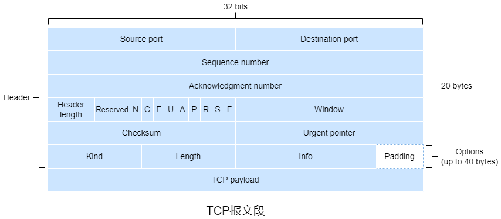

&emsp;&emsp;TCP报文段包括16位**源端口**、16位**目的端口**、32位**序号**、32位**确认序号**、4位**首部长度**、3位保留字段、9个标志位、16位**窗口长度**、16位**校验和**、16位**紧急指针**以及最多40字节的的选项字段。

&emsp;&emsp;TCP将数据看成一个无结构且有序的字节流，通过字节流确定序号，序号是==报文段首字节的编号==。初始序号一般随机。

&emsp;&emsp;确认号是==下一次按序应接收报文段首字节的编号==。TCP只确认报文段有效载荷中到第一个丢失字节为止的字节，故TCP提供**累积确认**。当有效载荷为空时吗，确认号被**捎带**在报文段中。

&emsp;&emsp;9个标志位中第2、3位标志位用于显式拥塞控制，若发送端至接收端链路中的某个路由器出现拥塞，当数据报达到该路由器后，路由器将数据报头部中的ECN标识为置1，接收端收到数据报后将ACK报文段头部中的`ECE`置1来通知发送端链路出现拥塞，发送端像快速重传一样对`ECE`为1的ACK回应ACK，发送端在下一个报文段中将`CWR`置1来通知接收端拥塞窗口已缩减。后6个标志是控制位。

&emsp;&emsp;﹡**NS/N**通常用于防止标记数据包被意外或恶意地隐藏。

&emsp;&emsp;﹡**CWR/C**为1时通知对方拥塞窗口已缩减。

&emsp;&emsp;﹡**ECE/E**为1时通知对方链路出现拥塞。

&emsp;&emsp;﹡**Urgent/URG/U**为1时表示高优先级报文段，紧急指针生效。

&emsp;&emsp;﹡**ACK/A**为1时表示确认序号生效，报文段成功接收。

&emsp;&emsp;﹡**Push/PSH/P**为1时表示应该立即将该报文段交给应用层而不用等待缓存区填满。

&emsp;&emsp;﹡**Reset/RST/R**为1时表示重置连接。

&emsp;&emsp;﹡**Synchronization/SYN/S**为1时表示三次握手中建立连接。

&emsp;&emsp;﹡**Finish/FIN/F**为1时表示四次挥手中断开连接。

&emsp;&emsp;选项字段包括8位Kind、可变的Length以及可变的Info。

| Kind字段值 | Length字段值 | Info字段长度 | 名称                       | 含义           |
| ---------- | ------------ | ------------ | -------------------------- | -------------- |
| 0          | 1            |              | 选项表结束(EOP)            |                |
| 1          | 1            |              | 空操作(NOP)                |                |
| 2          | 4            | 2字节        | 最大报文段长度(MSS)        |                |
| 3          | 3            | 1字节        | 窗口扩大系数(WSOPT)        | 窗口长度扩展   |
| 4          | 2            |              | 选择性确认(SACK-Premitted) | 表示支持SACK   |
| 5          | 可变         |              | 选择性确认(SACK)           | 收到的乱序数据 |
| 8          | 10           |              | TSPOT                      | 时间戳         |
| 19         | 18           |              | TCP-MD5                    | MD5认证        |
| 28         | 4            |              | User Timeout(UTO)          | 超时时间       |
| 29         | 可变         |              | TCP-AO                     | 认证算法       |
| 253/254    | 可变         |              | Experimental               | 保留           |

&emsp;&emsp;窗口长度用于流量控制服务。

&emsp;&emsp;校验和的计算类似于[UDP的校验和](#3.1 UDP)。

##### 3.4.2 连接管理


&emsp;&emsp;1）客户端向服务器发送**SYN(报文段)**，即报文段的有效载荷为空，`SYN`为1，客户端进入`SYN_SENT`。

&emsp;&emsp;2）服务器收到SYN后为该连接分配TCP缓存和变量，再向客户端发送**SYNACK**(报文段)，即ACK报文段的`SYN`为1，最后服务器进入`SYN_RCVD`。

&emsp;&emsp;3）客户端收到SYNACK后该连接分配TCP缓存和变量，再向服务器发送ACK，此时连接已建立，`SYN`置为0，最后服务器进入`ESTABLISHED`。服务器收到ACK后进入`ESTABLISHED`。


&emsp;&emsp;1）客户端向服务器发送**FIN**(报文段)，即报文段的有效载荷为空，`FIN`为1，客户端进入`FIN_WAIT_1`。

&emsp;&emsp;2）服务器收到FIN后发送ACK并进入`CLOSE_WAIT`。客户端收到ACK后进入`FIN_WAIT_2`。

&emsp;&emsp;3）服务器向客户端发送FIN并进入`LAST_ACK`。

&emsp;&emsp;4）客户端收到FIN后发送ACK并进入`TIME_wAIT`，同时设置时间等待计时器，到时后释放资源(包括端口号)并进入`CLOSED`。服务器收到ACK后释放资源并进入`CLOSED`。


&emsp;&emsp;在TCP连接的生命周期中，运行在每台主机的TCP协议会在各种**TCP状态**间变迁。

##### 3.4.3 超时

&emsp;&emsp;SampleRTT表示报文段从发送(交付给IP)到收到该报文段的确认所需时间。TCP不会为重传的报文段测量SampleRTT，仅仅为只需要传输一次的报文段测量。

&emsp;&emsp;EstimatedRTT表示SampleRTT的平均值。
$$
EstimatedRTT=(1-\alpha)\times EstimatedRTT+ \alpha \times SampleRTT(\alpha =\frac{1}{8})
$$
&emsp;&emsp;DevRTT表示SampleRTT偏离EstimatedRTT的程度。
$$
DevRTT=(1-\beta)\times DevRTT+\beta \times |SampleRTT-EstimatedRTT|(\beta=\frac{1}{4})
$$
&emsp;&emsp;EstimatedRTT和DevRTT的计算方式是**指数加权移动平均**。

&emsp;&emsp;TimeoutInterval表示超时时间，公式为$TimeoutInterval=EstimatedRTT+4\times DevRTT$。

##### 3.4.4 流量控制

&emsp;&emsp;TCP用**流量控制服务**来使发送端的发送速度和接收端的读取速度相匹配，这一服务通过让==发送端==维护**接收窗口**^【表示接收端可用缓存空间】^的变量来实现。

&emsp;&emsp;$RevBuffer$表示接收端的接收缓存的大小。$LastByteRead$表示接收端在接收缓存中读取的数据流的最后一个字节的编号。$LastByteRcvd$表示接收端缓存至接收缓存的数据流的最后一个字节的编号。$rwnd$表示接收窗口。
$$
rwnd=RcvBuffer-[LastByteRcvd-LastByteRead]
$$
&emsp;&emsp;接收端将报文段中窗口长度字段设置为$rwnd$来告知发送端可用缓存空间。

&emsp;&emsp;$LastByteSent-LastByteAcked$表示发送端待确认的数据量。
$$
LastByteSent-LastByteAcked\leqslant rwnd
$$


&emsp;&emsp;当发送端收到的窗口长度为零的ACK时，会设置坚持计时器并发送一个有效载荷为一字节的探测报文段，若计时器超时或收到ACK的窗口长度为零时会再次发送同样的报文段并重置计时器，否则继续发送有效载荷为有效数据的报文段。

##### 3.4.5 TCP拥塞控制

&emsp;&emsp;网络层不向端系统提供显示的网络拥塞反馈，故TCP只能使用端到端拥塞控制。

&emsp;&emsp;TCP发送端相比接收端多个变量，即**拥塞窗口**，用来限制发送速度。发送端未被确认的数据不能超过接收窗口与拥塞窗口的最小值。
$$
LastByteSent-LastByteAcked \leqslant min\{cwnd,rwnd\}
$$
&emsp;&emsp;假设接收窗口足够大、忽略丢包与时延以及发送端总有数据需要发送，==发送速度大致等于$\frac{cwnd}{RTT}(B/s)$==。

&emsp;&emsp;当某路径出现拥塞时，该路径上的一/多个路由器的缓存会溢出并导致某个数据包丢失，进而引发发送端的丢包，此时发送端可以确定该路径出现了拥塞。

&emsp;&emsp;==带宽探测：丢包表示出现了拥塞，应该降低发送速度。当未确认报文段的ACK到达时应该提高发送速度。==

###### 3.4.5.1 TCP拥塞控制算法

&emsp;&emsp;TCP拥塞控制算法包括**慢启动**、**拥塞避免**和**快速恢复**。

&emsp;&emsp;TCP拥塞控制被称为**加性增、乘性减**拥塞控制方式。加性增指在拥塞避免阶段$cwnd$的线性增加，乘性减指进入快速恢复阶段时$cwnd$的减半，若结果不是整数则向下取整。


&emsp;&emsp;在慢启动阶段，$cwnd$的初始值是$MSS$，$ssthresh$的初始值是$64KB$。每当报文段首次确认$cwnd$就增加$MSS$，即指数级增长。若出现超时导致的丢包，发送端令$ssthresh=\frac{cwnd}{2}$，$cwnd=MSS$并重新开始慢启动。当$cwnd \geqslant ssthresh$时发送端结束慢启动并进入拥塞避免阶段。当收到3个冗余ACK时，发送端结束慢启动并令$ssthresh=\frac{cwnd}{2}$，$cwnd=\frac{ssthresh}{2}+3MSS$，然后执行快速重传，最后进入快速恢复阶段。

&emsp;&emsp;在不考虑处理时间的情况下，客户端发送请求到远程数据中心并收到响应大致需要$4RTT$，其中建立TCP需要$RTT$，慢启动阶段需要$3RTT$。显然，当$RTT$较大时，时延也较大。可以使用**TCP分岔**解决这一问题，即通过CDN将请求转发至邻近客户端且与远程数据中心有很大窗口的连接的前端服务器，在这种情况下响应所需时间大致是$4RTT_{FE}+RTT_{BE}+处理时间$，其中$RTT_{FE}$表示客户端与前端服务器的往返时间，$RTT_{BE}$表示前端服务器与远程数据中心的往返时间。当前端服务器与客户端足够近，就可以忽略$RTT_{FE}$，此时响应所需时间大致等于$RTT$。

&emsp;&emsp;在拥塞避免阶段，每个$RTT$内$cwnd$仅增加$MSS$。通用实现方法是若$RTT$内发送了$n$个报文段，在此期间每个报文段首次确认时$cwnd$增加$\frac{cwnd}{n}$。超时和3个冗余ACK的情况同慢启动。

&emsp;&emsp;在快速恢复阶段，每收到一个冗余ACK，$cwnd$增加$MSS$。当收到了新报文段的首次ACK，发送端会结束快速恢复阶段并进入拥塞避免阶段。当出现超时导致的丢包时发送端会结束快速恢复并令$ssthresh=\frac{cwnd}{2}$，$cwnd=MSS$，然后进入慢启动阶段。

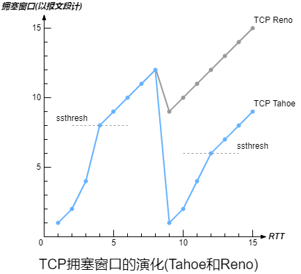

&emsp;&emsp;TCP的较新版本**TCP Reno**的快速恢复阶段符合上述情况。但TCP的早期版本**TCP Tahoe**在快速恢复阶段只要出现丢包都会结束快速恢复并令$ssthresh=\frac{cwnd}{2}$，$cwnd=MSS$，然后进入慢启动阶段。

&emsp;&emsp;TCP Vegas试图在维持较好吞吐量同时避免拥塞，通过测量RTT来衡量拥塞程度，根据拥塞程度线性地降低发送速度。TCP Vegas提供了慢启动、拥塞避免、快速恢复、快速重传和SACK。

###### 3.4.5.2 平均吞吐量

&emsp;&emsp;当计算一个吞吐量较大的连接的平均吞吐量时，因为慢启动阶段和快速恢复阶段通常很短，都可以忽略，故可以认为该连接处于拥塞避免阶段。在一个RTT内，窗口长度是$w(B)$，吞吐量大约是$\frac{w}{RTT}$。在出现丢包之前，每个RTT内$w=w+MSS$。用$W$表示出现丢包时$w$的值。

&emsp;&emsp;若在一段时间内吞吐量从$\frac{W}{2RTT}$线性增长到$\frac{W}{RTT}$，丢包仅出现了一次且发生在最后。
$$
\begin{align}
Segment_{total}&=\frac{W}{2RTT}\times RTT+\frac{W+2}{2RTT}\times RTT+\cdots +\frac{W}{RTT}\times RTT\\
&=(\frac{W}{4}+\frac{W}{2}) \times (\frac{W}{4}+\frac{1}{2})\\
&=\frac{3W^2}{8}+\frac{3W}{4}\\
\end{align}
$$
&emsp;&emsp;丢包率$L=\frac{Segment_{loss}}{Segment_{total}}$。
$$
\begin{align}
L&=\frac{1}{Segment_{total}}\\
&=\frac{1}{\frac{3W^2}{8}+\frac{3W}{4}}\\
&=\frac{8}{3W^2+6W}
\end{align}
$$
&emsp;&emsp;由于${3W^2}>>{6W}$，$6W$可以忽略，故$W \approx \sqrt{\frac{8}{3L}}$。由于增长是线性，平均吞吐量是$\frac{3W}{4RTT}(MSS)$。
$$
\begin{align}
平均吞吐量&=\frac{\sqrt{6}MSS}{2RTT\sqrt{L}}\\
&\approx \frac{1.22\times MSS}{RTT\sqrt{L}}
\end{align}
$$

###### 3.4.5.3 公平性

&emsp;&emsp;**瓶颈链路**指沿着某连接路径上的每条连接都不拥塞且相比该链路的传输容量都具有足够的传输容量。

&emsp;&emsp;假设$K$条TCP连接每条的端到端路径不同，但是都经过一段传输速率为$R(b/s)$的瓶颈链路。若每条连接都在传输一个大文件且无UDP流量通过该链路，而且每条连接的平均传输速度接近$\frac{R}{K}$，则认为该拥塞控制机制是**公平**的。在这种理想情况下，当所有连接的RTT相同时才能平等共享带宽。实际上这些条件不能满足，具有较小RTT的连接可以更快地扩大拥塞窗口。

&emsp;&emsp;UDP并没有内置的拥塞控制机制，UDP是不公平的，UDP可能抑制TCP。

&emsp;&emsp;当一个应用使用多条并行TCP连接时，对单条TCP连接可能是公平的，但对应用并不公平。

### 第四章 网络层

&emsp;&emsp;网络层提供的服务是**尽力而为服务**。

&emsp;&emsp;**转发**是指将分组从一个输入链路接口转移到适当的输出链路接口的路由器本地动作。转发所需时间通常为几纳秒，故通过硬件实现。

&emsp;&emsp;**路由选择**是指确定数据报从源到目的地的端到端路径的网络范围处理过程。路由选择所需时间通常为几秒，故通过软件来实现。

&emsp;&emsp;网络层可以分为**数据平面**和**控制平面**。

&emsp;&emsp;﹡数据平面即==路由器的功能==，用于从路由器的输入链路向输出链路转发分组，包括传统的==IP地址转发==和==通用转发==。两者都采用匹配加动作的模式，匹配是匹配分组，动作是匹配之后的动作，区别在于IP地址转发是根据IP地址匹配，而通用转发是根据协议栈对多个首部字段进行匹配。

&emsp;&emsp;﹡控制平面即==网络范围的逻辑==，用于协调路由器间的转发动作，使得分组最终沿着源主机和目的主机之间的路径进行端到端传输。可以通过传统的**每路由器控制**(每台都有转发和路由选择功能，每台路由器还有一个路由选择组件，该组件与其他路由器中的路由组件通信以计算转发表的值)和**SDN控制**(逻辑集中控制器计算并分发转发表给每台路由器)来构建控制平面。

&emsp;&emsp;**网络服务模型**定义了分组在发送与接收端系统之间的端到端运输特性。

&emsp;&emsp;主机与物理链路之间之间的边界叫做**接口**。路由器与其任意一条链路之间的边界也叫做接口，例如输入端口或输出端口。在技术层面上，一个IP地址与一个接口相关，而不是与包括该接口的主机/路由器相关。在公网中，除NAT接口之外的每台主机/路由器的每个接口都必须有个公网IP地址。

&emsp;&emsp;IP地址一般划分为网络地址和主机地址。主机地址不能全为0/1，主机地址全为0的地址是网络地址，主机地址全为1的地址是广播地址。

&emsp;&emsp;**子网掩码**用来区分IP地址的网络地址和主机地址，故必须与IP地址结合使用。

&emsp;&emsp;**IP广播**分为**受限广播**和**直接广播**。受限广播中发送数据报时不会进行路由选择，而是被广播到所属==物理网络==上的所有主机，**受限广播IP地址**全为1。直接广播中发送数据报时进行路由选择并广播到所属网络的所有主机，**直接广播IP地址**的主机地址全为1。IP广播地址除了受限广播地址和直接广播地址，还有**指向子网的广播IP地址**(主机地址全为1)以及**指向所有子网的广播IP地址**(子网地址和主机地址去全为1)。

&emsp;&emsp;第一跳路由器的IP地址称为**默认网关**。


&emsp;&emsp;**网络地址转换**是将数据报中的IP地址转换成另一个IP地址，主要用于实现内网访问公网的功能。

&emsp;&emsp;在互联网中每个**自治系统**由一组受相同管理控制的路由器组成，通常在一个ISP中的路由器以及互联它们的链路构成一个自治系统。自治系统由全局唯一的AS号(ASN)所标识。在同一自治系统中的路由器运行相同的路由选择算法并有彼此的信息。

&emsp;&emsp;在一个自治系统内运行的路由选择协议称为**自治系统内部路由选择协议**。自治系统间的路由选择协议称为**自治系统间路由选择协议**。两者的差别主要体现在策略、规模以及性能这三个方面。

&emsp;&emsp;﹡从策略的角度，AS内部都在同一管理控制下，策略在AS内部路由选择中起着微不足道的作用；AS间路由选择承载了路径属性并提供路由信息的受控分布，以便能做出基于策略的路由选择决策。

&emsp;&emsp;﹡从规模的角度，规模不是AS内部路由选择的关注重点，但它是AS间路由选择协议的关键问题。

&emsp;&emsp;﹡从性能的角度，AS内部路由选择协议注重路由的性能；AS间路由选择是面向策略的，因此所选路由的性能是次要问题。

&emsp;&emsp;互联网中所有AS运行相同的AS间路由选择协议，即**边界网关协议**，边界网关协议还常用于实现**IP任播**。

&emsp;&emsp;**存根网络**又称为桩网络或末端网络，指仅有一条(默认)路径连接到其他网络。

&emsp;&emsp;**网络功能虚拟化**指将用服务器、交换机和存储设备来代替复杂的中间盒。

#### 4.1 路由器


&emsp;&emsp;线路终端的功能是结束传入物理链路的物理层功能。

&emsp;&emsp;数据链路处理的功能是与位于传入链路远端的数据链路层交互的数据链路层功能。

&emsp;&emsp;当一条链路是双向时，输入端口和输出端口通常成对出现在同一线路卡上。

##### 4.1.1 IP地址转发

&emsp;&emsp;每台路由器都有**转发表**。路由选择处理器通过使用路由选择协议与其他路由器中的路由选择处理器交互来计算/更新转发表。在SDN路由器中，路由选择处理器用来接收远程控制器计算的转发表项更新转发表。

&emsp;&emsp;路由选择处理器经过独立总线将转发表复制到线路卡。通过转发表的副本，每个输入端口就可以本地完成转发，避免了集中式处理的瓶颈。

&emsp;&emsp;路由器根据分组目的地址的**前缀**与转发表中的表现进行匹配。当有多个匹配项时，路由器使用**最长前缀匹配规则**。

&emsp;&emsp;可以使用**三态内容寻址存储器**来保证查询转发表所需时间维持在一个常数内。

&emsp;&emsp;找到分组的输出端口后，分组就可以进入交换结构了，但如果该输出端口已被占用，分组可能在进入交换结构前暂时阻塞。

##### 4.1.2 交换结构


&emsp;&emsp;﹡==经内存交换==：最简单、最早的路由器是传统的计算机，输入端口与输出端口之间的交换是在CPU(路由选择处理器)的直接控制下完成的。输入/输出端口的功能就像传统操作系统中的I/O设备一样。当分组到达到达一个输入端口时，该端口先通过中断方式向路由选择控制器发送信号，该分组从输入端口复制到内存，路由选择处理器从分组首部中获取IP，查询转发表获取输出端口并将分组复制到输出端口的缓存中。若内存每秒能读/写$B$个分组，则总转发吞吐量必定小于$\frac{B}{2}$，因为共享系统总线每次仅能执行一个内存读/写。

&emsp;&emsp;﹡==经总线交换==：输入端口经一根共享总线将分组直接传输到输出端口，不需要路由选择控制器的干预。输入端口预先为分组指定一个交换机内部标签(首部)^【仅用来跨越总线】^并指示输出端口。每个输出端口都能收到该分组，但只有指定的输出端口才能保存该分组，指定的输出端口保存分组后去掉标签。每次仅有一个分组能跨域总线，故分组有时需要等待，导致路由器的带宽受限于总线速度。

&emsp;&emsp;﹡==经互联网络交换==：纵横式交换机是由$2N$条总线构成的互联网络，包括$N$个输入端口和$N$个输出端口。每条垂直的总线与每条水平的总线交叉，交叉点通过交换结构控制器实现随时开启/闭合。纵横式交换机是**非阻塞**的，只有两个或以上的分组同时转发到同一个输出端口，分组不会阻塞，否则会出现分组等待。

&emsp;&emsp;部分现代路由器也通过内存进行交换，不过转发表的查找和将分组存储进适当的内存存储位置是由输入线路卡来处理。

&emsp;&emsp;更复杂的互联网络使用多级交换元素来使多个分组同时转发到同一输出端口时无需等待。例如三级非阻塞交换策略，在这种策略中，输入/输出端口连接到$N$个交换结构，输入端口将分组分成$K$个较小的块并通过$N$个交换结构发送这$K$个块到指定输出端口，输出端口再将这$K$个块组装成原本的分组。

##### 4.1.3 排队

&emsp;&emsp;假设纵横式交换机有$N$个输入端口和$N$个输出端口且输入线路与输入线路速度相同，都为$R_{line}(packet/s)$。此外，所有分组具有相同的固定长度，以同步的方式到达输入端口且采用FCFS方式，即所有链路发送/接收分组的时间相等。用$R_{switch}$表示分组从输入端口传输到输出端口的速度。再假设$R_{switch}=N\times R_{line}$。


&emsp;&emsp;一个输入队列中排队的分组阻塞后，队列中该分组之后的分组也会阻塞，这种情况称为**线路前部阻塞**。由于HOL阻塞，当输入链路接收分组的度达到其容量的$58\%$时，在某些假设前提下，输入端口的队列长度将无限制地增大。

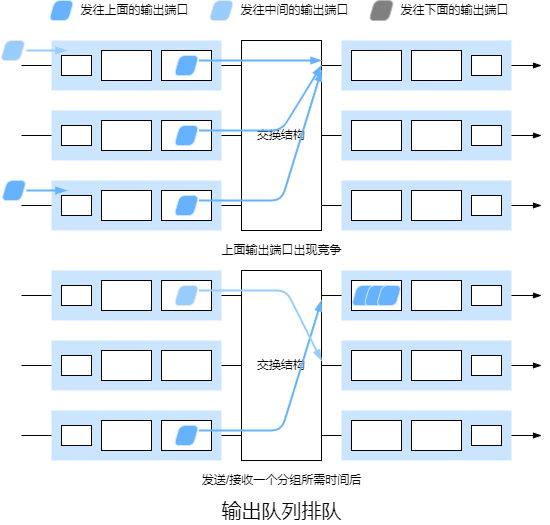

&emsp;&emsp;当没有足够缓存时，要么丢弃到达的分组(即弃尾策略)，要么删除排队中的分组。在某些情况下，在缓存填满之前便丢弃分组或在其首部加上标记，这可以向发送端反馈拥塞信号，这种策略称为**主动队列管理**策略。RED算法就算最广泛研究与实现的AQM算法之一。

&emsp;&emsp;$B$表示缓存容量，$C$表示链路容量，通常$B=RTT\times C$，当大量TCP流量经过同一链路时$B=\frac{RTT\times C}{\sqrt{N}}$。

##### 4.1.4 分组调度


&emsp;&emsp;FIFO/FCFS调度规则安装分组到达输出链路队列的顺序来传输分组。当链路正忙于传输其他分组时，到达链路输出队列的分组需要排队等待传输。若缓存不足则需要丢弃分组。


&emsp;&emsp;在**优先级排队**规则下，到达输出链路的分组被分类放入输出队列的优先级类，同一优先级采用FIFO方式。在非抢占式式优先级排队规则下，一旦分组开始传输就不能打断。


&emsp;&emsp;在**循环排队**规则下，分组会被分类，但是类之间不存在严格的优先级，循环调度器在这些类之间轮流提供服务。在**保持工作排队**规则下，有分组待传输时不会允许链路空闲，当指定类里不存在分组时，会立即检查循环序列中的下一个类。**加权公平排队**就是循环排队的一种通用实现方式，它也是保持工作队列。

&emsp;&emsp;WFQ与循环排队的不同之处在于每个类在任何时间间隔内可能收到==不同数量==的服务。对于WFQ，若有$n$个类存在分组待传输，类$i$的权值为$w_i$，即使所有类都有分组排队，类$i$总能保证至少$\frac{w_i}{\sum_{j=1}^{n}{w_j}}\times R$的吞吐量。

#### 4.2 网际协议

##### 4.2.1 IPv4数据报

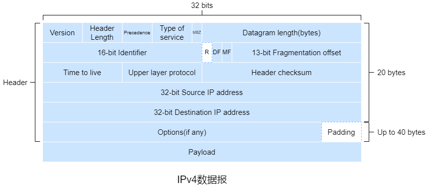

&emsp;&emsp;IPv4数据报包括4位的**版本(号)**、4位的**首部长度**、8位的**服务类型**(3位优先级、4位服务类型子字段和1位必须为零)、16位的**数据报长度**、16位的**标识**、3个**标志位**、13位的**片偏移**、8位的**生存时间**、8位的**上层协议**、16位的**首部检验和**、32位的**源IP地址**、32位的**目的IP地址**、最多40字节的**可选项**和有效载荷。

&emsp;&emsp;版本规定了IP协议版本。由于不同版本的IP协议数据报格式不同，需要版本字段来确定。

&emsp;&emsp;首部长度==以4字节为单位==表示首部长度。

&emsp;&emsp;服务类型用来区分不同类型的数据报。前3位是优先级字段，第4位到第6位是DTR字段，第4位到第7位是服务类型子字段，最后一位必须为零。服务类型子字段最多只能有1位为1。

| 优先级 | 名称                 | 含义             |
| ------ | -------------------- | ---------------- |
| 000    | routine              | 默认             |
| 001    | priority             | 数据业务         |
| 010    | immediate            | 数据业务         |
| 011    | flash                | 语音控制数据     |
| 100    | flash override       | 视频会议或视频流 |
| 101    | critic               | 语音数据         |
| 110    | internetwork control | 网络控制数据     |
| 111    | network control      | 网络控制数据     |

| 服务类型子字段 | 名称                   |
| -------------- | ---------------------- |
| 0000           | normal service         |
| 1000           | minimize delay         |
| 0100           | maximize throughout    |
| 0010           | maximize reliability   |
| 0001           | minimize monetary cost |

&emsp;&emsp;生存时间表示数据报能经过的最大路由器数量，每当路由器处理数据报时该字段值减1，当该字段值为0时丢弃该数据报。

&emsp;&emsp;由于源到目的地路径的上的每段链路可能使用不同的链路层协议，不同协议的最大传输单元可能不同，所以可能需要将数据报分成多个较小的数据报并封装成合适的链路层帧，这些较小的数据报称为**片**。片到达目的地后需要重组成原始数据报再交给传输层。重组过程在端系统完成，因为组装会给增加协议复杂性和降低路由器的性能。


&emsp;&emsp;标识、标志位以及片偏移用于分片和重组。标识是数据报的唯一值，分片时会复制到各个片中。3个标志位中第1位是保留位，第2位是禁止分片标志位，第3位是还有分片标志。DF为1时表示不能分片，MF为1时表示不是最后一个片。片偏移==以8字节为单位==表示片在原始数据报中的相对位置。

&emsp;&emsp;上层协议表示传输层所用协议的协议号。1表示ICMP，2表示IGMP，6表示TCP，17表示UDP，89表示OSPF。

&emsp;&emsp;首部校验和==仅用来校验数据报中的首部==，计算方式类似于[UDP的校验和](#3.1 UDP)。由于每次经过路由器时首部中的某些字段会改变，所以需要重新计算。

##### 4.2.2 IPv4编址

&emsp;&emsp;每个IPv4地址长度是32位，因此共有$2^{32}$个可能的IP地址。IP地址通常使用**点分十进制表示法**。

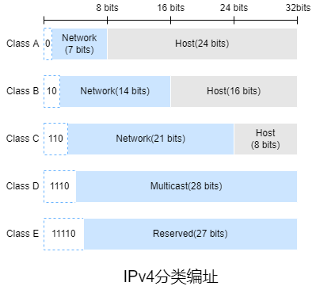

&emsp;&emsp;IPv4**分类编制**包括A、B、C三类普通地址以及D、E两类特殊地址。A类地址一般用于大型网络，B类地址一般用于中型网络，C型地址一般用于小型网络，D类地址是多播地址，E类地址是保留地址。

&emsp;&emsp;互联网的地址分配策略称为**无类别域间路由选择**。CIDR不在使用分类编址，IP地址表示为`a.b.c.d/x`。`x`表示网络地址所占的位数，该部分称为该地址的**前缀**，剩余的几位则表示主机地址。其地址掩码依然是子网掩码。使用单个网络前缀通告多个网络称为**地址聚合**或**路由聚合**或**路由摘要**。

##### 4.2.3 DHCP

&emsp;&emsp;**动态主机配置协议**允许主机自动获得IP地址、子网掩码、默认网关以及本地DNS服务器地址，故它也称为**即插即用协议**或**零配置协议**。DHCP是C/S体系结构，客户端即新到达的主机，若子网没有DHCP服务器则会由一个通常是路由器的DHCP中继代理，中继代理能够获取DHCP服务器。

&emsp;&emsp;DHCP分配IP地址包括**人工配置**、**自动配置**和**动态配置**。人工配置即管理员手动分配。自动配置即服务器为首次连接网络的客户端分配一个永久IP地址，客户端一直使用该IP地址。动态配置即按服务器为首次连接网络的客户端分配一个期限IP地址，到期后停止使用或续约。

&emsp;&emsp;DHCP租约表包括**静态租约表**和**动态租约表**，分别对应静态租约存储文件和周期存储文件。静态租约表中的IP地址不能重复使用。


&emsp;&emsp;DHCP属于**引导程序协议**，DHCP报文格式符合BOOTP报文格式。

| 字段   | 长度(字节) | 含义                                                         |
| ------ | ---------- | ------------------------------------------------------------ |
| op     | 1          | 报文类型，1表请求报文，2表示响应报文                         |
| htype  | 1          | 客户端硬件地址类型，1表示以太网地址                          |
| hlen   | 1          | 客户端硬件地址长度                                           |
| hops   | 1          | 跳数，客户端置0                                              |
| xid    | 4          | 报文的唯一值                                                 |
| secs   | 2          | 客户端获取到IP地址或续约成功到现在所消耗的时间，若未获得IP地址则为0 |
| flags  | 2          | DHCP仅用到了第一位，0表示单播的方式，1表示广播的方式，其余位保留 |
| ciaddr | 4          | 客户端IP地址                                                 |
| yiaddr | 4          | 服务器分配给客户端的IP地址                                   |
| siaddr | 4          | 服务器IP地址                                                 |
| giaddr | 4          | 网关IP地址                                                   |
| chaddr | 16         | 客户端硬件地址                                               |
| sname  | 64         | 服务器主机名，全为0则表示没有                                |
| file   | 128        | 引导文件名，全为0则表示没有                                  |
| vender | 可变       | 采用CLV模式，对于DHCP，必须以固定值01100011 10000010 01010011 01100011开头，表示Magic cookie，即之后是vender |

&emsp;&emsp;DHCP有8种报文，根据`Optiont(53)`可以区分，即**DHCP发现报文**、**DHCP提供报文**、**DHCP请求报文**、**DHCP ACK报文**、**DHCP NAK报文**、**DHCP拒绝报文**、**DHCP释放报文**和**DHCP信息报文**。


&emsp;&emsp;1）DHCP服务器发现。新到达的DHCP客户端首先需要寻找DHCP服务器。DHCP客户端以广播的方式发送DHCP发现报文，报文段封装成数据报时源IP地址是`0.0.0.0`，目的IP地址使用广播地址。

&emsp;&emsp;2）DHCP服务器提供。所有收到DHCP发现报文的DHCP服务器发送包括发现报文的事务ID、推荐IP地址、子网掩码以及IP**地址租用期**的DHCP提供报文来响应，报文段封装成数据报时目的IP地址使用广播地址，因为子网中可能存在多个新到达的DHCP客户端。若为静态租用则匹配硬件地址，若为动态租约则检测DHCP发现报文中是否包含有效`yiaddr`，有则进一步检测是否可用，否则从IP地址池中分配一个最小可用的IP地址。

&emsp;&emsp;3）DHCP请求。DHCP客户端可能会收到多个DHCP提供报文，DHCP客户端选择一个并发送包含配置参数的DHCP请求报文来响应。报文段封装成数据报时源IP地址是`0.0.0.0`，目的IP地址使用广播地址。

&emsp;&emsp;4）DHCP ACK/NAK。DHCP服务器根据客户端的状态进行响应，若客户端处于`selecting`则验证`yiaddr`和`siaddr`是否匹配，若客户端处于`init_reboot`则验证`yiaddr`是否匹配，若客户端处于`renewing/rebinding`则验证`ciaddr`是否匹配，若都不匹配以单播的方式发送DHCP NAK报文，否则发送DHCP ACK报文。

&emsp;&emsp;﹡当客户端的IP地址租期到$\frac{1}{2}$，客户端会以单播的方式向原服务器发送DHCP请求报文，若收到DHCP ACK报文则续租成功并更新租期，最多可重发3次，分别在4s、8s和16s后。

&emsp;&emsp;﹡当客户端的IP地址租期到$\frac{7}{8}$，客户端会以广播的方式向所有服务器发送DHCP请求报文，若收到DHCP ACK报文则更新租约，最多可重发3次，分别在4s、8s和16s后。

&emsp;&emsp;租约到期则重新开始【发现-提供-请求-确认】这4个步骤。

&emsp;&emsp;若客户端收到DHCP ACK报文后，向网络发送3个此IP地址的ARP解析请求以执行冲突检测。若出现冲突，客户端向服务器发送DHCP拒绝报文来重新获取IP地址，服务器会将租约表中关于客户端硬件地址置空并保持该IP地址一段时间。若客户端==不再需要当前IP地址或租约到期==，向服务器发送DHCP释放报文。若客户端需要获取租约的详细信息，可以向服务器发送DHCP信息报文，服务器会以DHCP ACK报文响应。

##### 4.2.4 IPv6

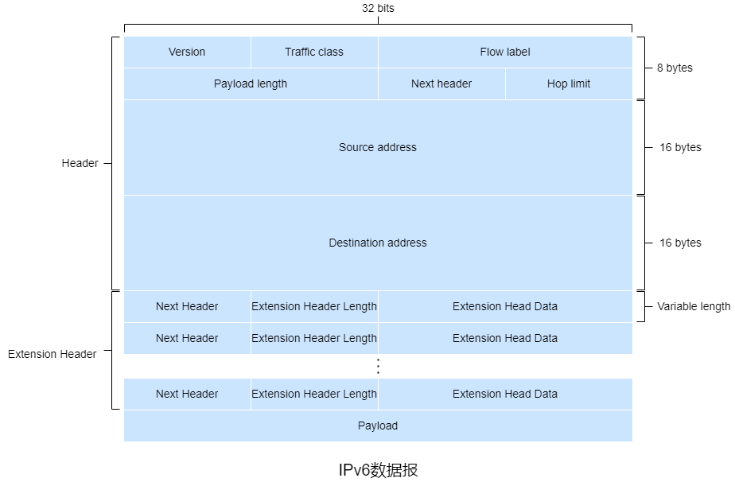

&emsp;&emsp;IPv6数据报包括8位的**版本(号)**、8位的**流量类别**、16位的**流标签**、16位的**有效载荷长度**、8位的**下个首部**、8位的**跳限制**、128位的**源IP地址**、128位的**目的IP地址**、非必需且长度不定的扩展首部以及有效载荷。

&emsp;&emsp;流量类别等同于IPv4数据报中的服务类型。

&emsp;&emsp;类标签用于区分实时流量，不同的流标签+源IP地址可以确定唯一的数据流。

&emsp;&emsp;有效载荷长度包括==扩展首部的长度+有效载荷的长度==，若超过65535则使用扩展首部中的超大有效载荷来表示。

&emsp;&emsp;下个首部类似于IPv4数据报中的上层协议，若存在下一个扩展首部则表示下一个扩展首部的编号，否则表示传输层协议的编号。

| 扩展首部类型             | 对应的下个首部值 | 描述                                                         |
| ------------------------ | ---------------- | ------------------------------------------------------------ |
| 逐跳选项扩展首部         | 0                | 用于为在传输链路上每跳转发指定参数，传输链路的每台中间节点都要读取并处理该字段。主要应用包括超大有效载荷、设备提示以及资源预留 |
| 路由选择扩展首部         | 43               | 用于强制让数据报经过特定的设备                               |
| 分片扩展首部             | 44               | 用于分片                                                     |
| 封装安全有效载荷扩展首部 | 50               | 由IPsec使用，提供认证、数据完整性校验以及重放保护，类似于认证 |
| 认证扩展首部             | 51               | 由IPsec使用，提供认证、数据完整性校验、首部部分字段保护以及重放保护 |
| 目的选项扩展首部         | 60               | 携带只有目的主机才会处理的信息                               |

&emsp;&emsp;跳限制等同于IPv4数据报中的生存时间。

&emsp;&emsp;IPv6数据报必须按照指定顺序：首部、逐跳选项首部扩展首部、目的选项扩展首部、路由选择扩展首部、分片扩展首部、认证扩展首部、封装安全有效载荷扩展首部、目的选项扩展首部以及有效载荷。

&emsp;&emsp;IPv6==只允许源主机和目的主机==进行分片与重组。若路由器收到的数据报因太大无法转发到链路上，则路由器丢弃该数据报并向发送端发送一个ICMP差错报文，然后发送端以较小长度的数据报重发。

&emsp;&emsp;由于传输层和链路层的协议都有差错检测，故IPv6并没有校验和。


&emsp;&emsp;IPv4迁移到IPv6的方法是**建立隧道**。其基本思想是：假设两个IPv6主机需要使用IPv6数据报进行交互，但它们的传输路径经过IPv4路由器，将路径上的IPv4路由器集合为一个**隧道**，借助隧道，将IPv6数据报作为IPv4数据报的有效载荷。

#### 4.3 路由选择算法

&emsp;&emsp;无向图$G=(N,E)$是一个$N$个节点和$E$条边的集合，其中每条边是取$N$的一对节点。节点可以表示路由器，连接节点的边可以表示路由器之间的物理路径。对于$E$中的任意一条边$(x,y)$，$c(x,y)$表示节点$x$和$y$的成本。若节点对$(x,y)$不属于$E$，则$c(x,y)=\infty$，否则两个节点互称**邻居**。$u$表示源节点。

&emsp;&emsp;对于任何两个节点$x$和$y$，通常有很多条路径，这些路径中的一条或多条是**最低成本路径**。当所有边的成本相同时，最低成本路径就是**最短路径**。

&emsp;&emsp;节点$x$到节点$y$的最低成本可以用Bellman-Ford算法表示，即$d_{x}(y)=min_{v}\{c(x,v)+d_{v}(y)\}$，其中$v$表示$x$的所有邻居。

&emsp;&emsp;路由选择算法根据集中式/分布式可以分为**集中式路由选择算法**和**分布式路由选择算法**，根据静态/动态可以分为**静态路由选择算法**和**动态路由选择算法**，根据负载的敏感可以分为**负载敏感算法**和**负载迟钝算法**。

&emsp;&emsp;﹡集中式路由选择算法以网络拓扑以及所有链路的成本为输入。具有全局状态信息的算法称为**链路状态算法**。

&emsp;&emsp;﹡分布式路由选择算法中，每个节点开始时仅有与其直连链路的成本信息，然后通过迭代计算过程以及与相邻节点交换信息，逐渐计算出到达某个或某组目的节点的最低成本路径。每个节点维护到其他节点的成本(距离)估计的向量称为**距离向量算法**，主要通过与相邻路由器间交换交互式报文。

&emsp;&emsp;﹡静态路由选择算法中路由选择随时间的变化非常缓慢，通常是人工进行调整。

&emsp;&emsp;﹡动态路由选择算法随着网络流量负载或拓扑变化而改变路由选择路径。一个动态路由选择算法可以周期性地或直接响应拓扑以及链路成本变化。

&emsp;&emsp;﹡负载敏感算法中，链路成本会动态地变化来反映底层链路的当前拥塞水平。若当前拥塞的链路与高成本相关联则该算法会趋向绕开该拥塞链路来选择路由。

&emsp;&emsp;﹡负载迟钝算法中，链路成本不会明确地反映其当前会最近的拥塞水平。

&emsp;&emsp;**收敛**指网络中所有路由器的路由选择表中的信息完全一致。

##### 4.3.1 LS算法

&emsp;&emsp;链路状态算法通过让每个节点向网络中所有其他节点广播链路状态分组来获得网络拓扑以及所有链路成本，其中每个链路状态分组包含它所连接的链路的标识和成本，这通常由**链路状态广播算法**来完成。

&emsp;&emsp;Dijkstra算法从某节点到网络中所有其他节点的最低成本路径，该算法是迭代算法，迭代$k$次后可以获得$k$个目的节点的最低成本路径。$D(v)$表示到本次迭代为止，从源节点$u$到节点$v$的最低成本路径的成本。$p(v)$表示源节点$u$到节点$v$的当前最低成本路径中$v$的前一节点。$N'$表示节点子集，若源节点$u$到节点$v$的最低成本路径已知，则$N'$包含$v$。

```assembly
;初始化阶段：N'仅包含u，若v是u的邻居则D(v)=c(u,v)，p(v)=u，否则D(v)=∞。
Initialization:
	N' = {u}
	for all nodes v
&emsp;&emsp;if v is a neighbor of u
&emsp;&emsp;	D(v) = c(u, v)
&emsp;&emsp;	p(v) = u
&emsp;&emsp;else D(v) = ∞
;循环阶段：查找不在N'中且到u的最短成本路径最小的节点w，将w加入N‘。若节点v不在N'中且是w的邻居则更新D(v)和p(v)。当N'包含所有节点时结束循环。
Loop
	find w not in N' such that D(w) is a minimum
	add w to N'
	update D(v) for each neighbor v of w and not in N':
&emsp;&emsp;if D(v) > D(w) + c(w, v)
&emsp;&emsp;	p(v) = w
&emsp;&emsp;	D(v) = D(w) + c(w, v)
until N' = N
```

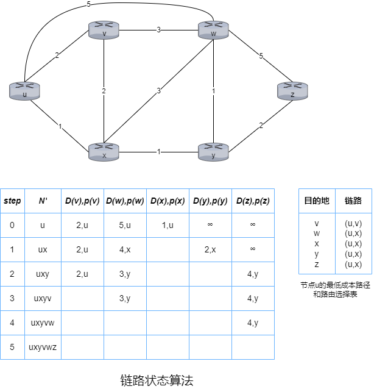

&emsp;&emsp;LS算法结束后，获得了除源节点以外的每个节点的最低成本路径以及前一节点。


&emsp;&emsp;当出现振荡时，最简单的解决方法是强制链路成本与承载的流量无关，但是这违背了路由选择的初衷之一——避开拥塞严重的链路。另一种解决方法是确保并非所有的路由器都同时运行LS算法。路由器最初在同一周期的不同时间执行算法，但最终算法会在路由器上同步并一直保持。避免这种自同步的方法之一就是让每台路由器发送链路通告的时间随机化。

##### 4.3.2 DV算法

&emsp;&emsp;根据Bellman-Ford算法可以实现邻居间的通信，基本思想是对应每个节点$x$以$D_x(y)$开始，对于$N$中的所有节点$y$，估计从$x$到$y$的最低成本路径的成本。$D_x=[D_x(y):y\in N]$表示节点$x$的距离向量，该向量是从$x$到$N$中所有目的地节点$y$的成本估计向量。

&emsp;&emsp;使用DV算法，每个节点$x$需要维护自身的距离向量$D_x=[D_x(y):y\in N]$，每个邻居$v$的成本$c(x,v)$以及每个邻居$v$的距离向量$D_v=[D_v(y):y\in N]$。每个节点不时地向每个邻居发送它的距离向量副本，邻居收到新的距离向量时，保存该距离向量并使用Bellman-Ford算法更新自身的距离向量。当节点的距离向量因收到邻居的距离向量或链路成本变化而改变时，该节点需要向所有邻居发送改变后的距离向量。

```assembly
Initialization:
	for all destinations y in N:
&emsp;&emsp;Dₓ(y) = c(x,y)
	for each neighbor v
&emsp;&emsp;Dᵥ(y) = ? for all destinations y in N
	for each neighbor v
&emsp;&emsp;send distance vector Dₓ = [Dₓ(y):y in N] to v
Loop
	wait until link cost changes or receive a distance vector
	for each y in N:
&emsp;&emsp;Dₓ(y) = minᵥ{c(x,y) + Dᵥ(y)}
	if Dₓ(y) changed for any destination y
&emsp;&emsp;send distance vector Dₓ = [Dₓ(y):y in N] to all neighbors
forever
```


&emsp;&emsp;假设$t_0$时刻$x$与$y$间的链路成本从2增加到10，则$D_y(x)=min\{10+0,1+3\}=4$，若$y$需要发送分组到$x$，则需要通过$z$，$t_1$时刻分组到达$z$，但是$z$节点的路由选择表中是通过$y$到达$x$，然后就出现了**路线选择环路**，即从$y$发往$x$的分组在$y$和$z$间来回传输。在$t_1$后的某个时刻，$z$收到了$y$的新距离向量，即$D_y(x)=4$，重新计算到$x$的最低成本$D_z(x)=min\{7+0,1+4\}=5$，$t_2$时刻$y$收到$z$的新距离向量，即$D_z(x)=5$，重新计算到x的最低成本$D_y(x)=min\{10+0,1+5\}=6$，这个过程会一直持续到$D_z(y)=11$，然后$z$确定到$x$的最低成本路径就是直接到$x$而不是通过$y$。当$c(x,y)$从4变为10000时，这种情况可以成为**无穷计数**问题。

&emsp;&emsp;通过**毒性逆转**可以解决这种==仅涉及2个节点==的简单路由选择环路，若$z$需通过$y$到达$x$，则发送$D_z(x)=\infty$的新距离向量给$y$来毒化$z$到$y$的逆向路径。$y$会发送$D_y(x)=10$的新距离向量给$z$，因为$y$不再通过$z$到$x$，之后$z$发送$D_z(x)=7$的新距离向量给$y$，$y$更新到$x$的最低成本路径的成本$D_y(x)=8$，此时$z$位于$y$到$x$的最低成本路径上，$y$发送$D_y(x)$的新距离向量来毒化$y$到$z$的逆向路径。

##### 4.3.3 LS算法与DV算法的比较

&emsp;&emsp;在LS算法的具体实现中，每个节点需要将该节点到所有邻居的直接相连链路的成本广播到其他所有节点。而在DV算法的具体实现中，每个节点仅需将已知的该节点到其他节点的估计最低成本发送给所有邻居。

&emsp;&emsp;﹡从报文复杂性的角度，LS算法需要发送$O(|N||E|)$个报文，当某条链路的成本改变时需要重新向其他节点发送报文；DV算法需要迭代的过程中仅邻居间交换报文，当某个节点到另一节点的最低成本路径的成本改变时才发送改变后的路径成本。

&emsp;&emsp;﹡从收敛速度的角度，LS算法的收敛所需时间为$O(|N|^2)$；DV算法的收敛速度较慢，收敛的过程中可能会出现路由选择环路以及无穷计数。

&emsp;&emsp;﹡从健壮性的角度，LS算法使用了广播的形式，每个节点仅计算自身的路由选择表，即每个节点在一定程度上是分离的，若某个节点损坏或丢弃了某个收到的分组也只会影响自身的路由选择表，保证了一定的健壮性；DV算法中每次迭代中每个节点的计算的最低成本路径的成本会发送给邻居，在下次迭代中会进一步扩散，经过一段时间，一个错误的最低成本路径的成本会扩散到整个网络。

#### 4.4 OSPF

&emsp;&emsp;OSPF是一种链路状态协议，它使用链路状态信息泛洪和Dijkstra最低成本路径算法。**链路状态通告**包含在OSPF报文中，OSPF报文由==直接由IP承载==。每台路由器都构建了整个AS的完整拓扑图，然后每台路由器在本地运行Dijkstra最低成本路径算法，以确定以自身为根节点到所有子网的最短路径树。OSPF不强制设置路径权值，而是提供一种协议，为给定链路权值集合确定最低成本路径的路由选择。

&emsp;&emsp;OSPF协议中，当一条链路的状态发生变化时，路由器会广播链路状态信息，即使未发生变化，路由器也周期性地广播链路状态信息。OSPF协议需要检测链路是否正常运行(通过邻居间发送HELLO报文)，允许路由器获得邻居网络范围内链路状态的数据库。

&emsp;&emsp;OSPF的优点包括安全、多条相同成本的路径、对单播与多播路由选择的综合支持以及支持单个AS中的层次结构。

&emsp;&emsp;﹡OSPF协议提供了报文的认证来保证安全性。OSPF报文默认不启用认证，可以配置简单认证和MD5认证。简单验证基于配置在所有路由器中的共享密码，但密码会以明文的形式出现在OSPF报文中。MD5认证基于配置在所有路由器上的共享密钥，发送路由器在OSPF报文中加入报文内容加密钥的MD5散列值。MD5认证与序号一起使用来防止重放攻击。

&emsp;&emsp;﹡当存在多条成本相等的路径时，无须仅选择单一的路径来承载所有的流量。

&emsp;&emsp;﹡MOSPF是OSPF的简单扩展，用来提供多播的支持。

&emsp;&emsp;﹡一个OSPF自治系统可以分层并配置为区域，其中只能存在一个主干区域，每个区域都运行自身的LS算法。在每个区域内，一台或多台区域边界路由器负责为发往区域外的分组提供路由选择。主干区域包含所有的区域边界路由器，可能包含一些非边界路由器。分组在区域间的路由选择需要先区域内路由到一个区域边界路由器，再通过主干区域路由到目的区域的区域边界路由器，最后路由到目的地。

#### 4.5 BGP

##### 4.5.1 BGP

&emsp;&emsp;在BGP中，分组并不是路由到一个特定的目的IP地址，而是路由到类似于CIDR的前缀，该前缀表示一个子网或一个子网的集合。因此，路由器的转发表将具有$(x,I)$形式的表项，$x$表示例如138.116.68/22的前缀，$I$表示该路由器的某个接口的接口号。

&emsp;&emsp;BGP允许每个子网向互联网的其他部分通告它的存在，同时确保所有AS收到该通告。

&emsp;&emsp;一台路由器可能知道多条到指定前缀的不同路由，为了确定最好的路由，而最好的路由基于策略以及可达性信息来确定，该路由器将在本地运行BGP路由选择(类似于DV算法，通过邻居获得前缀的可达性信息)。

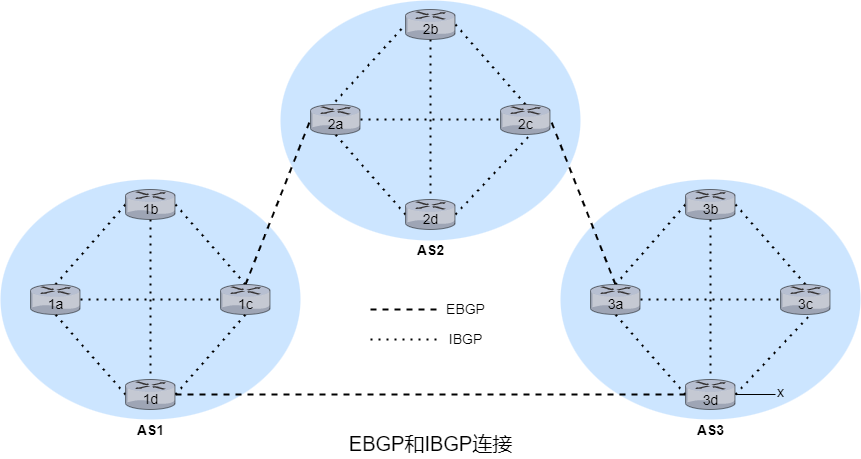

&emsp;&emsp;在BGP中，每条直接连接以及所有通过该连接发送的报文称为**BGP连接**。若BGP连接跨越AS则称为**外部BGP**连接，若在同一AS则称为**内部BGP**连接。内部BGP连接==并不总是==对应物理链路。建立BGP连接的两个路由器互称**BGP对等体**，其中发送BGP报文的路由器称为**BGP发言者**。

&emsp;&emsp;对于每个AS，其中的路由器是要么是**网关路由器**，要么是**内部路由器**。网关路由器位于AS边缘，内部路由器仅连接AS内部的主机和路由器。

&emsp;&emsp;若需要通告前缀$x$的可达性信息，对于跳数较多的路径，首先网关路由器3a向网关路由器2c发送EBGP报文“AS3 $x$”，然后网关路由器2c向AS2内的所有其他路由器发送IBGP报文“AS3 $x$”，最后网关路由器2a向网关路由器1c发送EBGP报文"AS2 AS3 $x$"。

&emsp;&emsp;路由器通过BGP连接通告前缀时，前缀中包括一些**BGP属性**，前缀以及属性称为**路由**。BGP属性分为**公认必遵**、**公认任意**、**可选传递**和**可选非传递**。

| BGP属性类别 | BGP属性类别详情                                              | 包含的BGP属性                              |
| ----------- | ------------------------------------------------------------ | ------------------------------------------ |
| 公认必遵    | 所有BGP路由器必须支持，必须包含于更新报文中                  | ORIGIN、AS_PATH、NEXT_HOP                  |
| 公认任意    | 所有BGP路由器必须支持                                        | LOCAL_PREF、ATOMIC_AGGREGATE               |
| 可选传递    | 可以不支持，即使不支持也应该能接收包含该属性的路由并传递给邻居 | COMMUNITY、AGGREGATOR                      |
| 可选非传递  | 可以不支持，若不支持则可以忽略包含该属性的更新报文           | MULTI_EXIT_DISC、ORIGINATOR_ID、CLUSTER_ID |

&emsp;&emsp;**ORIGIN**标识路由信息的来源。

&emsp;&emsp;**AS_PATH**包含了通告已通过的AS列表，可用来检测和防止通告环路，若路由器在AS_PATH中发现包含了自身所属的AS则拒绝该通告。

&emsp;&emsp;**NEXT_HOP**是==AS_PATH起始路由器接口的IP地址==。对于从AS1通过AS2到$x$的路由"AS2 AS3 $x$"，NEXT_HOP是路由器2a的左边接口的IP地址。对于AS1直接路由到AS3的路由"AS3 $x$"，NEXT_HOP是路由器3d的最左边接口的IP地址。

&emsp;&emsp;**LOCAL_PREF**表示路由的优先级，仅用在IBGP对等体间，由==本地AS的路由选择策略==决定。

&emsp;&emsp;**ATOMIC_AGGREGATE**表示路由是经过了聚合。

&emsp;&emsp;**COMMUNITY**表示共享相同属性的目的地集合，用于将路由信息编组，通过组的标识决定路由策略的传递。

&emsp;&emsp;**AGGREGATOR**是ATOMIC_AGGREGATE的补充，包含发起路由聚合的ASN和形成聚合路由的BGP发言者的IP地址。

&emsp;&emsp;**MULTI_EXIT_DISC**用于区分同一相邻AS的多个接口。

&emsp;&emsp;**ORIGINATOR_ID**用于标识路由反射器。

&emsp;&emsp;**CLUSTER_ID**用于标识路由反射器组。

##### 4.5.2 BGP路由选择

&emsp;&emsp;**热土豆路由选择**可以从所有可能的路由中选择到对应NEXT_HOP路由器成本最小的路由，忽略剩余端到端成本。

&emsp;&emsp;使用热土豆路由选择在转发表中增加AS外部目的前缀的步骤如下：

&emsp;&emsp;①从AS间路由选择协议知道可通过多个网关到达子网$x$。

&emsp;&emsp;②通过AS内部路由选择协议获取的路由选择信息来计算到每个网关的最低成本路径的成本。

&emsp;&emsp;③根据热土豆路由选择来选择成本最低的网关。

&emsp;&emsp;④从转发表确定通往最低成本网关的接口$I$并在转发表中加入表项$(x,I)$。

&emsp;&emsp;BGP实际使用的路由选择算法结合了热土豆路由选择的特点但更复杂。对应给定的目的前缀，算法的输入是到路由器已知悉且接受的到该前缀的所有路由的集合。若集合中多个路由则按下列消除原则直至最后一条路由：

&emsp;&emsp;1）路由被分配LOCAL_PREF作为BGP属性之一。路由的LOCAL_PREF可能已由路由器设置，也可能已从同一AS中的另一台路由器获悉。选择具有最高LOCAL_PREF的路由。

&emsp;&emsp;2）选择具有最短AS_PATH的路由。若该规则是路由选择的唯一规则，则BGP将使用DV算法决定路径，其中距离测量使用AS跳的跳数而不是路由器跳的跳数。

&emsp;&emsp;3）使用热土豆路由选择，选择到NEXT_HOP路由器成本最小的路由。

&emsp;&emsp;4）使用BGP标识符来选择路由。


&emsp;&emsp;假设A、B、C是主干提供商网络，且A、B、C直接向彼此发送流量，并向它们的客户网络提供全部的BGP信息，则W、Y是接入ISP，X是**多宿接入ISP**。可以通过控制BGP路由的通告的方式保证W、X和Y的存根网络行为，例如X可能知道到Y的一条路径(XCY)，但X==不会==将此路径通告给B，因此B也不会经由X来转发到C或Y的分组。

&emsp;&emsp;所有进入接入ISP网络的流量必定是以该网络为目的地，所有离开接入ISP网络的流量必定源自该网络。

&emsp;&emsp;各个对等协议通常都是ISP双方协商且通常对外保密。

&emsp;&emsp;商业规则是任何流经ISP提供商网络的流量的源或目的地(或两者)必须位于该ISP的客户网络中，否则这些流量将免费通过该ISP的网络。

##### 4.5.3 IP任播

&emsp;&emsp;当BGP被用于实现IP任播时，常用于DNS中。


&emsp;&emsp;在IP任播配置时，CDN公式为多台CDN服务器指派了==相同的IP地址==，然后这些服务器中的每一台都使用BGP来通告该IP地址。当某台BGP路由器该IP地址的多路由通告时，它将这些通告视为到同一物理位置的不同路径，配置路由选择表时，路由器将在本地使用BGP路由选择算法来确定最合适的路由。实际中CDN通常不使用IP任播，因为BGP路由选择的变化可能导致同一的TCP连接的的分组到达Web服务器的不同实例。

&emsp;&emsp;在DNS系统中，IP任播常用于将DNS请求指向最近的根DNS服务器。

#### 4.6 SDN

&emsp;&emsp;SDN体系结构包括**基于流的转发**、**数据平面和控制平面分离**、**网络控制**以及**可编程网络**这4个关键特征。

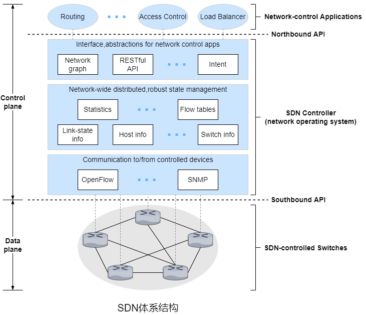

&emsp;&emsp;控制平面由SDN控制器(或网络操作系统)以及若干网络控制应用程序(运行在网络控制服务器上)组成。控制器维护准确的网络状态信息并为网络控制应用程序提供这些信息，还为这些应用程序提供方法来监控、编程以及控制底层网络设备。

&emsp;&emsp;SDN控制器的功能可分为**通信层**、**网络范围状态管理层**和**网络控制应用层的接口**。

&emsp;&emsp;﹡若SDN控制器需要控制远程设备，则需要一个协议(OpenFlow)来为SDN控制器和该设备传输信息。此外，该设备必须能够将本地观察到达的事件传输给SDN控制器。SDN控制器和受控网络设备之间的通信跨越了SDN控制器所谓的“南向”接口。

&emsp;&emsp;﹡SDN控制平面做出的最终控制决策将要求SDN控制器具有网络主机、链路、交换机和其他SDN控制的设备的最新状态信息。交换机的流表包含计数器，其值可以为网络控制应用程序所用。因为控制平面的最终目标是确定各种受控设备的流表，SDN控制器可能也维护这些表的副本。

&emsp;&emsp;﹡SDN控制器通过它的“北向”接口与网络控制应用程序交互。该接口允许网络控制应用程序在状态管理层中读取/写入网络状态和流表。应用程序可以注册以状态更新事件时收到通知，这样它们可以采取行动以响应来自受控于SDN的设备发送的网络事件通知。

##### 4.6.1 OpenFlow

&emsp;&emsp;==OpenFlow==是一个得到高度认可和成功的标准，它开创了匹配加动作转发抽象、控制器的概念以及更广泛的SDN革命。实际应用包括简单转发、负载均衡以及防火墙。

&emsp;&emsp;匹配加动作转发表在OpenFlow中称为**流表**。表项包括首部字段值的集合、计数器集合以及匹配项对应的动作集合。当匹配成功时更新计数器，计数器可能包括匹配成功分组的数量以及上次更新时间。匹配失败的分组将被丢弃或发送到远程控制器进行更多处理。在实践中，一个流表可能由多个流表实现。动作包括转发给指定的一个或多个输出端口、丢弃、复制以及重写部分首部字段。


&emsp;&emsp;支持OpenFlow的设备可以充当路由器转发分组以及充当交换机转发帧。以太网类型对应用来分解复用帧的有效载荷的传输层协议。

&emsp;&emsp;输入端口指路由器接收分组的输入端口。

&emsp;&emsp;流表项可以使用通配符`*`。每个流表项具有优先级。

&emsp;&emsp;动作中重要的动作包括转发、丢弃和修改字段。

&emsp;&emsp;﹡分组可以转发到指定的物理输出端口，可以广播到所有端口，也可以通过所选的端口集合进行多播。该分组可能被封装并发送到远程控制器，远程控制器可能会对分组进行某些动作，例如安装新的流表项并可能返回分组来更新流表项来根据更新的流表项转发。

&emsp;&emsp;﹡没有对应动作时分组将被丢弃。

&emsp;&emsp;﹡分组被转发到指定的输出端口之前，源MAC地址、目的MAC地址、以太网类型、局域网ID、局域网优先级、源IP地址、目的IP地址、服务类型、源端口、目的端口这些字段的值可以重写。

&emsp;&emsp;从SDN控制器流向受控路由器的重要报文包括==配置==报文、==修改状态==报文、==读取状态==报文、==发送分组==报文。配置报文允许SDN控制器查询并设置路由器的配置参数。修改状态报文用于增加/删除/修改路由器流表中的表项并设置路由器的端口属性。读取状态报文用于从路由器的流表和端口收集统计数据以及计数器值。发送分组报文用于从受控路由器的指定端口发送特定报文，报文的有效载荷包含分组。

&emsp;&emsp;从受控路由器流向SDN控制器的重要报文包括==流删除==报文、==端口状态==报文、==分组进入==报文。流删除报文用于通知SDN控制器已删除一个流表项。端口状态报文用于向SDN控制器通知端口状态的变化。分组进入报文用于分组匹配成功的分组发给SDN控制器。

##### 4.6.2 数据平面与控制平面的交互


&emsp;&emsp;Dijkstra算法是实现在每台路由器中泛洪链路状态更新，这里Dijkstra算法作为路由器外部的一个单独的程序而且路由器将链路更新发送到SDN控制器而不是彼此。

&emsp;&emsp;假设OpenFlow作为通信层协议，控制平面只执行路由选择。此外，s1与s2之间的链路出现了故障。

&emsp;&emsp;1）s1使用OpenFlow的端口状态报文通知SDN控制器链路状态改变。

&emsp;&emsp;2）SDN控制器收到报文后通知链路状态管理器，链路状态管理器更新链路状态数据库。

&emsp;&emsp;3）因为用于实现Dijkstra算法的网络控制应用程序之前已经注册，网络控制应用程序收到了链路状态更改的通知。

&emsp;&emsp;4）链路状态应用程序与链路状态管理器交互以获取最新的链路状态信息，也可能会与链路状态管理层的其他组件交互，然后计算新的最低成本路径。

&emsp;&emsp;5）链路状态应用程序与流表管理器交互来更新流量。

&emsp;&emsp;6）流表管理器使用OpenFlow更新受影响路由器的流表项。

##### 4.6.3 SDN的发展

&emsp;&emsp;Google的B4网络使用定制的交换机，每台交换机实现了OpenFlow的扩展版并带有本地OpenFlow代理。每个OFA与网络控制服务器中的OpenFlow控制器连接，使用单独的“带外”网络，该网络不同于数据中心间传输数据中心流量的网络。OpenFlow控制器因此提供网络控制服务器和其受控交换机之间的通信。在B4中，OpenFlow控制器还执行状态管理功能，将节点与链路信息保存在网络信息数据库中。OpenFlow控制器的实现基于ONIX SDN控制器。B4网络实现了BGP和IS-IS(类似于OSPF)。

&emsp;&emsp;在SDN发展早期，采用单一的SDN协议(OpenFlow)和单一的SDN控制器。最近，OpenDaylight(ODL)控制器和ONOS控制器得到业界广泛支持。


&emsp;&emsp;**网络服务应用程序**用于决定受控路由器完成数据平面转发和其他服务(如防火墙和负载均衡)。ODL控制器的核心是**基本网络服务功能**。控制器有RESTful接口和网络抽象层这2个接口，外部应用程序通过HTTP上的RESTful接口与控制器通信，内部应用程序通过SAL相互通信。应用程序实现在控制器外部还是控制器内部由应用程序设计者决定。

&emsp;&emsp;SAL允许控制器组件和应用程序互相调用并订阅彼此生成的事件，它还为通信层中特定的协议(如OpenFlow、SNMP和OVSDB)提供统一的抽象接口。

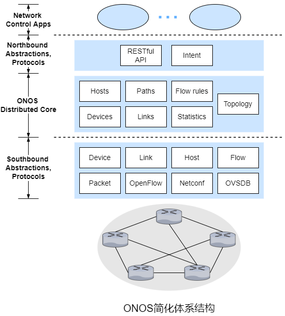

&emsp;&emsp;ONOS作为服务部署在一组互联的服务器上，每台服务器都运行相同的ONOS软件副本。

&emsp;&emsp;ONOS的一个独特功能是它的意图框架，它允许网络控制应用程序请求高级服务而无须了解该服务的具体信息。状态信息通过北向接口以同步(查询)或异步(监听器回调)提供给应用程序。

&emsp;&emsp;ONOS的分布式核心维护网络链路、主机以及设备的状态等。ONOS核心提供复制和实例间协调机制，为上层的应用程序和下层的受控设备提供逻辑上的集中式核心服务抽象。

&emsp;&emsp;ONOS的南向接口屏蔽底层主机、链路、交换机和协议的差异，允许分布式核心和这些无关。

#### 4.7 ICMP

&emsp;&emsp;ICMP虽然是网络层协议，但ICMP报文作为IP数据包的有效载荷，类似于TCP和UDP。ICMP最典型的用途是差错报告。基于ICMP的常用程序是ping和traceroute。


| ICMP type | ICMP code | 描述                              |
| --------- | --------- | --------------------------------- |
| 0         | 0         | echo(ping) reply                  |
| 3         | 0         | destination network unreachable   |
| 3         | 1         | destination host unreachable      |
| 3         | 2         | destination protocol unreachable  |
| 3         | 3         | destination port unreachable      |
| 3         | 6         | destination network unknown       |
| 3         | 7         | destination host unknown          |
| 4         | 0         | source quench(congestion control) |
| 8         | 0         | echo(ping) request                |
| 9         | 0         | router advertisement              |
| 10        | 0         | router discovery                  |
| 11        | 0         | TTL exceeded                      |
| 12        | 0         | IP header bad                     |

&emsp;&emsp;源抑制报文最初的目的是用于拥塞控制，即发送或对方减小发送速率。

&emsp;&emsp;在traceroute中，为了确定源主机和目的主机之间的路由器的主机板和IP地址，源主机向目的主机发送了一系列的IP数据报，这些数据报都带有一个不可达的UDP端口的UDP报文段，其中第$n$个数据报的TTL为$n$。因此，当第$n$个数据报到达第$n$个路由器时TTL刚好过期，路由器丢弃数据报并向源主机发送ICMP报文(type=11,code=0)，该报文包括路由器的主机名以及IP地址。当数据报到达目的主机时，由于UDP端口不可达，目的主机会向源主机发送ICMP报文(type=3,code=3)，源主机收到该报文后停止发送数据报。

#### 4.8 网络管理

##### 4.8.1 网络管理

&emsp;&emsp;**网络管理**包括对硬件、软件和人为元素的部署、集成和协调，以便对网络资源进行监视、测试、轮询、配置、分析、评估和控制，这样能以合理的成本满足例如实时运行性能、服务质量等需求。


&emsp;&emsp;网络管理的重要组件包括管理服务器、被管设备、MIB数据、远程代理以及SNMP。

&emsp;&emsp;管理服务器是一个应用程序，通常有人的参与，并在网络运营中心的集中式管理站上运行。管理服务器用于网络管理，负责网络管理信息的收集、处理、分析以及显示。

&emsp;&emsp;被管设备是被管网络中的网络设备(包括软件)。一个被管设备内可能有几个**被管对象**。这些被管对象包括被管设备中的实际硬件(例如网络接口卡是主机或路由器的一个组件)以及用于这些硬件和软件组件的配置参数(例如AS内部路由选择协议)。

&emsp;&emsp;被管设备中的每个被管对象的相关信息收集在**管理信息库**中，这些信息可供管理服务器使用。一个管理信息库的对象称为SMI，可以是计数器、收到的UDP报文的数量、描述性信息或状态信息等。

&emsp;&emsp;每个被管设备上都有**网络管理代理**，它是一个与管理服务器通信的进程，在管理服务器的命令和控制下在被管设备执行本地操作。

&emsp;&emsp;**网络管理协议**在管理服务器与被管设备间运行，运行管理服务器查询被管设备的状态并通过代理间接地在被管设备上采取行动。代理通过网络管理协议通知管理服务器异常事件。

##### 4.8.2 SNMP

&emsp;&emsp;**简单网络管理协议**用于管理服务器和被管设备上的网络管理代理之间传输网络管理控制和信息报文。SNMP常用模式是请求响应模式，管理服务器向代理发送请求，代理收到请求后执行某些操作并响应请求。请求通常用于查询或修改被管设备相关的MIB对象值。另一种情况是代理向管理服务器发送未被请求的报文，该报文称为**陷阱报文**。陷阱报文是异步产生的，即不是为了响应报文，而是为了响应管理服务器要求通知的事件，用于通知管理服务器异常情况导致MIB对象值改变。

| PDU类型        | 发送端-接收端                           | 描述                                                         |
| -------------- | --------------------------------------- | ------------------------------------------------------------ |
| GetRequest     | 管理服务器到代理                        | 获取一个或多个MIB对象值                                      |
| GetNextRequest | 管理服务器到代理                        | 获取下一个MIB对象值                                          |
| GetBulkRequest | 管理服务器到代理                        | 获取大数据块的值                                             |
| InformRequest  | 管理服务器到管理服务器                  | 通知==远程==管理服务器远程访问的MIB值                        |
| SetRequest     | 管理服务器到代理                        | 设置一个或多个MIB对象值                                      |
| Response       | 代理到管理服务器/管理服务器到管理服务器 | 响应GetRequest、GetNextRequest、GetBulkRequest、InformRequest和SetRequest |
| Trap           | 代理到管理服务器                        | 通知管理服务器异常事件                                       |


&emsp;&emsp;SNMP通常基于UDP，但UDP并不可靠，类似于rdt，管理服务器用Request Id来标识报文。SNMP并没有强制重传，若需要重传，管理服务器设置重传频率和周期。

&emsp;&emsp;GetRequest、GetNextRequest、GetBulkRequest PDU请求的值在PDU的变量绑定部分。GetRequest、GetNextRequest、GetBulkRequest PDU的数据请求颗粒度不同， GetRequest可以请求任意一组MIB值，多个GetNextRequest可用于对MIB对象的列表或表格进行排序，GetBulkRequest用于返回大块数据，相比多个GetRequest或GetNextRequest减小了成本。代理会使用包含对象标识符以及相关值的PDU来响应。

&emsp;&emsp;代理用带有"noError"错误状态的PDU来响应SetRequest。

### 第五章 链路层

&emsp;&emsp;运行链路层协议的设备称为**节点**。连接相邻节点的通信信道称为**链路**。

&emsp;&emsp;链路层提供的服务包括**封装成帧**、**链路接入**、**可靠交付**、**差错检测和纠错**。


&emsp;&emsp;通常链路层是通过**网络适配器**实现的，网络适配器也成为**网络接口卡**。网络适配器的核心是链路层控制器，通常是一个实现了很多链路层服务的专用芯片。因此，链路层控制器的大部分功能(封装成帧、链路接入和差错检测)是通过硬件实现的。链路层的软件部分实现更高级别的链路层功能(组装链路层寻找信息和激活控制器硬件)。

&emsp;&emsp;交换机的工作是主机与路由器之间传输数据报，即交换机不明确式地将帧寻址，因此它没有相连的主机或路由器的链路层地址。&emsp;&emsp;

&emsp;&emsp;主机和路由器的==网络适配器(即网络接口)==拥有链路层地址。链路层地址又称**LAN地址**、**物理地址**或**MAC地址**。MAC地址长度为6字节，共有$2^{48}$个可能的地址，常用16进制数表示，即一个字节对应一对16进制数。没有两块适配器拥有相同的MAC地址，因为一个公司想要生产网络适配器时需要向IEEE购买$2^{24}$个地址组成的地址空间，这些地址的前24位相同。

&emsp;&emsp;当网络适配器发送帧时会将目的网络适配器的MAC地址插入帧中。交换机可能将帧广播到所有接口，因此网络适配器可能收到不是发送给它的帧。当网络适配器收到帧时会将目的MAC地址与自身MAC地址进行匹配，若匹配则提取数据报并沿协议栈向上传递，否则丢弃该帧。

&emsp;&emsp;若网络适配器需要将帧广播到其他网络适配器，发送端网络适配器需要将帧的MAC地址设置为特殊的广播地址，即48位全是1。

&emsp;&emsp;**集线器**是物理层设备，作用于比特，当比特从一个接口到达时，集线器只需要重新生成该比特来提供其能量强度，并将该比特传输到其他所有接口。

&emsp;&emsp;**中继器**是物理层设备，用来放大信号，比特从输入接口达到后会重新生成该比特并传输到输出接口。

|          | 路由器 | 集线器 | 交换机 |
| -------- | ------ | ------ | ------ |
| 流量隔离 | √      | ⨉      | √      |
| 即插即用 | ⨉      | √      | √      |
| 优化路由 | √      | ⨉      | ⨉      |

#### 5.1 差错检测和纠错

&emsp;&emsp;**前向纠错**指接收端检测并纠错。

&emsp;&emsp;传输层通常由主机中的软件实现并作为主机操作系统的一部分，传输层的差错检验同样是通过软件实现的，故传输层使用了更简单快速的差错检测(例如校验和)。而链路层的差错检测通常在网络适配器中的专用硬件实现，可以快速执行更复杂的CRC操作。


&emsp;&emsp;最简单的差错检测技术是用单个**奇偶校验位**。假设待发送的信息$D$有$d$位，若使用偶校验，发送端只需要再加上1位，使得这$d+1$位有偶数个1，若使用奇校验则$d+1$位中有奇数个1。显然这种方案只能检测出奇数比特的差错。


&emsp;&emsp;**二维奇偶检验**可以检测出单比特的错误并纠错，只能检测错两比特的错误。

&emsp;&emsp;另一种差错检测技术是校验和，比较简单的校验和方法就是将$d$位数据看作$k$位整数的序列化，再将这$k$位整数相加并将得到的和用作差错检测位。**互联网校验和**就基于这种方法，即将待发送数据字节视作16位的整数并求和，求和时需要回卷，求和后再取反码，这个反码设置为分组首部的校验和字段。接收端收到分组后用同样的方式(包括校验和)求和取反码，若结果全为1则表示没有出现差错。


&emsp;&emsp;现在常用的差错检测技术是**循环冗余校验编码**，循环冗余校验编码也称为多项式编码，因为该编码将待发送的位串视作多项式，其系数是位串中的0和1，对位串的操作被视为多项式算术。


&emsp;&emsp;所有的CRC都采用模2运算，模2运算==不考虑进位和借位==，模2加法和模2减法等价于操作数的异或运算$\oplus$，模2乘法和模2除法运算规则与二进制中的乘法和除法相同。

&emsp;&emsp;依然假设待发送的数据$D$有$d$位，发送端接收端必须先就$r+1$位模式(二进制形式)达成一致，称为**生成多项式**，用$G$表示，$G$的最高有效位必须是1并且使用模2运算时$d+r$位模式(二进制形式)能整除$G$，若有余数则说明出现了差错。

&emsp;&emsp;根据二进制乘法中乘$2^k$相当于左移$k$位的特性，$d+r$位模式可以表示为$D\times 2^r\oplus R$。
$$
\begin{align}
D\times 2^r \oplus R&=nG\\
D\times 2^r\oplus R\oplus R&=nG\oplus R\\
D\times 2^r&=nG \oplus R\\
\end{align}
$$
&emsp;&emsp;显然，$R= D\times 2^r \pmod{ G}$。

&emsp;&emsp;CRC能检测出奇数比特的差错，而且CRC能检测出小于$r+1$位的差错，在适当的假设下还可以以$1-\frac{r}{2}$的概率检测出大于$r+1$位的差错。

#### 5.2 多路访问链路和协议

&emsp;&emsp;**点对点链路**由链路一端的单个发送端和链路另一端的单个接收端组成，相关协议包括PPP和HDLC。

&emsp;&emsp;**广播**指当任何节点通过广播信道传输帧时其他所有节点都会收到该帧的副本。**广播链路**可以有多个发送端和接收端都连接到同一共享广播信道。

&emsp;&emsp;因为所有的节点都能传输帧，所有可能多个节点会同时传输帧，此时，传输的帧在所有接收端**碰撞**，涉及此次碰撞的所有帧都会丢失。

&emsp;&emsp;**多路访问**指多个节点共享同一信道，其中任意节点发送的帧可以被多个节点接收。多路访问协议分为**信道划分协议**、**随机接入协议**和**轮流协议**。

&emsp;&emsp;在理想情况下，速度为$R(b/s)$的广播信息的，多路信道应该具有以下理想特性：

&emsp;&emsp;1）当仅有一个节点发送数据时，该节点吞吐量为$R(b/s)$。

&emsp;&emsp;2）当$M$个节点发送数据时，每个节点的吞吐量为$\frac{R}{M}(b/s)$。

&emsp;&emsp;3）协议是去中心化的，即不会因为主节点故障而导致整个系统崩溃。

&emsp;&emsp;4）协议是简单，故实现成本也不贵。

##### 5.2.1 信道划分协议

&emsp;&emsp;[频分复用和时分复用](#1.3.2 电路交换)可以用于信道划分。

&emsp;&emsp;频分复用消除了碰撞并且很公平，每个节点都获得了专用带宽$\frac{R}{N}(b/s)$。频分复用的缺点是带宽的限制。

&emsp;&emsp;时分复用也消除了碰撞而且很公平，每个节点在每个时间帧内都获得了专用传输速度$\frac{R}{N}(b/s)$。但是时分复用有两个主要缺点，首先是节点的平均速度被限制在$\frac{R}{N}(b/s)$，其次是节点必须等待传输序列的轮次。

&emsp;&emsp;另一种信道划分协议是**码分多址**，码分多址对每个节点分配了不同的编码，每个节点使用它的唯一编码来对待发送的数据进行编码。若精心选择编码，码分多址既可以保证不同节点同时传输，又可以保证它们对应的接收端仍能正确地接收数据。

&emsp;&emsp;在CDMA协议中，发送端的每个比特都通过乘一个信号(编码)进行编码，该信号的变化速度(称为**码片速率**)比初始数据比特序列的变化速率快很多。

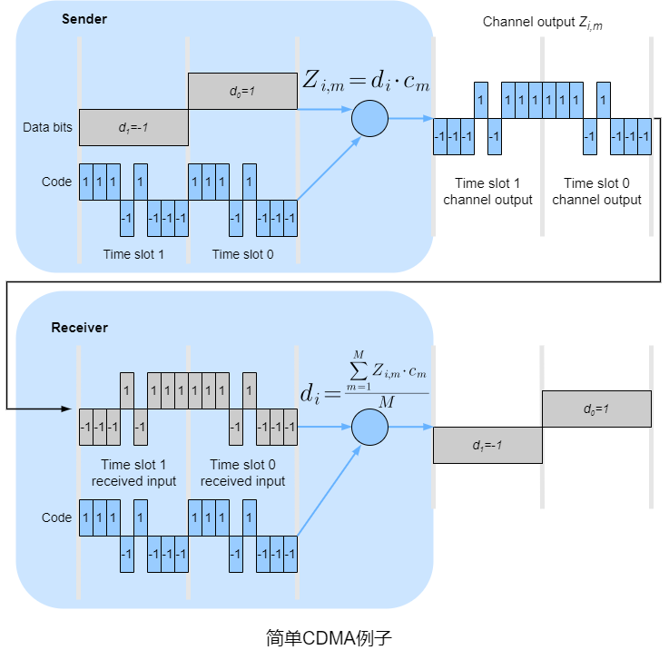

&emsp;&emsp;假设初始数据比特达到CDMA编码器的速率定义了时间单位，即每个待发送的初始数据比特需要1比特的时隙。为了数学上的便利，这里用$-1$代替$0$。$d_i$表示第$i$个比特时隙中的数据比特值。每个比特时隙进一步细分为$M$个微时隙(这里$M=8$，实际中$M$的值大得多)。发送端使用CDMA编码由$M$个值的一个序列$c_m$组成。

&emsp;&emsp;对于$d_i$比特传输时的第$m$微时隙，CDMA编码器的输出$Z_{i,m}=d_i\cdot c_m$。在没有其他发送端的干扰时，接收端将收到比特$Z_{i,m}$并恢复成初始的数据比特$d_i=\frac{\sum_{m=1}^MZ_{i,m}\cdot c_m}{M}$。


&emsp;&emsp;实际中干扰在所难免，CDMA在原始数据比特与干扰比特传输信号是相加的假设下工作。相比无干扰情况，接收端收到比特的值是所有发送端传输的比特总和$Z_{i,m}^*=\sum_{s=1}^NZ_{i,m}^s$。

##### 5.2.2 随机接入协议

&emsp;&emsp;随机接入协议中，节点总是以信道的最高速度$R(b/s)$进行传输，当发送碰撞时，涉及碰撞的每个节点都会重传直到无碰撞为止。当节点发生碰撞时，它不一定立即重传，它会==等待随机时延==后重传。涉及碰撞的节点都独立地选择随机时延。

###### 5.2.2.1 时隙ALOHA

&emsp;&emsp;在时隙ALOHA协议中，先做如下假设：

&emsp;&emsp;﹡所有帧的长度固定为$L$位。

&emsp;&emsp;﹡时间划分为$\frac{L}{R}(s)$的时隙，即一个时隙等于传输一帧所需时间。

&emsp;&emsp;﹡节点仅在时隙的开始传输帧。

&emsp;&emsp;﹡节点是同步的，每个节点都指定时隙的开始时间。

&emsp;&emsp;﹡若两个或多个帧在同一时隙内碰撞则所有节点在时隙结束前会检测到该碰撞。

&emsp;&emsp;当节点有帧待发送时，它等到下个时隙的开始并在该时隙内传输整个帧。若出现碰撞，该节点在时隙结束前会检测到该碰撞，在之后的每个时隙内以概率$p$(二项分布)重传该帧直到不出现碰撞。


&emsp;&emsp;只有一个节点传输的时隙称为**成功时隙**。时隙ALOHA协议的**效率**指大量活动节点的情况下成功时隙的比例。

&emsp;&emsp;假设$N$个节点，则某个时隙是成功时隙的概率就是其他$N-1$个节点不进行传输的概率。某个节点传输的概率是$p$，其他节点不传输的概率是$(1-p)^{N-1}$，因此该节点成功传输的概率是$p(1-p)^{N-1}$。因为有$N$个节点，其中任一节点成功传输的概率是$Np(1-p)^{N-1}$。
$$
\begin{align}
f(p)&=Np(1-p)^{N-1}\\
f'(p)&=(Np)'(1-p)^{N-1}-Np((1-p)^{N-1})'\\
&=N(1-p)^{N-1}-Np(N-1)(1-p)^{N-2}\\
&=N(1-p)^{N-2}(1-p-p(N-1))\\
&=N(1-p)^{N-2}(1-pN)
\end{align}
$$
&emsp;&emsp;令$f'(p)=0$时，则$p=\frac{1}{N}$或$p=1$。

&emsp;&emsp;当$p=\frac{1}{N}$时，$f(\frac{1}{N})=(1-\frac{1}{N})^{N-1}>0$，$p=\frac{1}{N}$是$f(p)$的极大值点。

&emsp;&emsp;当$p=1$时，$f(1)=0$，$p=1$是$f(p)$的极小值点。
$$
\begin{align}
\lim \limits_{N\rightarrow \infty} f(\frac{1}{N})&=\lim \limits_{N\rightarrow \infty} (1-\frac{1}{N})^{N-1}\\
&=\lim \limits_{N\rightarrow \infty} \frac{(1-\frac{1}{N})^N}{1-\frac{1}{N}}\\
&=\frac{\lim \limits_{N\rightarrow \infty}(1-\frac{1}{N})^N}{\lim \limits_{N\rightarrow \infty}(1-\frac{1}{N})}\\
&=\frac{1}{e}
\end{align}
$$


###### 5.2.2.2 ALOHA

&emsp;&emsp;ALOHA是无时隙的。在ALOHA中，当一个帧首次到达(数据报从发送端的网络层向下传递)，节点立即将整个帧传输到广播信道中。若出现碰撞，该节点(传输完出现碰撞的帧后)下一个帧传输时间以概率$p$重传。

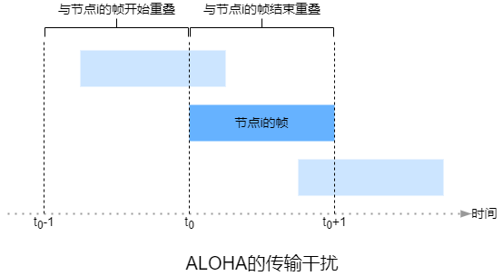

&emsp;&emsp;为了确定ALOHA的最高效率，关注的重点是单独的节点。类似于时隙ALOHA，时间单元为帧的传输时间。对于指定时间，节点$i$传输帧的概率是$p$。该节点在$t_0$开始传输，若该帧能够成功传输，在$[t_0-1,t_0]$内不能有其他节点传输，因为这样会导致传输干扰。其他所有节点在$[t_0-1,t_0]$内不传输的概率是$(1-p)^{N-1}$。当节点$i$传输时不能有其他节点传输，这样概率也是$(1-p)^{N-1}$。因此，节点$i$成功传输的概率是$(1-p)^{2N-2}$。当有$N$个节点，其中任一节点成功传输的概率是$Np(1-p)^{2N-2}$。
$$
\begin{align}
f(p)&=Np(1-p)^{2N-2}\\
f'(p)&=(Np)'(1-p)^{2N-2}-Np((1-p)^{2N-2})'\\
&=N(1-p)^{2N-2}-Np(2N-2)(1-p)^{2N-3}\\
&=N(1-p)^{2N-3}(1-p-p(2N-2))\\
&=N(1-p)^{2N-3}(1-p(2N-1))
\end{align}
$$
&emsp;&emsp;令$f'(p)=0$时，则$p=\frac{1}{2N-1}$或$p=1$。

&emsp;&emsp;当$p=\frac{1}{2N-1}$时，$f(\frac{1}{2N-1})= \frac{N}{2N-1} \times (1-\frac{1}{2N-1})^{2N-2}>0$，$p=\frac{1}{2N-1}$是$f(p)$的极大值点。

&emsp;&emsp;当$p=1$时，$f(1)=0$，$p=0$是$f(p)$的极小值点。
$$
\begin{align}
\lim \limits_{N\rightarrow \infty} f(\frac{1}{2N-1})&=\lim \limits_{N\rightarrow \infty} [\frac{N}{2N-1} \times (1-\frac{1}{2N-1})^{2N-2}]\\
&=\lim \limits_{N\rightarrow \infty} \frac{N}{2N-1}\times \lim \limits_{N\rightarrow \infty} (1-\frac{1}{2N-1})^{2N-2}\\
&=\frac{1}{2}\times \frac{\lim \limits_{N\rightarrow \infty}(1-\frac{1}{2N-1})^{2N-1}}{\lim \limits_{N\rightarrow \infty}(1-\frac{1}{2N-1})}\\
&=\frac{1}{2e}
\end{align}
$$


###### 5.2.2.3 CSMA

&emsp;&emsp;**载波侦听**指节点在传输前先侦听信道。若有其他节点在通过该信道传输则该节点会等待，直到短时间内未检测到传输再开始传输。


&emsp;&emsp;假设一条广播总线有A、B、C、D这4个节点。在$t_0$时刻，节点B侦听到信道是空闲的，因此节点B开始传输，帧向着总线的两端传输。在$t_1$时刻，节点D有帧待发送，此时节点B的帧还未到达节点D，因此D侦听到信道是空闲的，因此节点D也开始传输帧。过了一段时间后B的传输与D的传输碰撞。

&emsp;&emsp;广播信道的端到端**信道传播时延**在性能方面起到关键作用。信道传播时延越长，载波侦听节点不能侦听到另一节点已开始传输的几率越大。

###### 5.2.2.4 CSMA/CD

&emsp;&emsp;**碰撞检测**指节点在传输时侦听信道。若检测到其他节点在传输，该节点会停止并等待随机时延，再进入“侦听-空闲时传输”的循环。

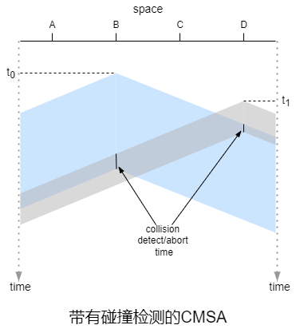

&emsp;&emsp;从连接到广播信道的节点的网络适配器角度来说明CSMA/CD的内容：

&emsp;&emsp;1）网络适配器从网络层获取数据报，将数据报封装成帧并将帧放入网络适配器的缓存中。

&emsp;&emsp;2）如果网络适配器侦听到信道是空闲的(无信号能量从信道进入网络适配器)则开始传输帧，否则网络适配器将等待，直至信道空闲。

&emsp;&emsp;3）传输帧时网络适配器会监视该信道中其他网络适配器的信号能量。

&emsp;&emsp;4）若传输整个帧的过程中未检测到其他网络适配器的能量信号则网络适配器完成了传输，否则网络适配器将中止传输。

&emsp;&emsp;5）中止之后，网络适配器将等待随机时延并回到第2步。

&emsp;&emsp;**二进制指数退避算法**可以让碰撞后节点等待的随机时延随着碰撞次数增长而增长。512比特在端到端的往返时间表示为$2\tau$，也称为**冲突窗口**或**竞争期**，一般设置为基本退避时间。若一个帧的碰撞次数达到16次时会==丢弃该帧并向上层反馈错误==。定义一个与冲突次数相关的参数$k$，$k=min\{碰撞次数,10\}$。从$[0,1,2,...,2^k-1]$中选取随机数$r$，则等待的随机时延是$r$倍的基本退避时间，即$r\times 2\tau$。

&emsp;&emsp;CSMA/CD的效率指大量活动节点时，帧在信道上无碰撞地传输的时间所占的比例。
$$
effciency\approx \frac{1}{1+5\frac{d_{prop}}{d_{trans}}}
$$
&emsp;&emsp;$d_{prop}$表示信号能量在任意两个网络适配器之间传输所需的最长时间。$d_{trans}$表示传输最大长度的帧所需时间。

&emsp;&emsp;假设$S$表示类似于时隙ALOHA的时隙，$S$比传输一帧的时间小很多且$S>d_{prop}$，这样在时隙结束前每个节点都能检测到其他节点的信号能量。所有帧的长度固定，用$L$表示，$L=kRS$，$R$表示信道的速度，即成功传输帧需要连续$k$个传输成功的时隙。由于时隙结束前每个节点都能检测到其他节点的信号能量，首个传输成功的时隙后的$k-1$个时隙无时隙竞争。此外，有$N$个节点且每个节点有无限帧待发送。每个节点在时隙内传输的概率是$p$。每$x$个传输失败的时隙后有传输成功的时隙。时隙内成功传输的概率是$\beta$，$\beta=Np(1-p)^{N-1}$。$Y$表示时隙序号。
$$
P(Y=x+1)=\beta (1-\beta)^{x}
$$
&emsp;&emsp;根据几何分布期望，$E(x+1)=\frac{1}{\beta}$，则$E(x)=\frac{1-\beta}{\beta}=\frac{1-Np(1-p)^{N-1}}{Np(1-p)^{N-1}}$。
$$
\begin{align}
effciency&=\frac{k}{k+x}\\
&=\frac{k}{k+\frac{1-Np(1-p)^{N-1}}{Np(1-p)^{N-1}}}
\end{align}
$$
&emsp;&emsp;显然$\beta$越大，效率越高，在[时隙ALOHA](#6.2.2.1 时隙ALOHA)中推导了$p=\frac{1}{N}$时$\beta$取最大值$\frac{1}{e}$，$effciency_{max}=\frac{k}{k+e-1}$。

##### 5.2.3 轮流协议

&emsp;&emsp;轮流协议中，只有一个节点活跃时，该节点的吞吐量为$R(b/s)$，当有$M$个活跃节点是，每个活跃节点的吞吐量接近$\frac{R}{M}(b/s)$。

&emsp;&emsp;**轮询协议**需要一个主节点，主节点以循环的方式**轮询**其他节点。主节点通过侦听信道来确定节点是否完成了传输帧。例如，主节点向节点1发送报文来告诉它能够传输的帧的最大数量。节点1传输了一些帧后，主节点再向节点2发送报文来告诉它能够传输的帧的最大数量。主节点通过这种方式来轮询每个节点。

&emsp;&emsp;轮询协议相比随机访问协议消除了碰撞和空时隙。但轮询协议需要引入了轮询延迟，更严重的的是问题是当主节点发生故障时整个信道将无法运行。

&emsp;&emsp;**令牌传递协议**相比轮询协议没有主节点，而是一个称为的**令牌**的小型专用帧以某种固定顺序在节点之间交换。当节点收到令牌时，若有帧待传输才持有令牌并发送最大数量的帧，否则它将按序向下一个节点转发令牌。

##### 5.2.4 DOCSIS

&emsp;&emsp;有线接入网通常将数千个住宅有线调制解调器连接到**电缆调制解调器终端系统**。**有线电缆数据服务接口规范**规定了有线网络架构及其协议。


&emsp;&emsp;DOCSIS使用FDM将下行(CMTS到调制解调器)和上行(调制解调器到CMTS)网段划分为多个频率信道。

&emsp;&emsp;每个下行信道的带宽是$6M(hz)$，每个信道的最大吞吐量大约为$40M(b/s)$。每个上行信道的最大带宽是$6.4M(hz)$，最大上行吞吐量约为$30M(b/s)$。每个上行和下行通道都是一个广播信道。

&emsp;&emsp;每个上行信道被划分为时间间隔(类似于TDM)，每个时间间隔包含一个微时隙序列，电缆调制解调器可以通过这些微时间序列向CMTS传输。CMTS显式地授予各个电缆调制解调器在指定微时隙序列传输的权限(通过CMTS在下行信道发送的称为MAP报文的控制报文来实现)。

&emsp;&emsp;CMTS在下行信道上传输的帧被所有接收该信道的电缆调制解调器接收。由于只有一个CMTS传输到下行信道，故不存在多路访问的问题。多个电缆调制解调器共享相同的上行信道到CMTS，因此可能出现碰撞。

&emsp;&emsp;电缆调制解调器在微时隙请求帧专用的微时隙间隔内向CMTS发送微时隙请求帧来达到让CMTS知晓自身有数据待发送的目的。这些微时隙请求帧以随机接入方式传输，故可能出现碰撞。电缆调制解调器既不能侦听上行信道是否空闲，也不能检测碰撞。相反，若电缆调制解调器没有在下一个下行信道的控制报文中收到微时隙请求帧的响应，则推断微时隙请求帧出现了碰撞并使用二进制指数退避算法来重传。

&emsp;&emsp;当上行信道的流量很少时，电缆调制解调器可以在微时隙请求帧专用的信道中传输帧。

#### 5.3 交换局域网

##### 5.3.1 ARP

&emsp;&emsp;**地址解析协议**用于将网络层地址解析为链路层地址，而**反向地址解析协议**用于将链路层地址解析为网络层地址。ARP仅解析同一子网下的主机和路由器接口的IP地址。

&emsp;&emsp;每个主机或路由器的内存中都有一个**ARP表**，其中包含IP地址到MAC地址映射。ARP表字段包括IP地址、MAC地址和TTL，TTL表示每个映射的删除时间，一般设置为20min。ARP表是自动构建的，若主机与子网断开连接，子网中的其他ARP表会删除该主机的表项。


&emsp;&emsp;ARP分组包括16位**硬件地址类型**、16位**协议地址类型**、8位**硬件地址长度**、8位**协议长度**、16位**操作类型**、48位**发送端MAC地址**、32位**发送端IP地址**、48位**目的MAC地址**、32位**目的IP地址**。

&emsp;&emsp;﹡硬件地址类型为1时表示以太网。

&emsp;&emsp;﹡协议类型为0x0080时表示IP。

&emsp;&emsp;﹡硬件地址长度和协议地址长度的单位是字节。

&emsp;&emsp;﹡操作类型为1时表示ARP请求分组，操作类型为2时表示ARP响应分组，操作类型为3时表示RARP请求分组，操作类型为4时表示RARP响应分组。

&emsp;&emsp;ARP请求分组用于获取目的IP地址对应的MAC地址，因此目的MAC地址为空(全为0)。

&emsp;&emsp;若需要发送一个IP寻址的数据报，发送端需要获取目的IP地址的目的MAC地址。若发送端的ARP表中没有目的IP地址的表项，则需要ARP协议来解析这个IP地址。

&emsp;&emsp;1）发送端构造ARP分组，网络适配器将分组封装成帧时将广播地址作为帧的目的MAC地址。

&emsp;&emsp;2）将待发送的数据报放入缓存。

&emsp;&emsp;3）同一子网下的其他网络适配器接收帧后将帧内的ARP分组传递给ARP模块。ARP模块会将分组中的目的IP地址与自身IP地址进行匹配，若匹配则向请求主机发送一个带有所需映射的ARP响应分组。发送端根据ARP响应分组更新ARP表。若接收端无法收到ARP响应分组，则会丢弃数据报。

&emsp;&emsp;4）从缓存中取出数据报并查询ARP表获取MAC地址。

&emsp;&emsp;5）将数据报封装成帧并发送。

&emsp;&emsp;某些ARP模块在等待ARP响应报文时==丢弃数据报==而不是放入缓存。

&emsp;&emsp;若子网1的主机A需要向子网2的主机B发送数据报，数据报首先发送到子网1中的第一跳路由，封装成帧时目的MAC地址应该是第一台路由的IP地址对应的MAC地址。路由器收到帧后提取数据报，再次封装成帧并根据转发表进行转发。

##### 5.3.2 交换机

&emsp;&emsp;交换机是全双工的，它可以在任何接口同时发送和接收。

&emsp;&emsp;交换机消除了碰撞，支持不同物理介质混搭且易于管理。

&emsp;&emsp;**过滤**是决定帧应该被转发到某个接口还是将其丢弃的交换机功能。**转发**是决定帧应该到哪个接口并移动到这个接口的交换机功能。交换机的过滤和转发功能是通过**交换机表**完成的。交换机表的表字段包括MAC地址、通向该MAC地址的接口和表项加入的时间。交换机表不一定包含局域网下所有主机和路由器的表项。

&emsp;&emsp;若一个帧从交换机的接口$x$到达，交换机用帧的目的MAC地址索引交换机表。若交换机表中没有帧的目的MAC地址的相关表项，交换机将帧的副本移动到接口$x$之外的所有接口的输出缓存，即广播该帧。若交换机表中帧的目的MAC地址关联接口$x$，交换机会丢弃该帧来执行过滤。若交换机表中有帧的目的MAC地址的相关表项且关联的接口不是$x$，交换机会将帧的副本移动到该接口的输出缓存来执行转发。

&emsp;&emsp;交换机表是**自学习**的。交换机表初始为空。对于每个从接口上到达的帧，交换机表会存储帧的源MAC地址、帧到达的接口和当前时间。交换机通过这种方式记录发送端所在的局域网。若一段时间(老化期)后没有收到源MAC地址为该地址的帧，交换机将删除表中的地址。

&emsp;&emsp;**交换机毒化**指向交换机发送大量不同伪造源MAC地址的帧来填满交换机表。

##### 5.3.3 以太网

&emsp;&emsp;在基于集线器的星形拓扑以太网中，主机或路由器通过双绞铜线直接连接到集线器。因此，这种局域网是一种广播局域网，只有集线器从一个接口收到比特，它就向所有其他接口发送副本。若集线器同时从两个接口接收帧就会发送碰撞，生成该帧的节点需要重新传输该帧。随着以太网的发展，集线器被交换机代替。集线器是半双工设备，交换机是全双工设备。

&emsp;&emsp;最初的以太网的吞吐量是$10M(b/s)$，使用了CMSA/CD协议，称为标准以太网。后来以太网出现了不同风格，用字符缩略词表示，例如10BASE-T、100BASE-2等。缩略词的第一部分为数字，表示吞吐量。第二部分通常是BASE或BROAD。BASE指基带以太网，表示物理介质仅承载以太网流量。BOARD指宽带以太网。第三部分表示物理介质，2表示细同轴电缆，5表示粗同轴电缆，F表示光纤，T表示双绞线。

&emsp;&emsp;$100M(b/s)$以太网除了吞吐量的提高，还定义了更高速的物理层。双绞线的距离限制为100m，光纤距离限制为几千米。

&emsp;&emsp;吉比特/千兆以太网是$10M(b/s)$和$100M(b/s)$的扩展，除了兼容前者和吞吐量的单位提高到了$G(b/s)$，还提供了全双工和半双工两种方式。半双工基于集线器，使用了一对电缆线，需要CMSA/CD。全双工基于交换机，使用了两对电缆线，不需要链路层协议。

&emsp;&emsp;以太网提供无连接且不可靠服务。


&emsp;&emsp;以太网帧包括8字节**前同步码**、6字节**目的MAC地址**、6字节**源MAC地址**、2字节**类型**、46字节~1500字节的**有效载荷**和4字节的**帧校验序列**。

&emsp;&emsp;﹡前同步码的前7个字节都是10101010，用于保证接收MAC帧时接收端的网络适配器的时钟频率与发送端的网络适配器同步。前同步码最后一个字节是10101011，最后连续的11表示之后是帧的信息。

&emsp;&emsp;﹡类型表示上层(网络层)协议类型。值为0x0800时表示IPv4，值为0x0806表示ARP，值为0x86DD表示IPv6。

&emsp;&emsp;﹡有效载荷不足46字节时会将数据报填充到46字节，网络层根据数据报首部中的长度字段来去掉填充的字节。

&emsp;&emsp;﹡帧校验序列用于差错检测，一般是[CRC编码](#6.1 差错检测和纠错)。

##### 5.3.4 虚拟局域网

&emsp;&emsp;支持**虚拟局域网**的交换机可以在单个物理局域网基础设施上定义多个虚拟局域网。

&emsp;&emsp;在基于端口的VLAN中，交换机的接口被分组。每个组构成一个VLAN，每个VLAN中的端口组成一个广播域，即来自端口的广播流量只能达到组中的其他端口。

&emsp;&emsp;将交换机端口连接到外部路由器，并将路由器接口中连接交换机的接口配置为属于交换机所属VLAN。通过这种方式可以实现基于端口的VLAN互联，从逻辑上就是通过路由器转发。

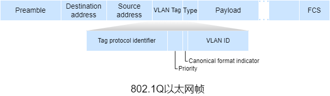

&emsp;&emsp;另一种更加可扩展性的实现基于端口的VLAN互联的方式是**虚拟局域网干道**，每个交换机的部分接口配置为干道接口，干道端口用于连接其他交换机，干道接口属于所有VLAN，干道接口之间的链路称为干道链路，发送到任何VLAN的帧都会通过干道链路转发到另一台交换机。为了区分VLAN，IEEE定义了一种扩展以太网帧格式802.1Q。相比以太网帧在首部加入了4字节**VLAN标签**用于标识VLAN。

| 字段名         | 长度  | 描述                                                     |
| -------------- | ----- | -------------------------------------------------------- |
| 标签控制信息   | 2字节 | 表示帧类型，一般取固定值0x8100，若自定义则各个设备需统一 |
| 优先级         | 3位   | 网络拥塞时，优先发送优先级高的帧                         |
| 标准格式指示位 | 1位   | 取值0时表示以标准格式封装，取值1时表示非标准格式封装     |
| VLAN标识符     | 12位  | 全为0和全为1为协议保留值                                 |

&emsp;&emsp;在基于接口的VLAN中，以太网帧分为**有标记帧**和**无标记帧**，有标记帧有VLAN标签，无标记帧没有。若交换机不支持有标记帧则会丢弃。干道链路上传输的帧都是有标记帧，接入链路上传输的帧都是无标记帧。交换机内部处理的帧都是有标记帧，若收到无标记帧，交换机会为无标记帧添加VLAN标签并重新计算FCS。交换机向接入链路发送帧时会将有标记帧的VLAN标签去除。

&emsp;&emsp;由于802.1Q以太网帧中的VLAN标识符只能表示$2^{12}-2=4096$个VLAN，为了扩展VLAN数量，可以将802.1Q以太网帧作为另一个802.1Q以太网帧的有效载荷，称为QinQ(802.1Q in 802.1Q)，这样VLAN数量增加到了$4096\times 4096$。

&emsp;&emsp;除了VLAN除了基于接口，还可以基于其他方式，例如MAC地址和网络层协议等。在基于MAC地址中的VLAN中会为VLAN指定MAC地址集。VLAN也可以跨IP路由器扩展，允许LAN岛连接在一起形成全球性的VLAN。

#### 5.4 MPLS

&emsp;&emsp;为了提高路由器的转发速度，MPLS采用了虚电路网络的一个关键概率：固定长度标签，其目标是在可能的情况下，标记数据报并允许路由器基于固定长度标签转发数据报，通常与IP协同，来提供转发速度。

&emsp;&emsp;MPLS是一种分类转发技术，它将具有相同转发处理方式的分组归类，称为**转发等价类**。


&emsp;&emsp;**MPLS标签栈**表示MPLS首部的排序集合。靠近链路层帧的MPLS首部称为栈顶标签或外层标签，靠近网络层数据报的MPLS首部称为栈底标签或内层标签。MPLS标签栈按后进先出方式组成首部，从栈顶开始处理首部。

&emsp;&emsp;MPLS首部位于链路层帧首部和网络层数据报首部之间。MPLS首部包括20位**标签**、3位**实验**、1位**栈底标识**和8位**生存时间**。

&emsp;&emsp;﹡标签用于标识分组所属FEC。

&emsp;&emsp;﹡实验常用于**服务分类**。

&emsp;&emsp;﹡栈底标识值为1时表示为最底层标签。

&emsp;&emsp;﹡生存时间与[IPv4数据报](#4.2.1 IPv4数据报)中的生存时间相同。

&emsp;&emsp;支持MPLS的路由器称为**标签交换路由器**，MPLS分组仅能标签交换路由器之间传输。LSR通过在其转发表中查找MPLS标签来转发MPLS分组，然后将数据报移动到对应的输出接口。**标签交换路径**指同一FEC报文在MPLS域内转发的路径。

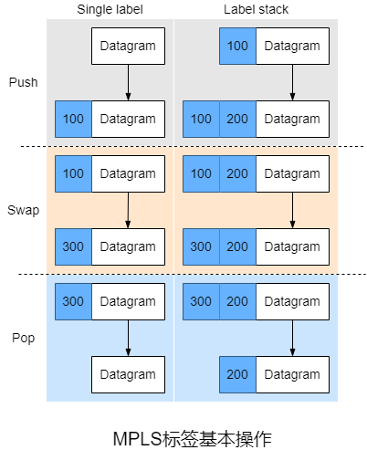

&emsp;&emsp;MPLS标签的基本操作包括**标签压入**、**标签交换**和**标签弹出**。

&emsp;&emsp;﹡标签压入指当LSP入口节点添加新MPLS标签或LSP中间节点按需添加一层新的标签。

&emsp;&emsp;﹡标签交换指LSP中间节点根据标签转发表替换MPLS分组的栈顶标签。

&emsp;&emsp;﹡标签弹出指当LSP出口节点去除标签或在LSP倒数第二跳节点去除栈顶标签。

&emsp;&emsp;在MPLS域内的最后一跳时，MPLS标签已失去作用，可以利用**倒数第二跳弹出**在MPLS域内倒数第二跳节点将标签弹出以减少最后一跳的处理负担。

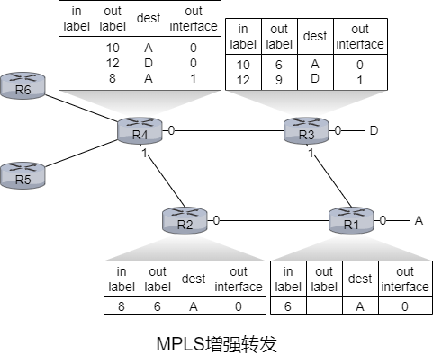

&emsp;&emsp;R1-R4是LSR，R5和R6是标准IP路由器。R1已向R2、R3通告可以路由到A，MPLS标签为6的帧将被转发到A。R3已向R4通告可以到达A和D，MPLS标签为10的帧将被转发到A，MPLS标签为12的帧将被转发到D。R2已向R4通告可以到达A，MPLS标签为10的帧将被转发到A。与交换LAN或ATM网络一样，R1-R4路由器的转发与IP数据报无关。

&emsp;&emsp;MPLS是一种简单形式的**流量工程**，其中ISP可以覆盖常规的IP路由并强制一些流量沿着一条链路传输到指定目的地，而其他流量则沿着另一条链路流向同一目的地。

&emsp;&emsp;MPLS可用于执行MPLS转发路径的快速恢复，例如用过预先计算的故障转移链路重新路由流量来响应链路故障。

&emsp;&emsp;MPLS可用于来实现**虚拟专用网**，ISP使用支持MPLS的网络将客户的各种网络连接在一起。MPLS还可用于将VPN客户端使用的资源和地址与跨ISP网络的其他用户的资源和地址隔离。

#### 5.5 数据中心网络

&emsp;&emsp;每个数据中心都有**数据中心网络**，将其主机互联并将数据中心与互联网互联。数据中心网络的关键需求是计算和服务放置的灵活。

&emsp;&emsp;数据中心的主机称为**刀片**。刀片负责提供内容、存储数据并共同执行大型分布式计算。主机堆叠在机架上，每个机架顶部都有一台**机架式**交换机。TOR交换机将机架上的互联。机架上的主机都有一个与TOR交换机连接的网络接口卡，每个TOR交换机都有可以连接到其他TOR交换机的额外接口。每台主机都分配了数据中心的内网IP。

&emsp;&emsp;数据中心网络支持两种流量：外部客户端和内部主机之间的流量以及内部主机之间的流量。为了处理外部客户端和内部主机之间的流量，数据中心网络包括一个或多个**边界路由器**用于将数据中心网络连接到互联网。所以数据中心网络需要将所有主机互联并将机架与边界路由器连接。


&emsp;&emsp;大型数据中心通常使用**等级拓扑**形式，其中有多个负载均衡器，每个负载均衡器专门用于一组特定的应用程序，这种负载均衡器也称为第四层交换机，因为它根据分组的端口号和目的IP地址进行决策。收到请求后，负载均衡器会将其转发到对应的主机，主机处理请求后将响应发送给负载均衡器，负载均衡器再将响应发送给客户端。负载均衡器不仅可以提供负载均衡，还可以提供类似NAT的功能，将公网IP地址转换为内网IP地址并将响应按向相反的转发方式处理。

&emsp;&emsp;在等级拓扑的数据中心网络中，边界路由器与接入路由器相连，接入路由器下有三层交换机。每台接入路由器下的主机构成一个子网，为了本地化ARP广播流量，这些子网进一步划分为VLAN子网。所有链路通常使用以太网作为链路层和物理层并使用铜缆和光纤。此外，数据中心还包括冗余网络设备和链路(例如，TOR交换机连接两台第二层交换机，每台接入路由器、第一层交换机和第二次交换机都可以冗余)。虽然这种结构解决了扩展性的问题，但是存在吞吐量的问题。

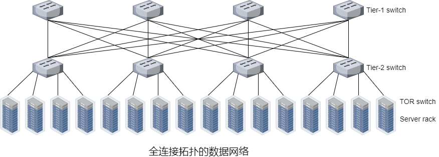

&emsp;&emsp;用**全连接拓扑**来代替交换机和路由器的等级结构可以改善吞吐量，这种结构中每台第一层交换机都连接到所有第二层交换机，因此需要考虑交换机之间选择算法，较简单的算法是随机，另一种在每个主机中部署多个网络接口卡，将主机连接到多个低成本商用交换机并允许主机在交换机之间智能路由流量。

&emsp;&emsp;另一种方式是采用基于集装箱的**模块化数据中心**。在MDC中，工厂在一个集装箱内建造一个迷你数据中心，并将集装箱运送到数据中心位置。当许多组件发生故障并且性能下降到阈值时，整个容器会被换掉。对于MDC，有两种网络类型：每个容器内的容器内部网络和连接每个容器的核心网络。容器内部可以使用全连接拓扑，但核心网络存在吞吐量问题。

### 第六章 无线网络和移动网络

&emsp;&emsp;无线网络包括**无线主机**、**无线链路**、**基站**和**网络基础设施**。主机通过无线通信链路连接到基站或无线主机，这里的连接指的是主机位于基站的无线通信范围内且主机通过基站来中继和更大的网络。

&emsp;&emsp;连接到基站的主机通常以**基础架构模式**运行，因为所有传统网络服务都是由主机通过连接到基站的网络提供。在**自组织网络**中，无线主机没有可连接的此类基础设施，主机本身必须提供这些传统网络服务。

&emsp;&emsp;当移动主机超出一个基站额度范围并进入另一个基站的范围时，它会将其连接点更改为更大的网络，这个过程称为**切换**。


&emsp;&emsp;无线网络可以按基站与主机通信时经过单跳还是多跳以及网络中是否存在基础设施进行分类。

&emsp;&emsp;﹡**单跳且基于基础设施**的无线网络中有一个连接到更大的有线网络的基站，该基站与无线主机之间的所有通信都仅经过单挑。

&emsp;&emsp;﹡**单跳且无基础设施**的无线网络中的节点可以协调其他节点的传输。

&emsp;&emsp;﹡**多跳且基于基础设施**的无线网络中有一个有线连接到更大的网络的基站，为了通过基站通信，其中部分节点需要通过其他节点中继它们的通信。

&emsp;&emsp;﹡**多跳且无基础设施**的无线网络中没有基站，节点可能需要其他节点中继。若节点是移动的则称为**移动自组织网络**。若移动节点是车载的则称为**车载自组织网络**。

#### 6.1 无线链路和网络特征

&emsp;&emsp;相比有线链路，无线链路存在**信号强度的衰减**、**其他源的干扰**以及**多径传播**。

&emsp;&emsp;﹡电磁波穿过物体时信号强度会衰减。随着传播距离的增加，电磁波信号强度也会降低，称为**路径损耗**。

&emsp;&emsp;﹡同一频段的电磁波将互相干扰，此外，环境中的其他电磁波也会导致干扰。

&emsp;&emsp;﹡当部分电磁波在物体或地面上反射时，在发送端和接收端之间经过了不同长度的路径，称为**多径传播**，这样会导致接收端收到的信号模糊。

&emsp;&emsp;无线链路相比有线链路更容易出现比特差错，因此无线链路不仅采用了[CRC编码](#6.1 差错检测和纠错)，还使用了链路层ARQ协议来重传受损的帧。

&emsp;&emsp;接收端收到的电磁信号是发送端传输的原始信号的退化形式(信号衰减和多径传播等)和环境中的噪声(干扰信号)的结合。**信噪比**是收到的信号和噪声强度的相对值，即以10为底接收到的信号的振幅的对数与噪声的振幅之比的20倍。

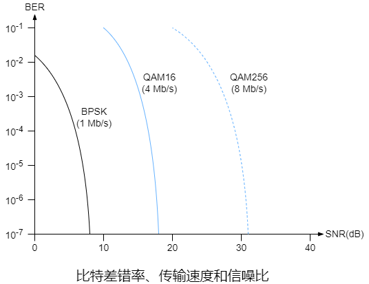

&emsp;&emsp;对于给定的调制技术，SNR越高，BER越低，发送端可以通过增加传输速度来增加SNR，进而降低BER。增加传输速度会消耗更大的能量而且可能干扰其他发送端的传输，传输功率达到某个阈值时收益将微乎其微。

&emsp;&emsp;对于给定的SNR，传输速度越高，BER越高。

&emsp;&emsp;物理层调制技术的动态选择可用于适配信道条件的调制技术。

#### 6.2 IEEE 802无线协议

&emsp;&emsp;在IEEE 802.11(WiFi)协议族中有几个WLAN技术的802.11标准。它们都使用了CSMA/CA协议，链路层帧结构相同，可以通过降低传输速度来增加传输距离，而且向后兼容。

| 标准     | 频率范围(Hz) | 最高传输速度(Mb/s) |
| -------- | ------------ | ------------------ |
| 802.11b  | 2.4G         | 11                 |
| 802.11a  | 5G           | 54                 |
| 802.11g  | 2.4G         | 54                 |
| 802.11n  | 2.5~5G       | 450                |
| 802.11ac | 5G           | 1300               |

&emsp;&emsp;802.11设备工作在==2.4G\~2.485G(称为2.4GHz)==和==5.1\~5.8GHz(5GHz)==这两个不同的频段。2.4GHz是无须许可的频段，802.11设备可能与2.4GHz电话或微波炉竞争。在5GHz频段，802.11 LAN在给定功率时传输距离更短且更容易受到多径传播的影响。802.11n和802.11 ac使用多输入多输出(MIMO)天线，即发送端和接收端都有两个或多个天线用来发送/接收不同的信号。802.11 ac基站可以同时向多个基站发送信号，并使用智能天线自适应成型波束向目的地传输，这样减少了干扰并增加了给定速度下的传输距离。

&emsp;&emsp;除了802.11，其他两个802无线协议是使用802.15.1的蓝牙以及使用802.15.4的ZigBee。802.15.1是低功率、小范围、小速率的电缆代替技术，因此802.15.1也称为**无线个人局域网**。802.15.4服务于低功率、低数据率和低工作周期的应用，例如物联网设备。

##### 6.2.1 802.11体系结构

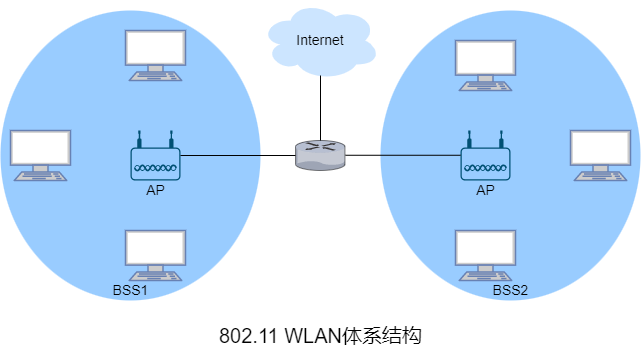

&emsp;&emsp;802.11体系结构的基本构建块是**基本服务集**。BSS包含一个或多个无线主机和一个称为**接入点**的中央基站。在常规的家庭网络中，一个AP和一个路由器(通常集成为一个单元)将BSS连接到互联网。

&emsp;&emsp;类似于以太网设备，每个802.11无线主机都有MAC地址，该地址存储在设备适配器(802.11网络接口卡)的固件中。每个AP的无线接口也有一个MAC地址。

&emsp;&emsp;部署AP的WLAN称为**基础设施WLAN**，基础设施指AP以及互联AP和路由器的有线以太网。802.11设备能将组成一个自组织网络，该网络无中央控制且与外部没有连接。

&emsp;&emsp;在802.11中，每个无线主机都需要与AP相连才能发送或接收网络层数据报。

&emsp;&emsp;在安装AP时会为AP分配一个或两个词的**服务集标识符**和一个信道号。802.11在2.4Ghz~2.485Ghz的频段内运行，在这个85MHz的频段内，802.11定义了11个部分重叠的信道，两个信道只有被4个或更多信道隔开时才不会有重叠，因此信道1、6和11的唯一的三个不重叠信道集合，同一个网络里可以安装3个802.11b AP并为这些AP分配信道1、6和11，然后将每个AP都连接到同一交换机上。

&emsp;&emsp;**WiFi丛林**指无线主机能从两个或多个AP接收到足够强的信号的任何物理位置。无线主机需要与AP**关联**才能加入AP所属子网并访问互联网，关联表示无线主机与AP建立一条虚拟链路。

&emsp;&emsp;802.11标准中AP会定期发送**信标帧**，每个信标帧包含AP的SSID和MAC地址。无线主机会扫描11个信道来获悉信标帧以及发送的AP。802.11标准并没有指定AP关联的算法，该算法由无线主机中的802.11固件和软件设计者决定。通常，设备会选择接收到的信标帧信号强度最高的AP，显然信号强度并不是决定设备接收性能的唯一AP特性。


&emsp;&emsp;扫描信道和侦听信标帧的过程称为**被动扫描**。无线主机也能通过向无线主机范围内所有的AP广播探测帧来**主动扫描**。无线主机选择AP后，向AP发送关联请求帧，AP响应关联响应帧。一旦与AP关联，无线主机将加入AP所属子网。

&emsp;&emsp;为了创建与特定AP的关联，无线主机可能需要向AP认证自身。802.11 WLAN为身份认证和访问提供了多种选择，例如基于主机的MAC地址和使用账户和密码，这两种方式中，AP通常与认证服务器通信，使用诸如RADIUS或DIAMETER之类的协议在无线主机与认证服务器之间中继信息。分离认证服务器和AP使得认证服务器可以为多个AP服务，将身份认证和访问的决策集中在单个服务器中，并降低AP成本和复杂度。

##### 6.2.2 802.11 MAC协议

&emsp;&emsp;802.11的载波侦听分为物理侦听和虚拟侦听，主要使用需要侦听。无线链路存在信号衰减、干扰以及多径传播，802.11使用**网络分配向量**来实现虚拟侦听，NAV是一个微秒计时器，用来指示预计使用信道的时间，当NAV不为0时则表示信道忙碌。

&emsp;&emsp;802.11MAC协议中帧间都有**帧间间隔**。一般情况下，发送帧前需要等待**分布式帧间间隔**，发送ACK帧前需要等待**短帧帧间间隔**。

&emsp;&emsp;802.11 MAC协议包括**分布式协调功能**、**点协调功能**和**混合协调功能**三种工作模式，其中DCF是PAF和HCF的基础，PCF是可选项，HCF提供QOS的支持。DCF采用竞争的方式接入信道，PCF采用统一分配的方式接入信道，HCF在DCF的基础上加入了QOS的支持。

&emsp;&emsp;﹡DCF是站点共享信道的接入方式，接入方式是CSMA/CA，还加入了可选的短**请求发送**控制帧和短**允许发送**控制帧来避免长数据帧的碰撞。

&emsp;&emsp;﹡PCF中需要一个站点作为**点协调器**，点协调器周期性地发送信标帧来广播WLAN的网络标识和管理参数，其他站点根据管理参数来设置NAV。由于信标帧通过DCF发送，点协调器必须参与信道竞争。PCF只能在**非竞争期**工作，其机制类似于[轮流协议](#6.2.3 轮流协议)中的轮询协议，点协调器轮询其他节点，轮询的节点才能传输帧，帧的长度受到限制。

&emsp;&emsp;﹡HCF类似于PCF，但可以在**竞争期**工作且支持QOS。

&emsp;&emsp;802.11并未实现碰撞检测，因为碰撞检测需要同时传输和侦听，由于接收信号的强度通常远小于发送信号的强度，实现碰撞检测成本较高。即使网络适配器可以同时传输和侦听(并在检测到碰撞时时中止传输)，由于隐藏终端和信号衰减的问题，网络适配器依然无法检测到所有碰撞。

&emsp;&emsp;当源站点有帧待发送时需要先侦听信道，当信道空闲后需要等待DIFS，若在此期间未侦听到信号就发送帧，否则源站点像[CSMA/CD](#6.2.2.4 CSMA/CD)使用二进制指数退避算法来计算退避时间并启动**退避计时器**，但不同于CSMA/CD的是退避时间的随机区间为[0,CW)，其中CW是**竞争窗口**，侦听到的信道空闲时间至少为DIFS时，计时器才会减一(基本退避时间)。若在退避时间内侦听到信号则暂停计时器，然后会重新等待到信道空闲并在下一个DIFS后再次启动计时器(计时器时间是剩下的时间)，计时器为0时发送帧。由于各种原因，帧可能无法完整地达到目的地，因此使用了类似于[rdt2.0](#3.2.2 rdt2.0)中ACK的**链路层确认**。当目的站点收到通过CRC的帧时，它会等待SIFS后响应一个ACK帧。若源站点等待ACK帧超时则重传，在给定次数的重传后依然未收到ACK帧则丢弃帧。

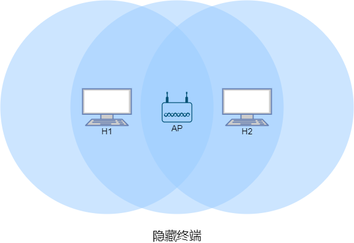

&emsp;&emsp;无线主机H1和H2都在AP的范围内且都与AP关联，但由于信号衰减，两个无线主机对AP不隐藏，但是对彼此隐藏。若H1正在传输帧时，H2也要传输帧，这会导致碰撞，因此H1和H2的整个传输期间，信道都被浪费。

&emsp;&emsp;为了避免隐藏终端导致的问题，802.11协议允许无线主机使用RTS帧和CTS帧来预约信道的访问。类似于[TCP连接管理](#3.4.2 连接管理)中的建立连接，当源站点有数据帧要发送时，可以先向AP发送一个RTS帧来指示传输数据帧和ACK帧所需的总时间，能够侦听到源站点信号的站点会进入NAV静默状态。当AP收到RTS帧后通过广播CTS帧来响应，这样既给了源站点明确的发送权限，也指示了其他站点在预约时间内不要发送，其他所有节点也进入NAV静默状态。若等待CTS帧超时则像发送普通数据帧一样使用二进制指数退避算法来计算退避时间并等待然后重传。


&emsp;&emsp;尽管RTS和CTS帧有助于减少碰撞，但也引入了延迟并消耗信道资源，因此，RTS和CTS帧仅用于长数据帧的传输通道预约。实际上可以为每个无线站点设置RTS阈值，当帧的长度超过阈值时才是RTS/CTS帧，默认阈值一般是2347字节。除了解决隐藏终端，RTS和CTS帧体现了==用短帧的碰撞来避免长帧的碰撞==。

##### 6.2.3 802.11帧

&emsp;&emsp;802.11帧分为**数据帧**、**控制帧**和**管理帧**。数据帧用于传输数据，控制帧通常与数据中配合使用。负责区域的清空、信道的取得、载波侦听的维护和响应数据。管理帧用于加入或退出WLAN以及处理基站之间的转移。


&emsp;&emsp;802.11帧包括2字节**帧控制**、2字节**持续期或ID**、6字节**地址1**、6字节**地址2**、6字节**地址3**、2字节**序号控制**、6字节**地址4**、最大2312字节有效载荷以及4字节CRC。

&emsp;&emsp;帧控制包括帧的类型信息和一些控制位。

| 帧控制字段       | 长度(位) | 描述                                                         |
| ---------------- | -------- | ------------------------------------------------------------ |
| protocol version | 2        | 802.11协议版本，目前只有一个版本，该字段值为0                |
| type             | 2        | 值为00时表示管理帧，值为01时表示控制帧，值为10时表示数据帧，值为11保留 |
| subtype          | 4        | 具体的802.11帧类型信息                                       |
| to DS            | 1        | 值为1时表示帧发送到无线工作站(例如AP)                        |
| from DS          | 1        | 值为1时表示帧由无线工作站(例如AP)发送                        |
| more flag        | 1        | 类似于[IPv4数据报](#4.2.1 IPv4数据报)中的分片标志位          |
| retry            | 1        | 值为1时表示重传帧                                            |
| power management | 1        | 值为1时发送完本帧后进入省电模式                              |
| more data        | 1        | 仅用于管理帧，控制帧的该字段值为0                            |
| protected frame  | 1        | 值为1时表示有效载荷已加密                                    |
| order            | 1        | 值为1时表示帧按序传输                                        |

&emsp;&emsp;持续器用于记载NAV的值。当最后一位为0时用于设置NAV，例如RTS和CTS帧中会设置这个值来指示其他站点在指定时间内不要发送帧。

&emsp;&emsp;地址1表示接收端(接收端不一定是目的地)的MAC地址。

&emsp;&emsp;地址2表示发送端(发送端不一定是源)的MAC地址。

&emsp;&emsp;地址3用于基站和传输系统的过滤，具体用法取决于网络类型。例如一台路由器需要向某个BSS中的某台无线主机发送帧，但是路由器并不知道它通过AP到达无线主机间，路由器发送目的MAC地址为无线主机的==以太帧==到AP。AP收到以太网帧后将其==转换为802.11帧==，该802.11帧的地址1是无线主机的MAC地址，地址2是自身地址，地址3是路由器发送数据报接口的MAC地址。

&emsp;&emsp;序号控制类似于[rdt2.0](#3.2.2 rdt2.0)中的序号。

&emsp;&emsp;地址4仅在无线分布式系统中使用。

##### 6.2.4 蓝牙和ZigBee

&emsp;&emsp;802.15.1的链路层和物理层基于早期的PAN蓝牙规范。802.15.1以TDM方式在2.4GHz频段上运行，时隙是625$\mu s$。在每个时隙中，发送端在79个信道中的一个上进行传输，信道以已知但伪随机的方式跳频，称为**跳频扩频**。802.15.1可提供最高$4 M(b/s)$的传输速度。

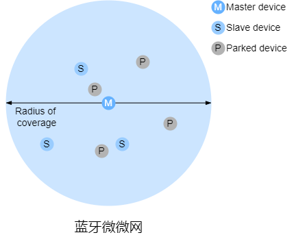

&emsp;&emsp;802.15.1网络是自组织网络，802.15.1设备首先组织成最多八个活动设备的**微微网**，这些设备之一被指定为主设备，其他设备充当从设备。主节点管理微微网，因为它的时钟决定微微网的时间，它可以在每个奇数时隙中传输，而从设备只能在主设备前一时隙与它通信后才能传输。除了从设备，微微网还可以容纳最多255个停放设备，停放设备只能在主设备将其状态变更为活动后才能通信。

&emsp;&emsp;ZigBee定义了20、40、100和250$k(b/s)$的信道速率，具体取决于信道的频率。在ZigBee网络中，多个相对简化功能的设备在单个全功能设备的控制下运行，并且多个全功能设备还能够配置为一个网状网络，全功能设备在它们之间路由帧。ZigBee使用了时隙版CSMA/CA。


&emsp;&emsp;单个全功能设备使用信标帧以时隙方式控制多个简化功能的设备。ZigBee网络将时间划分为重复出现的超帧，每个超帧以信标帧开始。信标帧将超帧划分为活跃周期(此周期内设备可以传输)和不活跃周期(此周期内设备可以休眠来节能)。活跃周期由16个时隙组成，其中部分由使用CSMA/CA随机接入方式的设备使用，其余部分由控制器分配特定的设备来给这些设备提供有保障的信道接入。

#### 6.3 蜂窝互联网接入

&emsp;&emsp;**蜂窝**(技术)是蜂窝网覆盖的区域被划分为称为**小区**或**蜂窝**的多个地理覆盖区域。每个蜂窝包含一个**基站收发台**，BTS负责像其蜂窝中的移动站点发送/接收信号。

&emsp;&emsp;最早的几代蜂窝主要服务于语音流量。第一代(1G)是专为纯语音通信设计的模拟**频分多址**系统。最初的2G系统也是为语音而设计的，后来扩展了对数据(互联网)的支持(2.5G)。3G系统支持语音和数据，但更强调数据能力和更高速的无线接入链路。4G系统基于LTE，其特点是全IP核心网络并以$M(b/s)$速度提供语音和数据服务。

&emsp;&emsp;2G蜂窝系统的GSM标准使用组合的FDM/TDM(无线电)作为空中接口。对于组合FDM/TDM系统，若将信道划分为$F$个子信道且时间划分为$T$个时隙，则该信道能够支持$F\cdot T$个并发呼叫。GSM系统由$200kHz$的频段组成，每个频段支持8个TDM呼叫。GSM以$13k(b/s)$和$12.2k(b/s)$编码语音。

&emsp;&emsp;单个GSM网络的**基站控制器**通过会为数十个BTS提供服务。BSC的作用是为移动用户分配BTS无线电信道，执行**寻呼**(查找移动用户所在的蜂窝)。基站控制器及其受控的BTS共同构成一个GSM**基站系统**。

&emsp;&emsp;**移动交换中心**在用户授权和计费、呼叫建立和断开以及切换中发挥着决定性作用。单个MSC通常最多包含5个BSC，因此每个MSC大约有20万用户。蜂窝提供商的网络有多个MSC，其中称为网关MSC的特殊的MSC将提供商的蜂窝网络连接到更大的公共电话网络。

&emsp;&emsp;**通用分组无线服务**是2G网络中的一种早期蜂窝数据服务，基于GSM的无线分组交换技术，提供端到端且广域的无线IP连接。

##### 6.3.1 3G蜂窝网


&emsp;&emsp;相比2G，3G UMTS不再使用GSM的FDMA/TDMA方案，而是在TDMA时隙内使用**直接序列宽带码分多址**，类似于[DOCSIS](#5.2.4 DOCSIS)。与WCDMA规范相关的数据分为称为高速分组接入。

&emsp;&emsp;3G核心蜂窝数据网络将无线接入网络连接到公网。鉴于现有蜂窝语音网络存在大量现有基础设施，因此3G保持现有核心GSM蜂窝语音网络不变，同时添加额外的蜂窝数据功能到现有的蜂窝语音网络。

&emsp;&emsp;3G核心网中有**GRRS服务支持节点**和**GRPS网关支持节点**这两种节点。SGSN负责向与其连接的无线接入网中的移动节点发送/接收数据报。SGSN与同一区域的蜂窝语音网络的MSC交互，提供用户授权和切换，维护活跃移动节点的蜂窝信息，并在无线接入网络中的移动节点和GGSN间转发数据报。GGSN充当网关，将多个SGSN连接到公网。因此，GGSN是源自移动节点的数据报进入公网之前经过的最后一个3G基础设施。对外界而言，GGSN无异于其他网关路由器。GGSN网络内3G节点的移动性对外隐藏。

&emsp;&emsp;3G**无线接入网络**是移动节点接触的无线首跳网络。**无线网络控制器**(又称为NodeB )通常控制多个蜂窝的BTS。每个蜂窝的移动节点和BTS之间通过无线链路连接。RNC通过MSC连接到连接到电路交换蜂窝语音网络，并通过SGSN连接到公网。3G蜂窝语音服务和数据服务虽然使用不同的核心网络，但它们共享第一跳和最后一跳无线接入网络。

##### 6.3.2 4G蜂窝网


&emsp;&emsp;相比3G，4G使用了**全IP核心网络**(语音和流量全都承载在IP数据报中)和增强的无线接入网络，而且4G对数据平面和控制平面进行了分离。

&emsp;&emsp;**eNodeB**是2G的基站和3G的RNC的逻辑后代。在控制平面中，eNodeB代表UE来处理注册和移动信令流量。在数据平面中，eNodeB负责在UE和P-GW之间转发数据报。UE数据报在eNodeB中封装并通过4G网络的全IP增强型分组核心(EPS)以隧道形式传输到P-GW。eNodeB与P-GW之间的隧道类似于[IPv6](#4.2.4 IPv6)中IPv4迁移到IPv6的隧道，这些隧道可能具有相关的QOS保证。

&emsp;&emsp;**分组数据网络网关**为UE分配IP地址并保证QOS的执行。作为隧道端点，它负责封装和解封装发给UE和来自UE的数据报。

&emsp;&emsp;**服务网关**是数据平面移动锚点，即所有UE流量都将通过。S-GW还负责收费/计费以及合法的流量拦截。

&emsp;&emsp;**归属用户服务器**容纳包括漫游接入能力、QOS配置文件和认证信道的UE信息，它从UE归属蜂窝提供商获得这些信息。

&emsp;&emsp;**移动性管理实体**代表驻留在其控制的蜂窝中的UE执行连接和移动性管理，它从HHS接收UE订阅信息。

&emsp;&emsp;LTE在下行信道使用组合FDM/TDM，称为**正交频分复用**。在LTE中，每个活跃移动节点在一个或多个信道频率中被分配一个或多个0.5$ms$时隙。分配的时隙越多，移动节点能够获取的传输速度越高。移动节点之间的时隙(重)分配可以每$ms$执行一次。

&emsp;&emsp;LTE标准没有规定分配移动节点特定的时隙。允许那些移动节点在特定频率上的给定时隙中进行传输由LET设备供应商或网络运营商提供的调度算法决定。使用机会调度，将物理层协议与发送端和接收端之间的信道条件相互匹配，并根据信道条件选择分组将发送到达接收端，使RNC能够充分利用无线链路。此外，用户的优先级和约定的服务级别可用于调度下行分组传输。高级LTE通过向移动节点分配聚合信道提供数百$M(b/s)$的下行带宽。

&emsp;&emsp;另外一种4G无线是使用802.16的WiMAX。

#### 6.4 移动管理


&emsp;&emsp;在网络环境中，一个移动节点的永久归属地称为**归属网络**。归属网络内代表移动节点执行移动管理的实体称为**归属代理**。移动节点当前所在的网络称为**外部网络**或**被访网络**，外部网络中帮助移动节点实现移动管理的实体称为**外部代理**。希望与移动节点通信的实体称为**通信者**。

&emsp;&emsp;当移动节点驻留在外来网络中时，所有发往该节点永久地址的流量需要路由到外地网络。为了实现这一点，一种方法是外部网络向所有其他网络通告移动节点驻留在其网络中，这通常可以通过交换域内和域间路由选择信息实现，而且只需要对现有路由选择基础设施进行少量改动即可。外部网络只需向它的邻居通告有一条特定的路由可以到达该移动节点的永久地址。类似于[DV算法](#4.3.2 DV算法)，作为更新路由选择信息和转发表的一个流程，这些邻居在整个网络传播此路由信息。当移动节点离开该外部网络并加入另一个外部网络是，新外部网络将通告一条通向该移动节点的新路由，而旧外部网络将撤销与该移动节点相关的路由选择信息。而实际中才用了另一种方法，将移动功能从网络核心转移到网络边缘，主要通过移动节点的归属网络来实现。

&emsp;&emsp;外部代理放置于外部网络的边缘路由器上，外部代理的作用之一是为移动节点创建一个所谓的**转交地址**，COA的网络部分与外部网络CIDR的网络部分相同。因此一个移动节点可与永久地址以及COA关联。外部代理的另一个作用是通知归属代理移动节点驻留在其网络中且具有给定的COA。移动节点可以(通过DHCP等协议)获取外部网络的COA并通知给归属代理。

##### 6.4.1 移动节点的间接路由选择


&emsp;&emsp;在**间接路由选择**中，通信者是将数据报寻址到移动节点的永久地址并将数据报发送到网络中，并不知道移动节点是驻留在归属网络还是外部网络。这些数据报首先路由到移动节点的归属网络。归属代理收到数据报后将其转发给外部代理，然后外部代理在转发给移动节点。若移动节点需要发送数据报给通信者，可以直接发送给通信者。

&emsp;&emsp;为了确保通信者发送的数据报的完好无损以及对移动节点隐藏数据报经过了归属代理的转发，可以建立类似于[IPv6](#4.2.4 IPv6)中IPv4迁移到IPv6的隧道，即归属代理将通信者的数据报封装在另一个数据报。归属代理将移动节点的COA作为封装后的数据报的目的IP地址来将数据报路由到外部网络。外部代理收到封装的数据报后拆封再将原始数据报转发给移动节点。

&emsp;&emsp;间接路由选择需要==移动节点到外部代理的协议==、==外部代理到归属代理的注册协议==、==归属代理数据报封装协议==以及==外部代理拆封协议==这些网络层新功能。当移动节点连接到外部网络时需要向外部代理注册，离开时也需要注销。此外，外来代理将向归属代理注册移动节点的COA，当移动节点离开网络不需要显式注销COA，因为移动节点再次连接新网络时，新COA的注册会完成注销。

&emsp;&emsp;间接路由选择存在**三角路由选择**问题，即发往移动节点的数据报需要先发送到归属代理再发送到外部网络。最坏的情况是移动节点与通信者在同一外部网络，但数据报还是需要先发往归属代理再回到该外部网络。

##### 6.4.2 移动节点的直接路由选择


&emsp;&emsp;**直接路由选择**解决了三角路由选择问题，但是在通信者所在的网络中加入了**通信者代理**，通信者代理需要先h获取移动节点COA，这可以通过向归属代理查询来完成。通信者代理通过隧道将数据报发送移动节点的COA，外部代理收到数据报后再拆封并转发给移动节点。


&emsp;&emsp;直接路由选择需要==移动节点定位协议==来查询归属代理并获得移动节点的COA。通信者代理仅在会话开始时查询归属并代理获得移动节点的COA，这样会导致会话过程中数据无法在移动节点切换外部网络后路由选择到新外部网络。一种解决方法是创建一个协议来告知通信者切换网络后的COA，GSM实践中采用了另一种方法，若数据当前在转发给位于某个外部网络的移动节点，且会话开始时移动节点位于该外部网络，该外部网络的外部代理称为**锚外部代理**。当移动节点移动到另一个外部网络后，移动节点向新的外部代理注册，新的外部代理再向锚外部代理提供移动节点新COA。当锚外部代理收到发往已离开该外部网络的移动节点的数据报后，它使用新COA再次封装数据报并转发给移动节点。若移动节点再次移动到另一个外部网络，则新外部代理将联系锚外部代理提供新COA。

#### 6.5 移动IP

&emsp;&emsp;移动IP标准由**代理发现**、**向归属代理注册**、**数据报的间接路由选择**这三部分组成。

​		加入新网络(外部网络或归属网络)的移动节点，它都必须知道相应的外部代理或归属代理的身份。实际上，正是具有新IP地址的的外部代理才允许移动节点的网络层知道自身已进入一个新外部网络，称为代理发现。代理发现可以通过**代理通告**或**代理请求**实现。


​		借助于代理通告，外部代理或本地代理使用扩展[ICMP](#4.7 ICMP)路由器发现报文来通告其服务。外部代理或本地代理周期性地在所以连接的链路上广播ICMP报文(type=9)。

| 字段名称                 | 字段长度(位) | 字段描述                                                     |
| ------------------------ | ------------ | ------------------------------------------------------------ |
| Router IP address        | 32           | 发送该报文的代理的IP地址                                     |
| type                     | 8            | 值固定为16                                                   |
| length                   | 8            | 值为6+4N，N表示COA地址的个数                                 |
| sequence number          | 16           | 代理启动后的第一个通告序列号必须是0，之后每次加一，但0xFFFF之后必须是256，这样可以区分序列号减小是由于重启还是达到序列号最大值 |
| registration lifetime    | 16           | 注册的最大生命周期(以秒为单位)。0xFFFF表示无穷大             |
| registration required(R) | 1            | 此网络中的移动节点必须向外部代理注册。若移动节点无法(使用DHCP)在外部网络中获取COA地址且无法承担自身外部代理的功能，则无需向外地代理注册 |
| busy(B)                  | 1            | 代理不再接受新移动节点的注册                                 |
| home agent(H)            | 1            | 代理为它所在网络的归属代理                                   |
| foreign agent(F)         | 1            | 代理为它所在网络的外部代理                                   |
| minimal encapsulation(M) | 1            | 隧道支持最小封装                                             |
| GRE encapsulation(G)     | 1            | 隧道支持GRE                                                  |
| reserved(r)              | 1            | 值固定为0                                                    |
| reverse tunneling(T)     | 1            | 支持反向隧道                                                 |
| U                        | 1            | 支持UDP                                                      |
| X                        | 1            | 支持撤销注册                                                 |
| I                        | 1            | 支持区域注册                                                 |
| COA address              | 32N          | 外部代理提供COA地址列表，移动节点选择一个作为其COA地址       |

​		移动节点可以通过代理请求直接广播ICMP报文(type=10)，收到该报文的代理将==单播==一个代理通告。


​		1）当收到代理通告后，移动节点向外部代理发送移动代理注册报文。注册报文由UDP数据报承载并发送到434端口，包括选择的COA、归属代理的IP地址、移动节点的永久IP地址、请求注册的生命周期以及一个64位的注册标识。

​		2）外部代理收到注册报文后记录移动节点的永久IP地址，将注册请求报文再封装并以隧道的形式发送给归属代理，报文同样由UDP数据报承载并发送端434端口。

​		3）归属代理收到注册请求并检测其真实性和正确性。归属代理将移动节点永久IP地址和COA地址绑定，然后将注册响应再封装并以隧道的形式发送给外部代理，报文中包括归属代理的IP地址、移动节点的永久IP地址、实际注册生命周期以及请求的注册标识。

​		4）外部代理收到再封装的注册响应后拆封并转发给移动节点。

#### 6.6 蜂窝网络中的移动性

### 附录1 专业术语

> **access point(AP)** 访问接入点
>
> **active scanning** 主动扫描
>
> **ad hoc network** 自组织网络
>
> **acknowledgment(ACK)** 确认
>
> **active optical network terminator(AON)** 主动光纤网络
>
> **active queue management(AQM)** 主动队列算法
>
> **additive increase,multiplicative decrease(AIMD)** 加性增、乘性减
>
> **address aggregation** 地址聚合
>
> **address lease time** 地址租用期
>
> **address resolution protocol(ARP)** 地址解析协议
>
> **agent discovery** 代理发现
>
> **agent solicitation** 代理请求
>
> **aggregator** 聚合器
>
> **alternating bit protocol** 比特交替协议
>
> **anchor foreign agent** 锚外部网络
>
> **anycast** 任播
>
> **application programming interface(API)** 应用程序编程接口
>
> **asynchronous transfer mode(ATM)** 异步传输模式
>
> **atomic aggregate** 原子聚合
>
> **automatic repeat request(ARQ)** 自动重传请求
>
> **autonomous system(AS)** 自治系统
>
> **available bite rate(ABR)** 可用比特率
>
> **average throughput** 平均吞吐量
>
> **band width** 带宽
>
> **bandwidth sensitive application** 带宽敏感的应用
>
> **base station** 基站
>
> **base station controller(BSC)** 基站控制器
>
> **base station system(BSS)** 基站系统
>
> **base transceiver station(BTS)** 基站收发台
>
> **basic service set(BSS)** 基本服务集
>
> **beacon frame** 信标帧
>
> **Berkeley Internet Name Domain(BIND/NAMED)** DNS服务器软件
>
> **best effort delivery service** 尽力而为交付服务
>
> **best effort service** 尽力而为服务
>
> **BGP attribute** BGP属性
>
> **BGP speaker** BGP发言者
>
> **blade** 刀片
>
> **bidirectional data transfer** 双向/全双工数据传输
>
> **binary exponential back off** 二进制指数退避
>
> **bit error ratio(BER)** 比特差错率
>
> **bootstrap protocol(BOOTP)** 引导程序协议
>
> **border gateway protocol(BGP)** 边界网关协议
>
> **border router** 边界路由器
>
> **botnet** 僵尸网络
>
> **bottleneck link** 瓶颈链路
>
> **bring home** 客邀
>
> **broadcast** 广播
>
> **cable internet access** 电缆互联网接入
>
> **cable modern** 电缆调制解调器
>
> **cable modern termination system(CMTS)** 电缆调制解调器终端系统
>
> **canonical hostname** 规范主机名
>
> **care-of address(COA)** 转交地址
>
> **carrier sense multiple access(CSMA)** 载波侦听多路访问
>
> **carrier sense multiple access with collision avoidance(CSMA/CA)** 带有碰撞避免的载波侦听多路访问
>
> **carrier sense multiple access with collision detection(CSMA/CD)** 带有碰撞检测的载波侦听多路访问
>
> **cellular** 蜂窝
>
> **centralized routing algorithm** 集中式路由选择算法
>
> **channel partitioning protocol** 信道划分协议
>
> **channel propagation delay** 信道传播时延
>
> **chipping rate** 码片速率
>
> **choke packet** 抑制分组
>
> **circuit** 电路
>
> **circuit switching** 电路交换
>
> **class of service(COS)** 服务分类
>
> **classful addressing** 分类编制
>
> **classless interdomain routing(CIDR)** 无类别域间路由选择
>
> **clear to send(CTS)** 允许发送
>
> **client** 客户端
>
> **cluster selection strategy** 集群选择策略
>
> **code division multiple access(CDMA)** 码分多址
>
> **communication link** 通信链路
>
> **congestion avoidance** 拥塞避免
>
> **congestion control** 拥塞控制
>
> **congestion window reduced(CWR)**  拥塞窗口减少
>
> **congestion window(cwnd)** 拥塞窗口
>
> **collision detection** 碰撞检测
>
> **connection oriented** 面向连接的
>
> **content distribution network(CDN)** 内容分发网络
>
> **content provider network** 内容提供商网络
>
> **contention period(CP)** 竞争周期
>
> **contention window(CW)** 竞争窗口
>
> **contention-free period(CFP)** 无竞争周期
>
> **control plane** 控制平面
>
> **convergence** 收敛
>
> **correspondent** 通信者
>
> **correspondent agent** 通信者代理
>
> **count to infinity** 无穷计数
>
> **countdown timer** 倒数计时器
>
> **cumulative acknowledgement** 累积确认
>
> **customer** 客户
>
> **cyclic redundancy check(CRC)** 循环冗余校验
>
> **data center** 数据中心
>
> **data center network** 数据中心网络
>
> **data center TCP(DCTCP)** 数据中心TCP
>
> **data over cable service interface specification(DOCSIS)** 有线电缆数据服务接口规范
>
> **data plane** 数据平面
>
> **datagram** 数据报
>
> **datagram congestion control protocol(DCCP)** 数据报拥塞控制协议
>
> **decentralized routing algorithm** 分布式路由选择算法
>
> **deep packet inspection(DPI)** 深度分组检测
>
> **default gateway** 默认网关
>
> **delay,throughput,reliability(DTR)** 延迟、吞吐量、可靠性
>
> **denial of service(DOS)** 拒绝服务
>
> **demultiplexing** 多路分解
>
> **destination options** 目的选项
>
> **destination port number field** 目的端口号字段
>
> **DHCP decline message** DHCP拒绝报文
>
> **DHCP discover message** DHCP发现报文
>
> **DHCP Inform message** DHCP信息报文
>
> **DHCP offer message** DHCP提供报文
>
> **DHCP release message** DHCP释放报文
>
> **DHCP request message** DHCP请求报文
>
> **digital subscriber line(DSL)** 数字用户线
>
> **direct sequence wideband CDMA(DS-WCDMA)** 直接序列宽带码分多址
>
> **distance vector(DV)** 距离向量
>
> **distributed application** 分布式应用程序
>
> **distributed coordination function(DCF)** 分布式协调功能
>
> **distributed inter-frame space(DIFS)** 分布式帧间间隔
>
> **distribution time** 分发时间
>
> **DNS caching** DNS缓存
>
> **don't fragment(DF)** 禁止分片
>
> **domain name system(DNS)** 域名系统
>
> **dotted-decimal notation** 点分十进制表示法
>
> **drop tail** 弃尾
>
> **duplicate data packet** 冗余数据分组
>
> **dynamic adaptive streaming over HTTP(DASH)** HTTP动态自适应流
>
> **dynamic host configuration protocol(DHCP)** 动态主机配置协议
>
> **dynamic routing algorithm** 动态路由选择算法
>
> **ECN Echo(ECE)** 显式拥塞提醒回应
>
> **edge router** 边缘路由器
>
> **encapsulating security payload** 封装安全有效载荷
>
> **encapsulation** 封装
>
> **end system** 端系统
>
> **end-end principle** 端到端原则
>
> **end-to-end connection** 端到端连接
>
> **enhanced distributed channel access(EDCA)** 增强型分布式信道接入
>
> **enter deep** 深入
>
> **elastic application** 弹性应用
>
> **event based programming** 基于事件的编程
>
> **error detection and correction(EDC)** 差错检测和纠错
>
> **explicit congestion notification(ECN)** 显式拥塞通知
>
> **extend simple mail transfer protocol(ESMTP)** 扩展简单邮件传输协议
>
> **external BGP(EBGP)** 外部BGP
>
> **exponential weighted moving average(EWMA)** 指数加权移动平均
>
> **fast recovery** 快速恢复
>
> **fast retransmit** 快速重传
>
> **flooding** 泛洪
>
> **flow control service** 流量控制协议
>
> **flow table** 流表
>
> **fiber to the home(FTTH)** 光纤到户
>
> **file transfer protocol(FTP)** 文件传输协议
>
> **filtering** 过滤
>
> **finite state machine(FSM)** 有限状态机
>
> **first come first service(FCFS)** 先来先服务
>
> **first input first output(FIFO)** 先进先出
>
> **foreign address** 外部地址
>
> **foreign agent** 外部代理
>
> **foreign network** 外部网络
>
> **forward error correction(FEC)** 前向纠错
>
> **forwarding** 转发
>
> **forwarding equivalence class(FEC)** 转发等价类
>
> **forwarding table** 转发表
>
> **fragment** 片
>
> **frame** 帧
>
> **frame check sequence(FCS)** 帧校验序列
>
> **frequency division multiple access(FDMA)** 频分多址
>
> **frequency-division multiplexing(FDM)** 频分复用
>
> **frequency-hopping spread spectrum(FHSS)** 跳频扩频
>
> **full duplex service** 全双工服务
>
> **gateway router** 网关路由器
>
> **gateway GRPS support node(GGSN)** GRPS网关支持节点
>
> **general packet radio service(GRPS)** 通用分组无线服务
>
> **geographically closest** 地理上最近
>
> **geostationary satellite** 同步卫星
>
> **gigabit ethernet** 吉比特/千兆以太网
>
> **global system for mobile communications(GSM)** 全球移动通信系统
>
> **go-back-n(GBN)** 回退N步
>
> **guided media** 导引型媒体
>
> **hand off** 切换
>
> **head of the line(HOL)** 线路前部
>
> **header line** 首部行
>
> **high-level data link control(HDLC)** 高级数据链路控制
>
> **high speed packet access(HSPA)** 高速分组接入
>
> **home agent** 移动代理
>
> **home network** 归属网络
>
> **home subscriber server(HSS)** 归属用户服务器
>
> **hop by hop options** 逐跳选项
>
> **host** 主机
>
> **host aliasing** 主机别名
>
> **hostname** 主机名
>
> **hot potato routing** 热土豆路由选择
>
> **hub** 集线器
>
> **hybrid coordination function(HCF)** 混合协调功能
>
> **hybrid fiber coax(HFC)** 混合光纤同轴
>
> **hyper text transfer protocol(HTTP)** 超文本传输协议
>
> **infrastructure mode** 基础架构模式
>
> **ingress port** 输入端口
>
> **initial sequence number(ISN)** 初始序号
>
> **input port** 输入端口
>
> **instantaneous throughput** 瞬时吞吐量
>
> **inter-autonomous system routing protocol** 自治系统间路由选择协议
>
> **inter-frame spacing(IFS)** 帧间间隔
>
> **intermediate system to intermediate system(IS-IS)** 中间系统到中间系统
>
> **internal BGP(IBGP)** 内部BGP
>
> **internal router** 内部路由器
>
> **internet control message protocol(ICMP)** 互联网控制报文协议
>
> **internet corporation for assigned names and numbers(ICANN)** 互联网名称与数字地址分配机构
>
> **internet exchange point(IXP)** 互联网交换点
>
> **internet engineering task force(IETF)** 互联网工程任务组
>
> **internet group management protocol(IGMP)** 互联网组管理协议
>
> **internet mail access protocol(IMAP)** 互联网邮件访问协议
>
> **internet protocol(IP) **网际协议
>
> **internet protocol security(IPsec)** 互联网安全协议
>
> **internet service provider(ISP)**  互联网服务提供商
>
> **internet standard** 互联网标准
>
> **intra-autonomous system routing protocol** 自治系统内部路由选择协议
>
> **IP spoofing** IP哄骗
>
> **label switching path(LSP)** 标签交换路径
>
> **label switching router(LSR)** 标签交换路由器
>
> **layer** 分层
>
> **least cost path** 最低成本路径
>
> **link layer switch** 链路层交换机
>
> **link state(LS)** 链路状态
>
> **link state advertisement(LSA)** 链路状态通告
>
> **load distribution** 负载分配
>
> **load insensitive algorithm** 负载迟钝算法
>
> **load sensitive algorithm** 负载敏感算法
>
> **local area network(LAN)** 局域网
>
> **local preference(LOCAL_PREF)** 本地优先级
>
> **logic communication** 逻辑通信
>
> **long term evolution(LTE)** 长期演进
>
> **longest prefix matching rule** 最长前缀匹配规则
>
> **loss tolerant application** 容忍丢失的应用
>
> **low earth orbiting(LEO)** 近地轨道
>
> **mail server aliasing** 邮件服务别名
>
> **managed device** 被管设备
>
> **managed object** 被管对象
>
> **management information base(MIB)** 管理信息库
>
> **managing server** 管理服务器
>
> **manifest file** 告示文件
>
> **malware** 恶意软件
>
> **maximum segment size(MSS)** 最大报文段长度
>
> **maximum transmission unit(MTU)** 最大传输单元
>
> **modular data center(MDC)** 模块化数据中心
>
> **message** 报文
>
> **mobile ac hoc network(MANET)** 移动自组织网络
>
> **mobility management entity(MME)** 移动性管理实体
>
> **mobile switching center(MSC)** 移动交换中心
>
> **more fragment(MF)** 还有分片
>
> **multicast OSPF(MOSPF)** 多播OSPF
>
> **multipath propagation** 多径传播
>
> **multiple access** 多路访问
>
> **multiple input multiple output(MIMO)** 多输入多输出
>
> **multiprotocol label switching (MPLS)** 多协议标签交换
>
> **multi-exit discriminator(MED/MULTI_EXIT_DISC)** 多出口鉴别器
>
> **multi-home** 多宿
>
> **multi-homed access ISP** 多宿接入ISP
>
> **must be zero(MBZ)** 必须为零
>
> **NAT translation table** NAT转换表
>
> **media access control(MAC)** 媒体访问控制
>
> **mesh** 网状
>
> **negative acknowledgment(NAK)** 否定确认
>
> **net file system(NFS)** 网络文件系统
>
> **network address translation(NAT)** 网络地址转换
>
> **network allocation vector(NAV)** 网络分配向量
>
> **network architecture** 网络体系结构
>
> **network control server(NCS)** 网络控制服务器
>
> **network functions virtualization(NFV)** 网络功能虚拟化
>
> **network information base(NIB)** 网络信息数据库
>
> **network interface card(NIC)** 网络接口卡
>
> **network management agent** 网络管理代理
>
> **network management protocol** 网络管理协议
>
> **network operations center(NOC)** 网络运营中心
>
> **network service model** 网络服务模型
>
> **nodal processing delay** 节点处理时延
>
> **nonce sum(NS)** 随机数和
>
> **non-persistent connection** 非持续连接
>
> **non-preemptive priority queueing** 非抢占式优先级排队
>
> **offered load** 供给载荷
>
> **open network operating system(ONOS)** 开放网络操作系统
>
> **open shortest path first(OSPF)** 开放式最短路径优先
>
> **open system interconnection reference model(OSI model)** 开放式系统互联网通信参考模型
>
> **OpenFlow agent(OFA)** OpenFlow代理
>
> **OpenFlow controller(OFC)** OpenFlow控制器
>
> **optical Carrier(OC)** 光载波
>
> **optical line terminator(OLT)** 光纤线路端连接器
>
> **optical network terminator(ONT)** 光纤网络终端
>
> **optional non-transitive** 可选非传递
>
> **optional transitive** 可选传递
>
> **orthogonal frequency division multiplexing(OFDM)** 正交频分复用
>
> **output buffer** 输出缓存
>
> **output port** 输出端口
>
> **output queue** 输出队列
>
> **packet** 分组
>
> **packet data network gateway(P-GW)**  分组数据网络网关
>
> **packet loss** 分组丢包
>
> **packet sniffer** 分组嗅探器
>
> **packet switch** 分组交换机
>
> **packet switching** 分组交换
>
> **paging** 寻呼
>
> **parity bit** 奇偶校验位
>
> **passive optical network(PON)** 被动光纤网络
>
> **passive scanning** 被动扫描
>
> **path** 路径
>
> **path loss** 路径损耗
>
> **payload field** 有效载荷字段
>
> **peer** 对等
>
> **peer to peer(P2P)** 点对点
>
> **penultimate hop popping(PHP)** 倒数第二跳弹出
>
> **permanent address** 永久地址
>
> **persistent connection** 持续连接
>
> **personal area network(PAN)** 个人局域网
>
> **per-router control** 每路由器控制
>
> **plug and play protocol** 即插即用协议
>
> **piconet** 微微网
>
> **piggyback** 捎带  
>
> **pipelining** 流水线
>
> **point coordination function(PCF)** 点协调功能
>
> **point coordinator** 点协调器
>
> **point of presence(POP)** 存在点
>
> **point to point** 点对点
>
> **point to point protocol(PPP)** 点对点协议
>
> **poisoned reverse** 毒性逆转
>
> **polling protocol** 轮询协议
>
> **post office protocol-version 3(POP3)** 第三版邮局
>
> **precedence** 优先级
>
> **prefix** 前缀
>
> **priority queueing** 优先级排队
>
> **propagation delay** 传播时延
>
> **protocol** 协议
>
> **protocol data unit(PDU)** 协议数据单元
>
> **provider** 提供商
>
> **physical medium** 物理媒体
>
> **pull protocol** 拉协议
>
> **push protocol** 推协议
>
> **quality of service(QOS)** 服务质量
>
> **queuing delay** 排队时延
>
> **quick UDP internet connection(QUIC)** 快速UDP互联网连接
>
> **radio access network(RAN)** 无线接入网络
>
> **radio network controller(RNC)** 无线网络控制器
>
> **random access protocol** 随机接入协议
>
> **random early detection(RED)** 随机早期检测
>
> **rarest first** 最稀缺优先
>
> **real time measurement** 实时测量
>
> **reliable data transfer(RDT)** 可靠数据传输
>
> **repeater** 中继器
>
> **representational state transfer(REST)** 表征状态传递
>
> **request for comment(RFC)** 请求评论
>
> **request line** 请求行
>
> **request to send(RTS)** 允许发送
>
> **resource record(RR)** 资源记录
>
> **retransmission time out(RTO)** 重传超时时间
>
> **reverse address resolution protocol(RARP)** 反向地址解析协议
>
> **round robin(RR) queueing** 循环排队
>
> **round trip time(RTT)** 往返时间
>
> **route** 路径
>
> **route aggregation** 路由聚合
>
> **route summarization** 路由摘要
>
> **router** 路由器
>
> **routing** 路由选择
>
> **routing loop** 路由选择环路
>
> **routing table** 路由选择表
>
> **routing processor** 路由选择处理器
>
> **secure shell(SSH)** 安全外壳
>
> **segment** 报文段
>
> **selective acknowledgement(SACK)** 选择性确认
>
> **selective repeat(SR)** 选择重传
>
> **self clocking** 自计时的
>
> **sequence number** 序号
>
> **service abstraction layer(SAL)** 服务抽象层
>
> **service set identifier(SSID)** 服务集标识符
>
> **serving GRPS support node(SGSN)** GRPS服务支持节点
>
> **serving gateway(S-GW)** 服务网关
>
> **shared medium** 共享媒体
>
> **short inter-frame spacing(SIFS)** 短帧间间隔
>
> **shortest path** 最短路径
>
> **signal-to-noise ratio(SNR)** 信噪比
>
> **silent period** 静默期
>
> **simple mail transfer protocol(SMTP)** 简单邮件传输协议
>
> **simple network management protocol(SNMP)** 简单网络管理协议
>
> **sliding-window protocol** 滑动窗口协议
>
> **slow start** 慢启动
>
> **slow start threshold(ssthresh)** 慢启动阈值
>
> **socket** 套接字
>
> **slot** 时隙
>
> **software defined network(SDN)** 软件定义网络
>
> **source port number field** 源端口号字段
>
> **source quench** 源抑制
>
> **source sockets layer** 安全套接字层
>
> **splitter** 分配器
>
> **stateless protocol** 无状态协议
>
> **static routing algorithm** 静态路由选择算法
>
> **stop and wait** 停等
>
> **store and forward transmission** 存储转发传输
>
> **stream control transmission protocol(SCTP)** 流控制传输协议
>
> **structure of management information(SMI)** 管理信息结构
>
> **stub network** 存根网络
>
> **subnet mask** 子网掩码
>
> **switching fabric** 交换结构
>
> **switch poisoning** 交换机毒化
>
> **tag protocol identifier(TPID)** 标签协议标识符
>
> **taking-turns protocol** 轮流协议
>
> **TCP friendly rate control(TFRC)** TCP友好速度控制
>
> **TCP splitting** TCP分岔
>
> **ternary content addressable memory(TCAM)** 三态内容寻址存储器
>
> **three way handshake** 三次握手
>
> **time division multiple access(TDMA)** 时分多址
>
> **time division multiplexing(TDM)** 时分复用
>
> **time frame** 时间帧
>
> **time to live(TTL)** 生存时间
>
> **tit for tat** 一报还一报
>
> **token passing protocol** 令牌传递协议
>
> **top down approach** 自顶向下方方法
>
> **top level domain(TLD)** 顶级域
>
> **top of rack(TOR)** 机架式
>
> **torrent** 洪流
>
> **total nodal delay** 节点总时延
>
> **tagged** 有标记的
>
> **tracker** 追踪器
>
> **traffic engineering(TE)** 流量工程
>
> **traffic intensity** 流量强度
>
> **traffic volume** 通信容量
>
> **transmission control protocol(TCP)** 传输控制协议
>
> **transmission delay** 传输时延
>
> **transmission rate** 传输速度
>
> **trap message** 陷阱报文
>
> **triangle routing** 三角路由选择
>
> **tunnel** 隧道
>
> **tunneling** 建立隧道
>
> **two dimensional parity** 二维奇偶检验
>
> **type of service(TOP)** 服务类型
>
> **unchoked** 疏通
>
> **unguided media** 非导引型媒体
>
> **unidirectional data transfer** 单向/半双工数据传输
>
> **universal mobile telecommunications service(UMTS)** 通用移动通信系统
>
> **unreliable service** 不可靠服务
>
> **unshielded twisted pair(UTP)** 无屏蔽双绞线
>
> **untagged** 无标记的
>
> **user agent** 用户代理
>
> **user datagram protocol(UDP)** 用户数据报协议
>
> **user equipment(UE)** 用户设备
>
> **utilization** 利用率
>
> **vehicular ad hoc network(VANET)** 车载自组织网络
>
> **VLAN  trunking** 虚拟局域网中继/干道
>
> **virtual local area network(VLAN)** 虚拟局域网
>
> **virtual private network(VPN)** 虚拟专用网
>
> **visited network** 被访网络
>
> **weighted fair queueing(WFQ)** 加权公平排队
>
> **well-known discretionary** 公认任意
>
> **well-known mandatory** 公认必遵
>
> **well-known port number** 周知端口号
>
> **WiFi jungle** WiFi丛林
>
> **wireless communication link** 无线通信链路
>
> **wireless local area network(WLAN)** 无线局域网
>
> **wireless personal area network(WPAN)** 无线个人局域网
>
> **wireless distribution system(WDS)** 无线分布式系统
>
> **work-conserving queuing** 保持工作排队
>
> **world interoperability for microwave access(WiMAX)** 全球微波接入互操作性
>
> **zero configuration protocol** 零配置协议

### 附录2 相关RFC

> ARP相关：RFC 826、RFC 1180
>
> BGP相关：RFC 4271
>
> BOOTP相关：RFC 951、RFC 1542
>
> cookie相关：RFC 6265
>
> DCCP相关：RFC 4340
>
> DHCP相关：RFC 2131、RFC 2132
>
> DIAMETER相关：RFC 3588
>
> DNS相关：RFC 1034、RFC 1035、RFC 2136、RFC 3007
>
> email相关：RFC 5322
>
> HTTP相关：RFC 1945、RFC 2616、RFC 7540
>
> ICMP相关：RFC 792、RFC 1256
>
> IMAP相关：RFC 3501
>
> IPv4相关：RFC 791、RFC 950、RFC 2123、RFC 4632
>
> IPv6相关：RFC 1546、RFC 1752、RFC 2460、RFC 4291、RFC 7094、RFC 8200
>
> IP隧道相关：RFC 2003、RFC 2004
>
> mobile IP相关：RFC 5944
>
> MPLS相关：RFC 3031、RFC 3032、RFC 3034、RFC 3035
>
> OSPF相关：RFC 1584、RFC 2328
>
> RADIUS相关：RFC 2865
>
> POP3相关：RFC 1939
>
> port相关：RFC 1700、RFC 3232
>
> router相关：RFC 3439
>
> SCTP相关：TFC 3286、RFC 4960
>
> SMTP相关：RFC 821、RFC 1425、RFC 1511、RFC 1521、RFC 1522、RFC 5321 
>
> SNMP相关：RFC 3410、RFC 3416
>
> TE相关：RFC 2702、RFC 3272、RFC 3346
>
> telnet相关：RFC 854
>
> TFRC相关：RFC 5348
>
> TCP相关：RFC 793、RFC 1122、RFC 1323、RFC 2018、RFC 2581、RFC 3168、RFC 3390、RFC 3649、RFC 3782、RFC 5681
>
> UDP相关：RFC 768
>
> 移动IP相关：RFC2002、RFC 5944